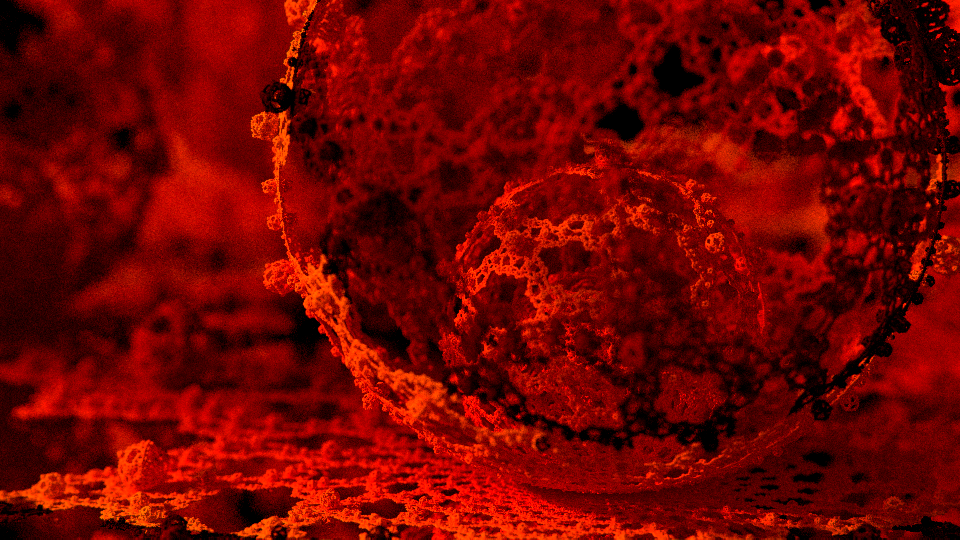
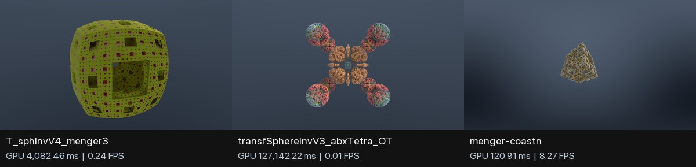
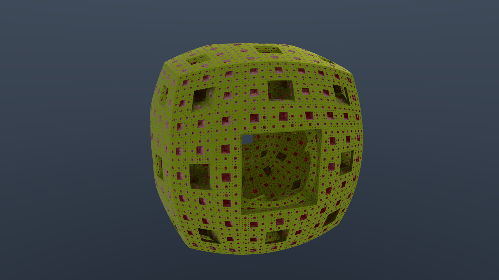
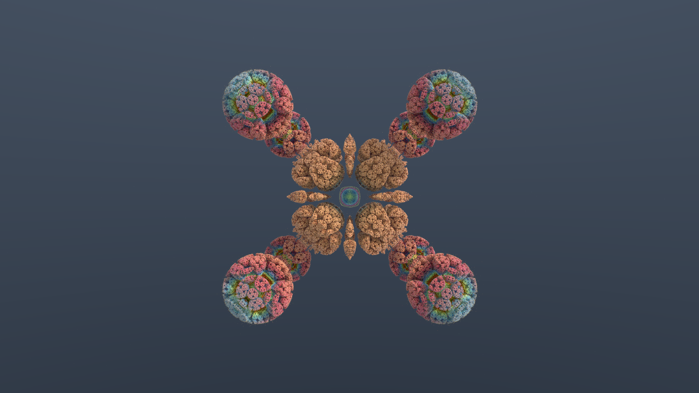
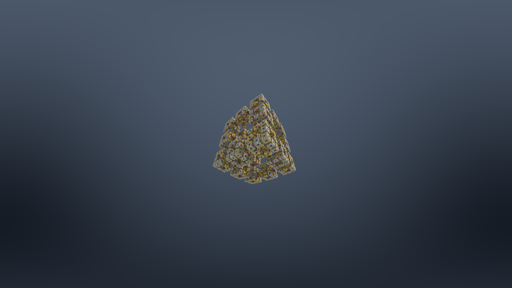
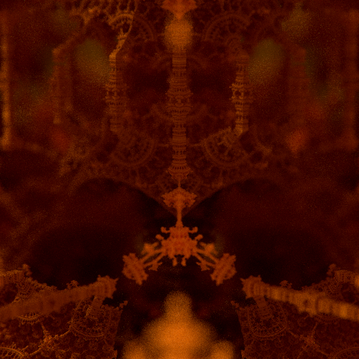
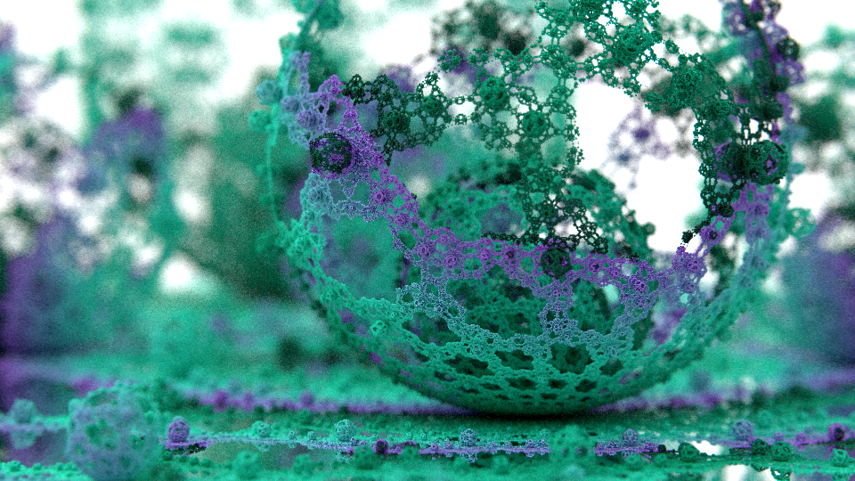
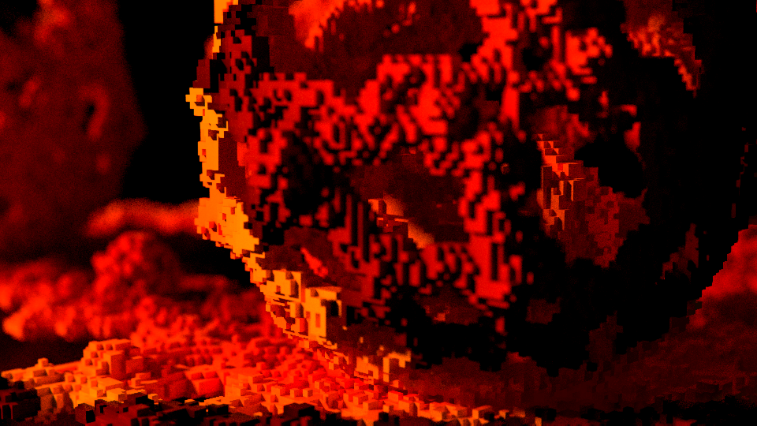
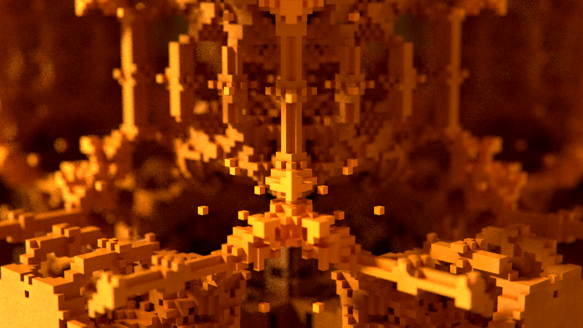
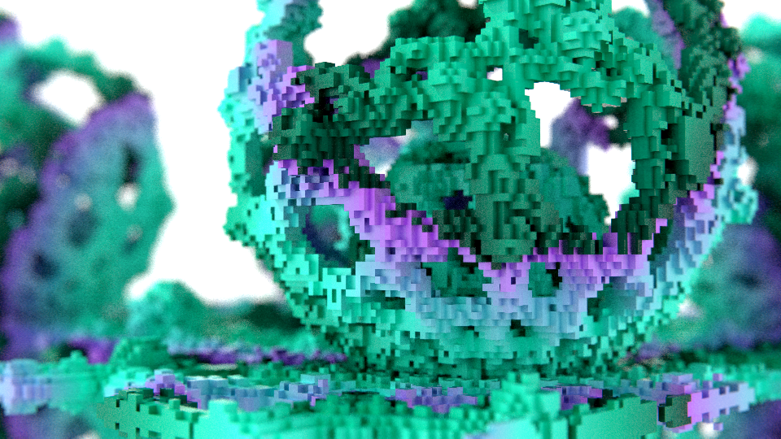

<div align="center">

# FPT Metal

**A native Rust + Metal fractal path tracer with SDF and voxel backends for macOS.**

[](https://developer.apple.com/metal/)
[](https://www.rust-lang.org/)
[](https://developer.apple.com/metal/)



FPT Metal is a native **Metal/Rust port of
[adam-pa/FPT](https://github.com/adam-pa/FPT/)**, preserving its SDF scenes,
camera model, materials, lighting, and postprocessing while replacing the
Python/OpenGL runtime with a standalone macOS renderer.

</div>

## What Changed in This Port

| Upstream FPT | FPT Metal |
| --- | --- |
| Python host and OpenGL/GLSL rendering | Rust CLI and AppKit host with native Metal compute shaders |
| Runtime shader and application dependencies | Embedded `.metallib` and a standalone release binary with no Python or Zig runtime |
| Original Beauty JSON scenes | Compatibility loader plus explicit Metal implementations of all nine Beauty presets |
| Fixed shader-authored fractals | Typed, scene-independent SDF programs for generated fractals, transforms, folds, repetition, CSG, gradients, and materials |
| Procedural SDF traversal only | Optional GPU voxelization with reusable sparse-brick storage and exact grid DDA traversal |
| Six finite-difference samples per normal | Analytic derivative propagation for typed programs, measured up to `1.83x` faster |
| Per-sample automatic focus and full SDF material queries | One-shot GPU focus prepass and distance-only marching, producing a `1.71x` combined featured-scene speedup |
| Original viewport and offline output | Progressive interactive path tracing, responsive camera controls, scene cycling, and deterministic offline accumulation |
| Manual visual inspection | Automated MAE, RMSE, SSIM, blank-image checks, strict parity gates, diff sheets, and contact sheets |
| Basic runtime feedback | Real GPU milliseconds, FPS, workload estimates for marches/normals/bounces, and Metal System Trace capture |
| Environment and post effects | Radiance RGBE HDR input and shared offline/interactive tone mapping, exposure, saturation, aberration, and highlights |

The experimental NAADF backend used during development was removed before
release. The repository now provides shared SDF and voxel geometry paths plus
the generic typed-program route for future procedurally generated fractals.
Arbitrary GLSL translation remains intentionally out of scope.

FPT Metal also contains a generated Mandelbulber2 formula frontend with 458
fixed formula implementations and 747-scene dependency coverage. It supports
analytic/delta estimators, hybrids, Boolean combinations, embedded custom
formulas, and Mandelbulber palette colouring through FPT Metal's material
system. The retained exact optimization stack improved full-corpus median GPU
time from 35.934 ms to 23.756 ms while all 743 comparable images remained
pixel-identical.

## Mandelbulber2 Scenes

The importer reads `.fract` scenes and formula sources from an external
[Mandelbulber2](https://github.com/buddhi1980/mandelbulber2) checkout, generates
a scene-specialized Metal distance estimator, and renders the exact procedural
surface through FPT Metal's own camera, materials, lighting, and path tracer.
It does not bake the fractal into voxels or a cached SDF.



These three production examples span the measured fast, median, and slow
cohort at `1280x720`, 50 spp on an Apple M1 Max. Their GPU times were 120.910
ms, 4,082.461 ms, and 127,142.222 ms respectively; shader compilation is not
included.

<table>
  <tr>
    <td width="50%"></td>
    <td width="50%"></td>
  </tr>
  <tr>
    <td align="center"><strong>T_sphInvV4_menger3</strong><br>4,082.461 ms GPU</td>
    <td align="center"><strong>transfSphereInvV3_abxTetra_OT</strong><br>127,142.222 ms GPU</td>
  </tr>
  <tr>
    <td colspan="2"></td>
  </tr>
  <tr>
    <td colspan="2" align="center"><strong>menger-coastn</strong><br>120.910 ms GPU</td>
  </tr>
</table>

### How the Mandelbulber frontend works

1. The Rust importer parses a `.fract` scene, its active formula slots,
   transforms, iteration schedule, camera, lights, and supported material
   controls.
2. Formula IDs are resolved against an external Mandelbulber2 checkout. The
   source frontend translates the selected OpenCL formula bodies and shared
   helpers into scene-specialized Metal.
3. Generated shaders preserve the procedural distance estimator. FPT Metal
   sphere-traces that exact field and uses its own path tracer for final
   lighting rather than voxelising or meshing the fractal.
4. Generated libraries and Metal pipeline archives are cached by source and
   topology hash. Scene-content policies enable exact compiler
   specializations only where native-resolution image gates passed.

The exact renderer retains a Mandel-specific kernel, representable-position
march termination, 35 selected homogeneous schedules, 11 selected short-period
hybrid schedules, persistent pipeline caching, and watchdog-safe tiled retry.
Cached SDF, voxel, NAADF, sparse traversal, adaptive sampling, and approximate
normal experiments were not retained because they either lost detail, changed
images, or failed to improve end-to-end time.

Render an upstream scene after building the release binary:

```sh
MANDELBULBER_ROOT=/path/to/mandelbulber2
SCENE="$MANDELBULBER_ROOT/deploy/share/mandelbulber2/examples/mandelbulb001.fract"

target/release/fpt-metal render "$SCENE" \
  --out renders/mandelbulb001 --renderer sdf \
  --mandelbulber-root "$MANDELBULBER_ROOT" \
  --width 1280 --height 720 --samples 50 \
  --sdf-accumulation per-sample
```

Exact rendering is the default. A deliberately opt-in, device- and
output-specific approximation example is provided in
[`docs/mandel-approximation-cache-960x540-1spp.json`](docs/mandel-approximation-cache-960x540-1spp.json):

```sh
target/release/fpt-metal render "$SCENE" \
  --out renders/mandel-auto --renderer sdf \
  --mandelbulber-root "$MANDELBULBER_ROOT" \
  --width 960 --height 540 --samples 1 \
  --mandel-optimization auto \
  --mandel-selection-cache docs/mandel-approximation-cache-960x540-1spp.json
```

Cache decisions apply only when the complete scene hash, width, height, and
sample count match. Every miss or failed quality gate falls back to exact.
The packaged example accepts three candidates at SSIM at least `0.98` and
speedup at least `1.10x`, and records one explicit rejection.

| Example cache scene | Selection | Speedup | SSIM |
| --- | --- | ---: | ---: |
| `bristorbrot001` | Screen LOD 1.0 | 2.651x | 0.99116 |
| `mandelbulb powe 6 - circle` | Iteration scale 0.70 | 1.624x | 0.99934 |
| `T_sphInvV4_abxKali_hexGrid2` | Iteration scale 0.70 | 1.362x | 0.99980 |
| `hex grid 002` | Exact fallback | 1.318x candidate | 0.97496 |

Formula geometry is broadly covered, but Mandelbulber's complete appearance
system is not: volumetric fog and clouds, visible light geometry, advanced
reflection/transparency gradients, textures, and some material graphs can
still make an otherwise correct fractal look different. Three of 746 valid
corpus scenes currently reach visible diffuse-normal geometry but fail the
full path-traced appearance gate. Generated formula artifacts retain
Mandelbulber2's GPLv3-or-later boundary and stay in ignored runtime caches; the
Apache-2.0 repository does not vendor the upstream generated formula corpus.

### Rust library and portable voxel export

The crate exposes serializable fractal requests, the exact 12-byte Metal
`VoxelCell`, sparse `VoxelGrid` volumes, a deterministic built-in CPU reference
voxelizer, and a greedy-meshed GLB encoder. Real `.fract` scenes retain their
authoritative generated evaluator by dispatching the existing Metal
`voxel_build_kernel` and reading its cells back:

```sh
target/release/fpt-metal voxel-export "$SCENE" \
  --out renders/mandelbulb001.glb \
  --voxel-resolution 256 \
  --mandelbulber-root "$MANDELBULBER_ROOT"
```

The GLB deduplicates packed materials, carries glTF specular, transmission,
IOR, and emissive extensions, and embeds the versioned marker
`asset.extras.fpt_voxel_contract`. See
[`docs/fractal-library-api.md`](docs/fractal-library-api.md) for public API
signatures, payload layout, bounds controls, consumer integration, and the
Mandelbulber licensing boundary.

## Quick Start

Requirements: macOS with a Metal-capable GPU, Xcode command-line tools, and a
current stable Rust toolchain.

```sh
cargo build --release

target/release/fpt-metal render scenes/readme/01-Render005.json \
  --out renders/readme
```

`build.rs` compiles and embeds the Metal library in
`target/release/fpt-metal`, producing a standalone executable.

## Featured Scenes

<table>
  <tr>
    <td width="50%"></td>
    <td width="50%"></td>
  </tr>
  <tr>
    <td align="center"><strong>Render0ad03</strong><br>Recursive gold Tower</td>
    <td align="center"><strong>Glass</strong><br>Teal and violet Cage</td>
  </tr>
</table>

The presets and scene files are bundled. Reproduce all three images locally:

```sh
mkdir -p renders/readme

target/release/fpt-metal render scenes/readme/01-Render005.json --out renders/readme
target/release/fpt-metal render scenes/readme/08-Render0ad03.json --out renders/readme
target/release/fpt-metal render scenes/readme/09-Glass.json --out renders/readme
```

Use `--samples 32` for a quicker draft. To render all seven upstream README
re-creations and build a contact sheet:

```sh
FPT_README_SAMPLES=32 scripts/run_readme_reproductions.sh
```

## Performance

Measured on an **Apple M1 Max** at one sample per pixel and each featured
scene's native `960x540` resolution. Values are the median of four interleaved
measured runs after an uncounted warm-up, timed around the Metal command
buffers. The baseline is merge commit `2233b5e`; both paths use the default
six-sample central-difference normals.

| Scene | Baseline | Specialized | Speedup | FPS |
| --- | ---: | ---: | ---: | ---: |
| Render005, Cage | 114.5 ms | **102.4 ms** | **1.12x** | **9.77** |
| Render0ad03, Tower | 66.0 ms | **51.6 ms** | **1.28x** | **19.40** |
| Glass, Cage | 114.5 ms | **97.7 ms** | **1.17x** | **10.24** |

Built-in SDF scenes automatically use compact precompiled Metal libraries that
omit the large typed-program payload. Cage and Tower additionally use
scene-family-specialized distance entry points, while accepting all ordinary
scene parameters from the JSON file. At the README's native 112 spp,
Render005 and Glass were pixel-exact against the baseline. Render0ad03 passed
the strict image gate with MAE `1.180`, SSIM `0.9717`, and low-frequency SSIM
`0.99993`; its small delta comes from specialized fast-math code generation.

Central differences remain the default. `--sdf-normal-mode tetra` is an
explicit faster-quality option that evaluates four normalized tetrahedral
offsets instead of six axis offsets. In the controlled 32 spp matrix it added
another `1.20-1.35x` over the generic central-normal path and passed the strict
image gate, but it is not selected automatically.

Generated typed SDF normals use analytic derivatives rather than six finite
differences per hit:

| Generated benchmark | Central normals | Analytic normals | Speedup | Image delta |
| --- | ---: | ---: | ---: | ---: |
| Folded box + subtractive sphere | 109.3 ms | **84.9 ms** | **1.29x** | SSIM `0.9986` |
| Sphere fixture | 126.0 ms | **69.0 ms** | **1.83x** | SSIM `0.999995` |

The exact typed-program renderer also includes a procedural compiler and
measured Metal backend selector. These figures come from separate controlled
matrices and should be read as backend-relative results rather than one shared
scene benchmark:

| Compiler result | Measurement | Correctness |
| --- | ---: | --- |
| Basic global optimizer | 12 to 7 instructions; **1.53x** | SSIM `1` |
| Typed SoA direct evaluator | **2.61-5.15x** over optimized bytecode | Maximum MAE `0.0000347` |
| Canonical affine direct evaluator | **2.16x mean**, `1.57-3.56x`; 12/12 wins | Minimum SSIM `0.999994` |
| Generated analytic surface, 28 primitives | **2.18x** over typed SoA; `1.10x` over generated distance | 1,048,576 samples; zero field/gradient failures |
| Selector v8 control | Specialized backend selected and cached in **5/5** scenes | Pixel-exact final PNGs |

See the [optimization investigation summary](docs/optimization-investigation-summary.md)
and [compact evidence package](docs/evidence/procedural-jit/README.md) for the
experiment boundaries, negative controls, and reproduction details.

Re-run the benchmarks:

```sh
scripts/run_typed_program_benchmark.sh

cp target/release/fpt-metal /tmp/fpt-metal-baseline
# Make and build a renderer change, then compare it:
BASELINE_BIN=/tmp/fpt-metal-baseline scripts/run_readme_engine_benchmark.sh
```

## Interactive Path Tracing

```sh
target/release/fpt-metal preview scenes/readme/09-Glass.json \
  --pathtrace --width 960 --height 540 --samples 256 --sdf-profile
```

Omit `--pathtrace` for the fast viewport renderer. Progressive path tracing
resets automatically after camera movement.

| Input | Action |
| --- | --- |
| `W A S D` | Move on the X/Z plane |
| `Q / E` or `Space` | Move vertically |
| Mouse drag or arrow keys | Rotate camera |
| `Shift` | Increase movement speed |
| `[` / `]` | Cycle available scenes |
| `Esc` | Close the viewer |

The `--sdf-profile` HUD samples GPU time every 30 frames and estimates primary
march, shadow march, normal, and bounce contributions. Capture a complete
Instruments trace with:

```sh
scripts/run_metal_system_trace.sh
```

## Voxel Renderer

The voxel backend converts the same procedural SDF programs into a reusable GPU
field, then traces that field instead of evaluating the distance estimator for
every ray step. Camera, lighting, materials, path accumulation, and
postprocessing remain shared with the SDF renderer.

<table>
  <tr>
    <td width="33%"></td>
    <td width="33%"></td>
    <td width="33%"></td>
  </tr>
  <tr>
    <td align="center"><strong>Render005</strong></td>
    <td align="center"><strong>Render0ad03</strong></td>
    <td align="center"><strong>Glass</strong></td>
  </tr>
</table>

All three examples use the same release settings: `256^3`, bounds
`[-3.25, 3.25]^3`, surface band `0.50`, face normals, `960x540`, and 112 spp.
Measured on an Apple M1 Max against SDF renders from the same build and sample
count:

| Scene | MAE | SSIM | LF-SSIM | SDF render | Voxel build | Voxel render | Cached speedup |
| --- | ---: | ---: | ---: | ---: | ---: | ---: | ---: |
| Render005 | `26.70` | `0.291` | `0.401` | 11,380 ms | 52 ms | 3,456 ms | **3.29x** |
| Render0ad03 | `31.63` | `0.328` | `0.172` | 4,837 ms | 52 ms | 3,547 ms | **1.36x** |
| Glass | `55.75` | `0.202` | `0.493` | 9,760 ms | 60 ms | 3,087 ms | **3.16x** |

MAE is lower-is-better; SSIM and low-frequency luminance SSIM are
higher-is-better. Build time is reported separately because the field is reused
across progressive samples and camera movement.

Reproduce the gallery, comparison JSON, performance summary, and contact sheet:

```sh
scripts/run_voxel_readme.sh
```

The harness defaults to the settings above. Override `WIDTH`, `HEIGHT`,
`SAMPLES`, `VOXEL_RESOLUTION`, or `OUT_DIR` for experiments. Render one scene
directly with:

```sh
target/release/fpt-metal render scenes/readme/09-Glass.json \
  --renderer voxel \
  --voxel-resolution 256 \
  --voxel-surface-band 0.50 \
  --voxel-storage sparse-bricks \
  --voxel-normal face \
  --width 960 --height 540 --samples 112 \
  --out renders/voxel
```

The build kernel samples `distanceSdf` at each cell centre, marks cells within
the configured surface band, evaluates `userSdf` once for occupied-cell
material data, and packs colour, roughness, specular, translucency, IOR, and
emission. The default staging path compacts occupied `4x4x4` bricks behind a
dense page table; `--voxel-build direct` instead constructs sparse bricks on the
GPU and falls back to staging if its capacity is exceeded. Conservative brick
rejection is available through `--voxel-brick-rejection`, and
`--voxel-storage dense` retains the complete field as a correctness reference.
Rays intersect the field bounds and use exact grid DDA to find the first packed
cell before continuing through the shared path-tracing and postprocess stages.

Resolutions up to `512` remain available as an opt-in offline quality mode, but
`256` is the recommended balance. The staging builder creates a dense field
before sparse compaction and can peak near `1.8 GiB` for a `512^3` Tower build.
The direct builder avoids that dense staging field and caps its `512^3` sparse
allocation at approximately 480 MiB.

## Generated SDF Programs

Generated fractals do not require a new scene-specific shader. A bounded typed
instruction stream describes transforms, primitives, CSG, orbit colouring, and
physical material properties:

```json
{
  "sdf_program": {
    "operations": [
      {"op": "repeat", "value": [2, 2, 2]},
      {"op": "sort_desc"},
      {"op": "box", "value": [0.7, 0.5, 0.3], "orbit_weight": 1},
      {"op": "sphere", "radius": 0.35, "combine": "subtract"}
    ],
    "material": {"mode": "gradient", "roughness": 0.65},
    "gradient": [
      {"position": 0, "color": [0.1, 0.6, 1.0]},
      {"position": 1, "color": [1.0, 0.2, 0.1]}
    ]
  }
}
```

Analytic normals are selected automatically for typed programs. Use
`--sdf-normal-mode central` to compare with finite differences. Programs are
bounded to 64 operations and 16 gradient stops.

For stable typed topologies, `--sdf-backend probe` benchmarks the optimized
direct, generated-distance, and generated-analytic-surface candidates with
identical deterministic probes and caches the qualifying decision.
`--sdf-backend auto` reuses that decision; on a one-shot cache miss it renders
directly instead of paying cold JIT discovery cost. Interactive preview keeps
the direct evaluator active while specialization is compiled asynchronously.

Radiance RGBE `.hdr` environments are supported through `world.hdri`, using an
absolute path or a path relative to the scene JSON.

## Verification

```sh
cargo test --release
FPT_ROOT=../FPT scripts/run_smoke.sh
FPT_ROOT=../FPT scripts/run_all_parity.sh
FPT_ROOT=../FPT scripts/run_high_sample_parity.sh
FPT_ROOT=../FPT scripts/run_capability_tests.sh
```

One-off comparisons generate metrics and a three-panel baseline/candidate/diff
sheet:

```sh
target/release/fpt-metal compare baseline.png candidate.png \
  --report reports/comparison.json --strict
```

FPT compatibility behavior and bundled presets are derived from
[adam-pa/FPT](https://github.com/adam-pa/FPT/).
