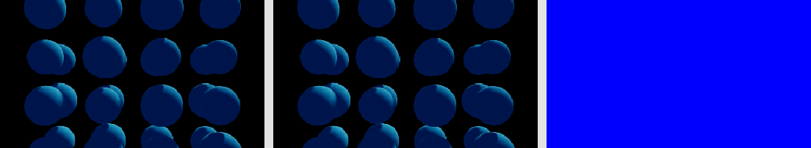
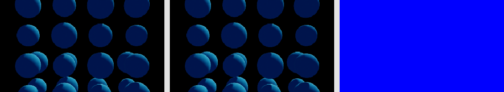

# Procedural compiler evidence

This is the compact, reviewable evidence package for the procedural compiler
and exact-rendering optimization work. Raw timestamped runs remain under the
gitignored `reports/` directory because the complete matrices contain hundreds
of renders and intermediate artifacts.

Machine-readable headline results are in `results.json`. The included sheets
show representative parity controls rather than every tested condition.

## Production results

| Result | Measurement |
| --- | ---: |
| Basic global optimizer | 12 to 7 instructions; 1.527x speedup |
| Typed SoA direct evaluator | 2.61-5.15x faster than optimized bytecode |
| Canonical affine direct evaluator | 12/12 wins; 2.16x mean; 1.57-3.56x range |
| Built-in Cage/Tower specialization | 1.12-1.28x at native 960x540; central normals remain the default |
| Generated analytic surface at 28 primitives | 2.18x over typed SoA; 1.10x over generated distance; 1.20x over stitching |
| Selector v8 controls | Specialized backend selected in 5/5; cached decisions reused in 5/5 |
| Generated field validator | 1,048,576 points; zero distance or gradient failures |

The automatic selector considers only optimized direct, generated distance,
and generated distance plus analytic surface. All alternative representations
and spatial accelerators remain explicit research controls.

## Important negative results

| Experiment | Result |
| --- | --- |
| Canonical-descriptor generated MSL | 0/72 selector wins; about 0.35x direct performance |
| Function stitching | Strong small-program results, but a stable 32-primitive and mixed-vocabulary compiler cliff |
| Dual full-source library | 2.04-2.59x greater cold cost; 9.08-12.03x render regression at 32 primitives |
| Tiny private-linked helper | Source compile reduced 14-57x, but total cold discovery 1.11-1.45x worse and 16-primitive rendering 3.81-4.97x slower |
| Shared DAG and affine indices | Useful representations, no stable margin over compact sequential generated MSL |

## Included sheets

### Global optimizer

### Generated analytic surface

### Selector output

### Tiny-link negative control

