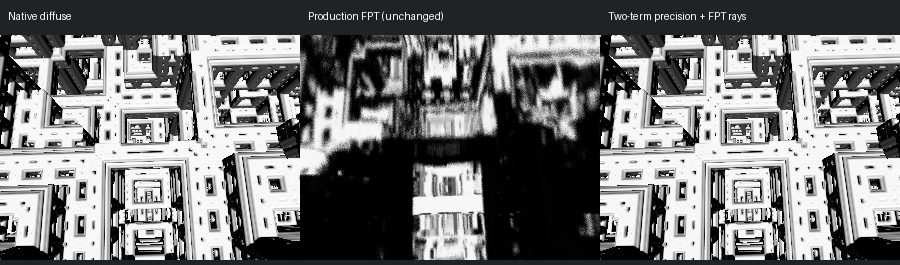
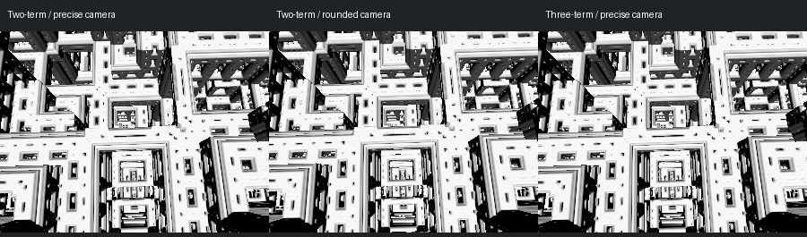

# Scene 578: Geometry Recovered In A Precision Diagnostic

[Previous diagnosis](../mandel-578-precision-20260913/README.md) | [Results](summary.json)

**The numerical hypothesis is confirmed.** Keeping the camera, formula
constants, ray positions, orbit and normal stencil in compensated precision
restores the nested square openings. This is an isolated continuous-Metal
diagnostic, not yet the production FPT viewer, authored path tracing or NAADF.



Left: native white diffuse. Middle: unchanged production FPT white diffuse.
Right: two-term precision with generated FPT camera-ray directions, the original
high-precision camera origin, and a camera-aligned white directional light.
All images are 300x225 with the authored framing, no AO/specular/shadows, and
no postprocessing registration, flips, exposure edits or crops. Production FPT
uses 32 SPP; the deterministic precision diagnostic uses one ray per pixel.
Native sampling and refinement remain different, so this is not a byte-parity
or equal-work benchmark.

## Results

| Check | Result |
| --- | ---: |
| RGB MAE vs native, production FPT (0-255 scale) | 119.94 |
| RGB MAE vs native, two-term precision / FPT rays | 0.7236 |
| Identical-point distance samples | 128 |
| Maximum absolute distance error | 1.2344e-15 |
| Median relative distance error | 5.31e-9 |
| Full-image hits | 67,500 / 67,500 |
| Stalls / max-step exits | 0 / 0 |
| Native first-hit comparison | 273 / 273 common hits |
| Median depth error / native threshold | 0.00208 |
| Maximum depth error / native threshold | 0.03143 |
| Rays with depth error over one threshold | 0 |

The current first-hit check uses the original double camera and sampled integer
pixel coordinates. The previous diagnostic rounded the native origin to Metal
float32 and used a different ray grid. Their medians are not a paired benchmark.

FPT ray directions and native directions produce practically identical images:
42 grayscale pixels differ by one level, with no hit/miss changes. Native and
FPT-ray renders both recover the structure. No image alignment correction is
being supplied by the native ray provider.

## Precision Controls



| Variant | Finding |
| --- | --- |
| Two-term arithmetic, precise inputs | Structure restored; native MAE 0.7236 |
| Three-term arithmetic, precise inputs | Only one grayscale pixel changes by one level vs two-term |
| Two-term arithmetic, camera rounded to float32 | Native MAE rises to 22.82; 51,807 pixels differ from precise camera |
| Two-term arithmetic, formula constants rounded to float32 | Median relative DE error rises to 0.02815; field gate fails, so no image is rendered |

The formula-only control changes the scale/limits, keeping all orbit arithmetic
expanded. The camera-only control changes the origin but keeps the light and
ray directions fixed. These show why upgrading only the arithmetic after
already rounding inputs is insufficient.

Three-term arithmetic is unnecessary for this image: its isolated GPU dispatch
sum was about 20.3 seconds vs 1.4-1.6 seconds for two-term. These are tiled,
safe-math diagnostic measurements, not interactive FPS or production benchmark
results. The diagnostic is slow; production integration and optimization remain
separate work. No performance-increasing change is claimed here.

## Implementation Boundary

- `hybrid-config` exports resolved native parameters and sequence for the
  existing narrowly permitted Menger-7 / Tglad-1045 hybrid.
- `run_mandel_hybrid_precision.py` validates scene and formula SHA-256 hashes,
  imports the real upstream formula bodies at runtime, maps their parameters,
  and rejects unsupported configuration instead of approximating it.
- The field carries four components, including W, even though W remains zero
  in this scene. Both positive and negative fold limits remain intact.
- The existing `TwoTerm.metal` / `Expansion.metal`, white-headlight template
  and bounded 256-ray Metal driver are reused. Safe math is mandatory.
- The point gate runs twice and must pass before rendering. FPT rays are an
  optional input provider; `--verify-hits` additionally invokes the original
  native marcher on a bounded sample grid.

Generated GPL formula sources, native-linked binaries and metallibs stay in
ignored reports. No generated native formula implementation was vendored into
the production library. The approved library's licensing boundary is unchanged.

## Verification

144 Python tests pass, including four new precision-diagnostic tests. The native
adapter builds and the existing production source, shaders, catalogue and
423-scene gallery are unchanged. The final FPT-ray run reproduces both image
and complete depth/shading output byte-for-byte from the preceding FPT-ray run.
The field gate also repeats byte-exactly. No scenes are automatically promoted.

## Next

Integrate an explicit compensated-precision specialization into FPT's normal
configuration and renderer, preserving high/low camera and formula values from
the Rust parser before they enter float-only configuration buffers. Carry the
same position representation into colour and secondary-ray work rather than
rounding back at those boundaries. Then validate authored materials and lighting
against native and recheck unaffected scenes before considering promotion.

Do not enable this expensive path globally. No change to conventional NAADF,
fog/clouds, scene 095 or the frozen gallery is part of this experiment.

## Reproduce

Build the external native adapter with `scripts/build_native_distance_probe.py`.
Run the new harness with the pinned scene-578 `.fract`, the matching native
source root, `--native-probe`, `--points`, and a new output directory:

```sh
python3 scripts/run_mandel_hybrid_precision.py \
  --scene /path/to/menger-FabsAddTgladFold4D.fract \
  --mandelbulber-root /path/to/mandelbulber2 \
  --native-probe /path/to/native-distance-probe \
  --points /path/to/native-points.tsv \
  --out /path/to/new-report --size 300x225 \
  --metal-probe target/release/examples/mandel_normal_probe --verify-hits
```

Use `--arithmetic three`, `--round-data camera`, or
`--round-data formula --field-only` for the isolated controls. The latter is
expected to reject the field gate. Commands, logs, generated shaders and raw
outputs remain under `reports/mandel-578-expanded-20260913/`.
This directory includes selected raw metrics, inputs, images and a SHA-256
manifest; it does not bundle external executables.
