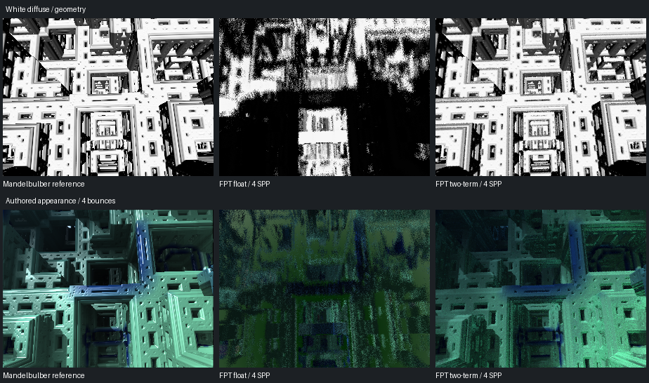

# Scene 578: Compensated Precision In The FPT Path Integrator

[Previous isolated diagnostic](../mandel-578-expanded-20260913/README.md) |
[Raw comparison summary](summary.json)

**The geometry recovery survives integration with FPT's sampled path tracer.**
This is an explicit, headless experimental executable, not a change to the
normal `fpt-metal render` command, viewer, NAADF, or gallery selection.



Columns: Mandelbulber CPU reference, ordinary float FPT control, two-term FPT.
Top: white material and camera-aligned direct diffuse light, no AO/specular.
Bottom: authored appearance. All images are 300x225 with the original framing;
there are no image registration, exposure, crop or orientation adjustments.
All FPT comparison captures use 4 SPP, with one bounce for geometry and four
bounces for authored appearance. Native authored sampling is not equivalent to
FPT SPP and its shading model differs.

## Results

| Variant | Geometry MAE vs native, 0-255 | Authored MAE vs native, 0-255 |
| --- | ---: | ---: |
| Float / fast math | 121.99 | 54.93 |
| Float / safe math | 124.90 | Not run |
| Two-term / safe math | 9.17 | 27.58 |

- Geometry image error falls by **92.48%** versus the matched float control.
- Safe math alone does not repair the structure; preserving the extra bits is
  necessary. The recovered openings remain visible under authored shading.
- Two authored runs reproduce both PNG and complete linear radiance bytes.
- The two-term runs report zero pixels with flagged invalid transport. Stalls,
  iteration exhaustion, invalid normals and failed shadow queries produce a
  large finite sentinel that survives sample averaging and fails the capture.
  This is not a separate hit-mask/depth parity assertion.
- Authored output is still darker and noisier than native. Restored geometry
  and broadly similar palette placement do not establish lighting parity.

The earlier one-ray diagnostic scored 0.72 MAE using native integer pixel
sampling and deterministic steps. This experiment uses FPT's pixel sampling,
jittered stepping and accumulation. Those scores are **not a paired regression
comparison**. The matched float/two-term controls above are the relevant test.

## Cost

In the first complete matched run, tiled render wall time was approximately:

| FPT capture | Float | Two-term |
| --- | ---: | ---: |
| Geometry, 4 SPP | 1.35 s | 6.47 s |
| Authored, 4 SPP / 4 bounces | 6.75 s | 34.87 s |

These are render-bridge wall durations with one-row tiles and one sample per
dispatch, **not isolated GPU timings, interactive FPS, or an A/B performance
gate**. A repeated validation suite is retained separately in `summary.json`.
No speed improvement is claimed. Do not enable compensated arithmetic globally.

## Implementation

`examples/mandel_hybrid_render.rs` loads the original scene through the Rust
parser, generates the normal scene-specialized shader, and substitutes precise
queries into its existing `renderPath`. It uses the existing accumulation,
presentation and Metal render bridge via `beauty_probe`, compiled with safe math.

- Camera origin and Tglad limits are split from f64 before float32 conversion.
- The real Menger and Tglad formula bodies are imported at runtime from
  hash-validated external sources. No native executable or Python process is
  needed to run the experimental renderer.
- Ray positions, orbit evaluation, threshold/refinement, normal stencil,
  colour orbit, directional-shadow positions and bounce offsets stay expanded.
- Final shading values and ray directions remain float32. Existing sample
  dimensions, scattering, throughput, environment and presentation are retained.
- The effective generated colour mode is explicitly checked, including
  `kMandelColorPreV215 = false`. The source file's version label alone is not
  enough to infer the migrated colour-orbit mode. The existing palette function
  and material construction are reused, not replaced with a new palette.
- Unsupported source revisions, scenes, source markers, camera overrides,
  preview, DOF, auxiliary lights and multi-ray AO are rejected. Resolution is
  limited to 320x240, authored 4:3 framing, at most 16 SPP, and 1-4 tile rows.

**AO scope:** this scene does not activate FPT's generated multi-ray lightmap AO
path. The retained authored mode uses the existing generic ambient approximation.
No native SSAO implementation or new AO behavior is claimed. An initial unused
multi-ray precision adapter was removed before the retained gate rather than
shipping an untested path. Fog/clouds remain excluded.

External GPL formula bodies and compiler outputs stay in ignored reports.
Only the importer, generic precision helpers and experiment are checked in.
The production library and its established licensing boundary are unchanged.

## Verification And Status

- Release example builds; its three Rust tests pass.
- All 148 Python script tests pass, including four new report tests.
- Native reference hashes are checked before reuse; native producer commands
  and the original scene hash are bundled with this evidence.
- A complete second six-capture suite repeats the first image/linear outputs.
- No production `src/`, `shaders/`, scenes, catalogue or gallery files changed.
- Scene 578 remains outside the 423-scene reviewed gallery. No push or scene
  promotion is part of this checkpoint.

The immediate next step is to separate the remaining authored-lighting mismatch
from precision, then decide whether to expose this proven but expensive path
through a strictly opt-in production specialization. Interactive camera movement,
general hybrid coverage and voxel export require separate validation. Do not
silently use the baked high-precision camera in an interactive viewer.

## Reproduce

```sh
cargo build --release --example mandel_hybrid_render

FPT_MANDEL_TILED_DISPATCH=1 FPT_MANDEL_TILE_ROWS=1 \
  target/release/examples/mandel_hybrid_render \
  /path/to/menger-FabsAddTgladFold4D.fract \
  --mandelbulber-root /path/to/mandelbulber2 \
  --mandel-appearance authored-path \
  --width 300 --height 225 --samples 4 --sdf-bounce-cap 4 \
  --out /path/to/new-output
```

Use `--mandel-appearance geometry` for white diffuse. Add
`--precision-control float` or `--precision-control safe-float` for controls.
`scripts/run_mandel_hybrid_path.py` runs the matched six-capture suite and
generates its report/contact sheet using the two validated native references.
Raw generated sources, radiance buffers and logs are under
`reports/mandel-578-path-integration-20260913/`; selected results and image hashes
are bundled here. Native author credit: Robert Pancoast, CC-BY 4.0, Mandelbulber
upstream revision `230456cee40968cbaa7f301bba91daa4865a29db`.
