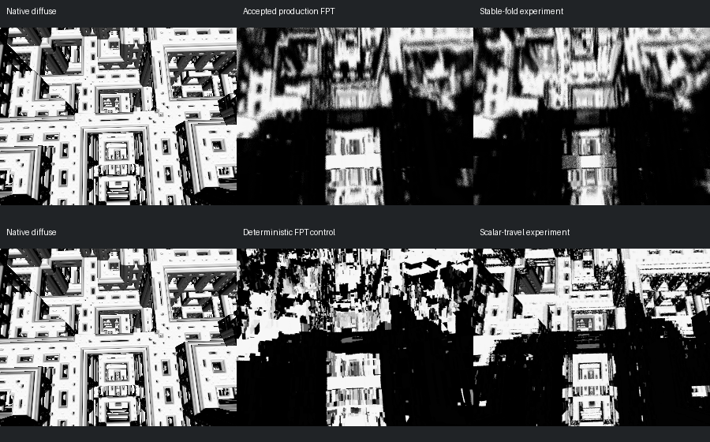

# Scene 578: Precision Diagnosis

[Previous boolean fix](../mandel-geometry-outliers-20260913/README.md) | [Evidence](summary.json) | [First-hit audit](first-hit.json)

Scene 578 remains blocked. This work establishes a numerical failure in the
continuous FPT renderer, not a NAADF voxelization problem. No production
renderer change or gallery promotion is retained. The 423-scene reviewed
gallery remains unchanged.

## Image Experiments

All images use the authored camera/aspect at 300x225, white diffuse material,
and no AO, specular or shadows. FPT uses 32 SPP. Native CPU sampling and the
normal estimator still differ. No registration, cropping or exposure adjustment
was applied to the images.

Top row: native / accepted production FPT / stable-fold experiment.
Bottom row: native / deterministic FPT diagnostic / scalar-travel diagnostic.
The two FPT controls are deliberately different: the diagnostic disables
production step jitter. Compare each candidate only with its own control.

| Experiment | Finding | Decision |
| --- | --- | --- |
| Piecewise Tglad fold, formula 1045 only | Better identical-point DE agreement, but the large smeared regions remain | Reverted |
| Scalar travel with `fma(direction, travel, origin)` | Recovers all sampled ray hits and some square openings; large dark/incorrect regions remain | Diagnostic only |

The stable fold is algebraically equivalent to
`abs(x + limit) - abs(x - limit) - x`. For a negative limit, its inner branch
must be `-3*x`, not `x`. Testing both signs matters: this scene uses a negative
Y limit. The field probe's median relative error fell from 0.2043 to 0.1139,
p95 from 1.6315 to 0.9791, and matching iteration counts rose from 83 to 96 of
128. These were diagnostic 300x158 hit points, not the image camera aspect.
They did not establish a sufficient visual improvement.

## First-Hit Evidence

The adapter now has an explicit, restricted `hybrid-march` mode. It invokes
the original native `cRenderWorker::RayMarching`, not a reimplementation.
It permits the plain Menger-7 / Tglad-1045 hybrid only, rejects additional
formula slots and unsupported scene dependencies, and leaves the existing
formula-11 `march` contract intact.

273 identical float-rounded ray directions were tested at the authored
300x225 aspect. Native origin was rounded to the same Metal origin to isolate
march/evaluator differences. This removes origin disagreement from this probe;
it does not certify the original high-precision camera contract.

| Seed-zero primary probe | Native | Accepted Metal | Scalar travel experiment |
| --- | ---: | ---: | ---: |
| Hits | 273 | 194 | 273 |
| Native-only hits | - | 79 | 0 |
| Median unrefined position error / native detail threshold | - | 4.289 | 1.427 |

The median is over common hits, so the two Metal columns have different
populations. Scalar travel still has 199/273 points over one native threshold.
This is not exact geometry parity. Native seeds 1 and 2 reproduce the same
79 missing-ray classification for the accepted Metal path.

An isolated termination counter reproduces the accepted hit flags exactly:

- 194 rays converge.
- **All 79 misses stop at `next_position == position`.**
- No sampled ray exits for non-finite distance, range or step limit.
- At those stops, DE is 1.006 to 2.258 times the hit threshold, so simply
  declaring a stalled ray a hit would alter the surface contract.

## Why Scalar Travel Is Not Enough

The scaled camera is approximately `(341.52, 545.94, -1074.82)`.
Float32 coordinate spacings there are about `3.05e-5`, `6.10e-5` and `1.22e-4`.
At the scalar-travel hit points the median normal-sampling delta is only
`3.32e-5`. Changing the global scale by a power of two does not recover lost
relative precision.

Using the GPU-returned hit points and normal deltas, a float32 stencil audit
finds **263/273 points lose both offsets on at least one axis**: 0 on X,
122 on Y, and 263 on Z. None loses all three axes, but a partial derivative
can still disappear. The hybrid orbit also has independently measured DE
errors. Recovering hit flags alone cannot repair either problem.

## Next Work

1. Build a scene-scoped compensated-precision diagnostic for formulas 7/1045,
   reusing the existing precision helpers rather than enlarging every kernel.
2. Preserve the authored camera residual, ray position, orbit state and normal
   offsets together. Rounding to float3 before the DE would lose the benefit.
3. Compare identical-point DE, native first hits and neutral images before
   attempting authored colour or any production promotion.
4. Retain a specialization only after it fixes visible structure and passes
   unaffected-scene gates. Do not increase hit epsilon or fill stalled rays.

This is a correctness investigation; no performance claim is made. Fog/clouds,
scene 095 and deferred native-reference timeouts remain out of scope.

## Verification And Reproduction

- Release production binary and diagnostic example build successfully.
- 140 Python tests and 11 derivative/march diagnostic tests pass.
- Unsupported `march`/`hybrid-march` configurations return rejection code 15.
- After reverting the fold, fresh 246/578 neutral and authored captures are
  byte-exact with the accepted production baseline (four captures).
- Catalogue/gallery files unchanged; `git diff --check` passes. No push.

Use `scripts/build_native_distance_probe.py` with the pinned external native
build, then `scripts/run_mandel_first_hit_parity.py` with
`--native-mode hybrid-march --max-axis 300` and the scene-578 source.
The old default remains 300x158 for historical diagnostics.

For the image diagnostic, use `target/release/examples/mandel_derivative_render
beauty <scene> --mandelbulber-root <root> --width 300 --height 225 --samples 32
--sdf-accumulation chunked --sdf-chunk-samples 1 --mandel-appearance geometry
--out <new-dir>`. Compare `FPT_MARCH_PROBE_PARAMETRIC=0` with `=1`.
Both use the same deterministic control; neither changes the production CLI.

Raw experiments, commands, generated diagnostic shaders, identities and logs
remain under `reports/mandel-578-hybrid-20260913/`. Selected JSON and images
are preserved here with a SHA-256 manifest; external GPL-linked binaries and
generated metallibs are not bundled.
