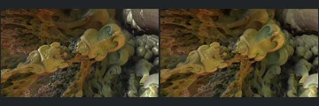

# Seventh Additional Review Batch

[Reviewed showcase](../mandel-showcase/README.md) | [Needs-work audit](../mandel-showcase/needs-work.md) | [Catalogue](README.md)

Coverage-first publication from checkpoint `475b08a`. No renderer, source-scene,
camera, shading, sampling or acceptance-policy changes. Existing outliers remain
deferred to the consolidated final investigation rather than retried here.

## Outcome

| Result | Scenes |
| --- | ---: |
| Previously unreviewed scenes selected | 50 |
| FPT neutral geometry succeeded | 50 |
| FPT authored path succeeded | 50 |
| Complete native/FPT comparisons | 36 |
| Accepted with limitations | 25 |
| Explicit visual needs-work | 11 |
| Native CPU timeout, unpromoted | 14 |

The catalogue now contains **240 reviewed, 374 experimental and 132 blocked**
scenes. Blocked includes 111 explicit visual holds and 21 historical screening
failures. The showcase has 24 pages. Prior evidence/decisions for 315 comparisons
and all 630 prior gallery images are retained unchanged.

## Settings And Evidence

- Authored camera/aspect, 300px maximum edge, FPT 32 SPP and existing bounce
  defaults. Chunked single-sample accumulation with eight-row Metal tiles.
- Native CPU at the same dimensions, with authored sampling and effects
  unchanged. No reduced-MC cap, crop, flip or higher-SPP gate.
- Native timeout 120 seconds; FPT timeout 900 seconds. One native CPU reference
  overlaps sequential FPT geometry/authored captures, with a per-scene barrier.
- Source collections: Graeme McLaren 17, Krzysztof Marczak 17, root examples 16.
- Capture checkpoint: `475b08ac075017713bd82f30546bdf63a7a12d50`.
- FPT executable SHA256: `698f2967631d743065e1b9101921a52f70e954560ef0aecb6a88b5e17ec294e1`.
- Native executable SHA256: `ecf9de8f749c6c7956573d8c7e7b7ea151562f0db48856d51095f8892071bda8`.
- Upstream revision: `230456cee40968cbaa7f301bba91daa4865a29db`.

[Manual assessment](assessment-batch07-2026-09-12.json),
[capture evidence](review-evidence.json) and [bound decisions](reviews.json)
record source, settings and image identities with per-scene visual notes.
Raw commands, summaries, captures and logs remain in ignored
`reports/mandel-review-batch07-20260912/`.
Continuous FPT acceptance is not NAADF/CVOX interoperability or parity certification.
New evidence uses the actual `captured-2026-09-12` epoch instead of the
assembler's inherited refresh label. This metadata correction does not change
images or any earlier review; the new assessments are bound to the corrected evidence.

## Throughput

The run took **3128.45 seconds (52.1 minutes)**. This is workflow elapsed time,
not a renderer GPU benchmark or a controlled comparison against earlier batches.

There were **zero native cache hits**: these were first-time comparisons.
Successful eligible references populate the provenance-checked cache for later
reuse. No incomplete or unproven historical reference was reused. Native
sampling stayed authored; no lower-resolution or reduced-sample substitutes
were used for publication.

Expensive FPT captures also contribute to elapsed time. Scene 161 authored took
175.4 seconds versus 27.6 seconds for native; scene 162 authored took 206.6
seconds versus 34.3 seconds for native, plus 55.2 seconds for its neutral control.
The per-scene barrier can leave the CPU waiting for those FPT captures. No
scheduling or renderer changes were made in this coverage pass.

## Accepted Captures

IDs: **146, 147, 148, 149, 150, 151, 152, 153, 155, 156, 157, 158,
159, 160, 161, 162, 474, 478, 486, 487, 702, 703, 704, 708, 709**.

Open cages, curled ribbons, decorated rounded forms and repeated landscapes
retain readable geometry and framing. Palette, reflections, depth of field and
atmosphere can differ substantially; acceptance is limited to the documented
broad structure and readability, not exact pixels or fine optical transport.
High-frequency sparkle, subpixel filaments and distant reflective detail are
explicitly not certified where the low-resolution comparison cannot resolve them.

## Visual Holds

IDs: **154, 476, 479, 483, 488, 692, 693, 696, 700, 706, 707**.

- **154:** the native solid-looking central gold form becomes a hole-like region
  in both FPT controls. Major geometry/visibility mismatch.
- **483:** an open red cavern with separate platforms becomes close vertical
  bands and a large opening. Geometry/framing and illumination both diverge.
- **696:** a large native cyan luminous ring is absent from both FPT controls;
  the remaining forms are dark or clipped. Geometry and emissive behaviour need work.
- **693, 706:** native open-looking regions become crowded or dark in FPT.
  Geometry versus depth-of-field, atmosphere or reflective obscuration remains
  uncertain, so these are not treated as colour-only differences.
- **479, 692, 707:** severe saturation/clipping obscures native surface detail.
- **476, 700:** authored illumination loses meaningful separation or darkens
  important contours despite broadly corresponding geometry.
- **488:** the geometry aligns, but defining white light/reflection features
  disappear into green/dark material response.

These comparisons and failure notes remain in the audit. No outlier fixes were
attempted and no timeout was interpreted as an unsupported scene.

## Deferred References

Native references **475, 477, 480, 481, 482, 484, 485, 489, 490, 694,
697, 698, 701 and 705** exceeded 120 seconds. Both FPT modes succeeded, but
these incomplete triplets were not promoted. See the
[source-bound incomplete inventory](incomplete-batch07-2026-09-12.json).

All 35 earlier incomplete cases were excluded before selection. These fourteen
bring the deferred inventory to 49 cases for an explicit later pass. They retain
experimental status. Continue coverage-first review; no push without approval.

## Verification

All 128 Python tests passed; catalogue regeneration and `git diff --check`
passed. Verified 1080 gallery artifact hashes and 4253 local Markdown links.
All 315 prior evidence/decision rows, 630 prior gallery images and the original
ranked 50-scene gallery remain unchanged. Both renderer binaries retain their
recorded hashes. A dry selection excludes all 49 incomplete scenes; no next
capture batch was started and no renderer processes remain running.
