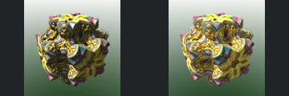

# Ninth Additional Review Batch

[Reviewed showcase](../mandel-showcase/README.md) | [Needs-work audit](../mandel-showcase/needs-work.md) | [Catalogue](README.md)

Coverage-first review of **100 previously unreviewed scenes** from checkpoint
`1513006`. The selector now accepts up to 100 scenes, with tests for bounds,
uniqueness and deterministic collection balancing. Its default remains 50.
No renderer, source-scene, camera, sampling or acceptance-policy changes.
Known outliers remain deferred; increasing batch size does not increase concurrency.

## Outcome

| Result | Scenes |
| --- | ---: |
| Previously unreviewed scenes selected | 100 |
| FPT neutral geometry succeeded | 99 |
| FPT authored path succeeded | 99 |
| Native CPU references succeeded | 79 |
| Complete native/FPT comparisons | 79 |
| Accepted with limitations | 39 |
| Explicit visual needs-work | 40 |
| Native timeout, unpromoted | 21 |
| Of those: both FPT modes also rejected primitive repetition | 1 |

The catalogue now contains **302 reviewed, 254 experimental and 190 blocked**
scenes. Blocked includes 169 explicit visual holds and 21 historical screening
failures. The showcase has 31 pages. Prior evidence/decisions for 392 comparisons
and all 784 prior gallery images are retained unchanged.

## Settings And Evidence

- Authored camera/aspect, 300px maximum edge, FPT 32 SPP and existing bounce
  defaults. Chunked single-sample accumulation with eight-row Metal tiles.
- Native CPU at the same dimensions, with authored sampling and effects
  unchanged. No reduced-MC cap, crop, flip or higher-SPP gate.
- Native timeout 120 seconds; FPT timeout 900 seconds. One native CPU reference
  overlaps sequential FPT geometry/authored captures, with a per-scene barrier.
- Source collections: Graeme McLaren 42, Krzysztof Marczak 42, root examples 16.
- Capture checkpoint: `151300688f81fad701a969c54cbaa8aa4140aa51`.
- FPT executable SHA256: `698f2967631d743065e1b9101921a52f70e954560ef0aecb6a88b5e17ec294e1`.
- Native executable SHA256: `ecf9de8f749c6c7956573d8c7e7b7ea151562f0db48856d51095f8892071bda8`.
- Upstream revision: `230456cee40968cbaa7f301bba91daa4865a29db`.

[Manual assessment](assessment-batch09-2026-09-12.json),
[capture evidence](review-evidence.json) and [bound decisions](reviews.json)
record source, settings and image identities with individual visual notes.
All completed comparisons were visually inspected; appearance MAE did not
determine acceptance. Raw commands, captures, logs and review previews remain
in ignored `reports/mandel-review-batch09-20260912/`.
New evidence uses `captured-2026-09-12`; prior records are unchanged.
Continuous FPT acceptance is not NAADF/CVOX interoperability certification.

## Throughput

Capture took **6624.08 seconds (110.4 minutes)** for 100 scene attempts.
This is elapsed workflow time, not a GPU benchmark or a controlled speedup
claim. Larger batches reduce handoffs, not per-scene rendering work.

There were **zero native cache hits** on these first-time comparisons.
Successful references populate the provenance-checked cache. No incomplete
reference or reduced-quality substitute was reused for publication.

The slowest authored FPT captures were 186 (327.7 seconds), 220 (259.9),
207 (242.8), 195 (212.9), 201 (172.4) and 182 (122.2). The per-scene barrier
can therefore idle the CPU behind the FPT lane; native reference timeouts do
not explain all elapsed time. No scheduler or renderer experiment was mixed
into this review batch.

## Accepted Captures

IDs: **180, 183, 185, 187, 188, 190, 191, 192, 193, 195, 196, 197,
199, 200, 201, 202, 204, 205, 206, 207, 208, 209, 210, 211, 212,
213, 214, 215, 217, 218, 219, 221, 528, 531, 733, 734, 737, 740, 746**.

Strong comparisons include repeated posts, perforated shells, segmented
curved surfaces, concentric arches and decorated isolated forms. Material,
reflection, palette and atmosphere differences are documented rather than
described as exact parity. Scenes with noisy or very thin geometry have explicit
limits on subpixel detail. Stereo example 737 is accepted only for readable
monocular structure, not reproduction of native red/cyan stereo output.

[](../mandel-showcase/192.md)
[](../mandel-showcase/209.md)
[](../mandel-showcase/218.md)

## Visual Holds

IDs: **181, 184, 189, 194, 198, 203, 216, 220, 508, 509, 510, 511,
512, 516, 517, 518, 520, 522, 527, 529, 532, 533, 534, 535, 536,
542, 544, 545, 546, 547, 548, 551, 552, 730, 732, 735, 736, 738,
742, 745**.

- **508, 527:** concrete structural failures. Mountainous forms become a wall
  and rectangular opening in 508; rounded clusters become long streaks in 527.
- **181, 184, 189, 198, 220, 532, 736:** excessive exposure/clipping obscures
  relief. Stereo projection also complicates interpretation of 736.
- **216, 730, 544-547:** missing or altered fake-light/orbit-trap features.
  Rendering the underlying solid is not enough to reproduce these scenes.
- **509-512, 516-518, 522, 535-536, 542, 551:** missing sources, glow or
  environmental illumination. Large important regions become dark in several cases.
- **194, 548, 552:** reflection/environment composition changes substantially;
  severe clipping or missing focal illumination is not accepted as colour drift.
- **520, 529, 533-534, 738, 742, 745:** optical effects, transparency or
  background visibility leave structural agreement uncertain. They need targeted
  controls before any geometry claim.

Individual notes cover the remaining held scenes. These categories are visual
observations for the later outlier investigation, not proven source-code causes.

## Deferred Comparisons

Native references **182, 186, 514, 515, 523, 524, 525, 526, 530, 537,
538, 539, 540, 541, 549, 550, 553, 731, 739, 743 and 744** exceeded
120 seconds. Twenty have successful FPT pairs but no complete triplet.
Scene **553, repeat**, also fails both FPT modes with:

```text
Error: primitive_box_1: repetition is not supported
```

This is a recorded unsupported operation, not a crash or a completed visual
comparison. Its source and mode statuses remain in the
[incomplete inventory](incomplete-batch09-2026-09-12.json); raw errors are retained locally.

The prior 58 incomplete cases were excluded before selection; these 21 bring
the inventory to **79**. Of the **254** experimental scenes now remaining,
**157** are eligible for routine review, **79** are deferred incomplete cases
and **18** have historical screening warnings. The next routine groups can be
100 then 57; those counts exclude known outliers and may change after review.
No next capture batch was started as part of this publication. No push.

## Verification

All **130 Python tests** passed, including the new 100-scene selection tests.
Catalogue regeneration and `git diff --check` passed. The generated-gallery
audit verified **1447 artifact hashes** and **5875 local Markdown links**.
All 392 prior evidence/decision rows, 784 prior gallery images and the original
ranked 50-scene gallery remain unchanged. Both renderer binaries retain their
recorded hashes. The assessment covers exactly all 79 completed triplets;
all 21 incomplete triplets remain unpromoted. A dry 100-scene selection excludes
all 79 deferred incomplete cases. No capture processes remain running.
