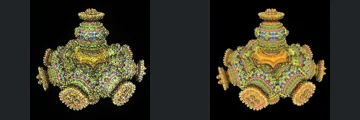

# Tenth Additional Review Batch

[Reviewed showcase](../mandel-showcase/README.md) | [Needs-work audit](../mandel-showcase/needs-work.md) | [Catalogue](README.md)

Coverage-first review of **100 previously unreviewed scenes** from checkpoint
`200e63c30ce431a883d968f37bbd550492bb6519`. No renderer, camera, source-scene,
sampling, scheduler or acceptance-policy changes. Outlier fixes remain deferred.

## Outcome

| Result | Scenes |
| --- | ---: |
| Previously unreviewed scenes selected | 100 |
| FPT neutral geometry succeeded | 100 |
| FPT authored path succeeded | 99 |
| Native CPU references succeeded | 93 |
| Complete native/FPT comparisons | 92 |
| Accepted with limitations | 73 |
| Explicit visual needs-work | 19 |
| Native timeout, unpromoted | 7 |
| FPT authored timeout, unpromoted | 1 |

The catalogue now contains **375 reviewed, 162 experimental and 209 blocked**
scenes. Blocked comprises 188 visual holds and 21 historical screening failures.
All 471 prior evidence/decision rows and 942 prior gallery images are preserved.
The original ranked 50-scene gallery is unchanged.

## Settings And Evidence

- Authored camera/aspect, 300px maximum edge, FPT 32 SPP and existing bounce
  defaults. Chunked single-sample accumulation with eight-row Metal tiles.
- Native CPU at the same dimensions, authored sampling and effects unchanged.
  No reduced-MC cap, crop, flip or higher-SPP gate.
- Native timeout 120 seconds; FPT timeout 900 seconds. One native CPU reference
  overlaps sequential FPT neutral/authored captures, with a per-scene barrier.
- Collections: Graeme McLaren 92, Krzysztof Marczak 8.
- FPT executable SHA256: `698f2967631d743065e1b9101921a52f70e954560ef0aecb6a88b5e17ec294e1`.
- Native executable SHA256: `ecf9de8f749c6c7956573d8c7e7b7ea151562f0db48856d51095f8892071bda8`.
- Upstream revision: `230456cee40968cbaa7f301bba91daa4865a29db`.

[Manual assessment](assessment-batch10-2026-09-12.json),
[capture evidence](review-evidence.json) and [bound decisions](reviews.json)
record individual observations and source/settings/image identities. Every
completed triplet was visually inspected; MAE did not determine acceptance.
New evidence is labelled `captured-2026-09-12`; prior records are unchanged.
Raw captures, commands, logs and review previews remain locally under ignored
`reports/mandel-review-batch10-20260912/`.
Continuous FPT acceptance does not certify NAADF/CVOX interoperability.

## Throughput

Capture took **5325.84 seconds (88.8 minutes)**. This is elapsed workflow time,
not GPU time or a controlled speedup measurement. There were **zero native cache
hits**; successful new references populate the provenance-checked cache.

Scene 295 needed 510.6 seconds for authored FPT; 298 needed 642.3 seconds.
Scene 307 needed 199.2 seconds for neutral FPT, then its authored render reached
the 900-second limit despite a 3.5-second native reference. The CPU can idle
behind these long GPU captures because the workflow retains its per-scene
barrier. Timeout limits and capture quality were not changed to accelerate them.

## Visual Results

The 73 accepted comparisons preserve readable major forms: perforated bodies,
curved frames, layered decorated objects and corridors. Palette, roughness,
reflection and atmosphere differences remain documented limitations, not exact
material parity. Some fine bands and thin features remain unresolved at 300px.

Visual holds: **233, 246, 249, 256, 258, 259, 261, 262, 268, 271, 285,
300, 301, 309, 310, 312, 557, 559, 560**.

- **268:** native fine perforations on the foreground block and floor become
  broad solid squares; the neutral control also lacks the fine structure.
- **233, 249, 261, 262, 271, 285, 309, 560:** excessive exposure or saturation
  hides important relief or material patterns.
- **301, 310, 312:** missing illumination or changed material response leaves
  focal surfaces substantially darker than the reference.
- **246, 256, 258, 259, 300, 557, 559:** light/optical/atmospheric differences
  obscure structural agreement. These need controlled follow-up, not an
  unqualified geometry acceptance.

These are image observations for the deferred investigation, not proven
source-code diagnoses. Individual notes document every accepted and held scene.

## Deferred Comparisons

Native references **295, 298, 554, 555, 558, 561 and 562** exceeded 120 seconds.
Their two FPT captures succeeded. Scene **307** has a successful native and
neutral capture, but its authored FPT render exceeded 900 seconds.
All eight remain unpromoted in the [incomplete inventory](incomplete-batch10-2026-09-12.json).
A timeout alone does not establish unsupported geometry.

The prior 79 incomplete cases were excluded before selection; the inventory
now contains **87**. The remaining **162 experimental** scenes comprise **57**
eligible for routine review, **87** deferred incomplete cases and **18** with
historical screening warnings. The next routine batch is therefore 57 scenes.
No next capture batch or push is included in this publication.

## Verification

All **130 Python tests** passed. Catalogue regeneration and `git diff --check`
passed. The gallery audit verified **1730 artifact hashes** and **7300 local
Markdown links**, plus unchanged renderer binary hashes. All 471 prior
evidence/decision rows, 942 prior images and the original ranked gallery remain
unchanged. The assessment covers exactly the 92 completed triplets; all eight
incomplete triplets remain unpromoted. A dry 57-scene selection excludes all
87 deferred cases. A published comparison was visually checked for correct
labels and layout. No capture processes remain running.
