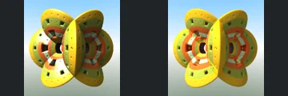

# Eleventh Additional Review Batch

[Reviewed showcase](../mandel-showcase/README.md) | [Needs-work audit](../mandel-showcase/needs-work.md) | [Catalogue](README.md)

This final routine batch contains **57 scenes**, not 100: only 57 eligible
unreviewed candidates remained after batch ten. Known outliers were not mixed
back into the selection to fill the batch. Capture checkpoint:
`21143e3f6fb1bb22fa378b2dac24fec3f1b46f34`.
No renderer, source-scene, camera, sampling or scheduling changes.

## Outcome

| Result | Scenes |
| --- | ---: |
| Previously unreviewed scenes selected | 57 |
| FPT neutral geometry succeeded | 57 |
| FPT authored path succeeded | 57 |
| Native CPU references succeeded | 57 |
| Complete native/FPT comparisons | 57 |
| Accepted with limitations | 46 |
| Explicit visual needs-work | 11 |
| Incomplete or timed out | 0 |

The catalogue now contains **421 reviewed, 105 experimental and 220 blocked**
scenes. Blocked comprises 199 explicit visual holds and 21 historical screening
failures. All 563 prior evidence/decision rows and 1126 prior gallery images
are preserved; the original ranked 50-scene gallery remains unchanged.

## Settings And Evidence

- Authored camera/aspect, 300px maximum edge, FPT 32 SPP and existing bounce
  defaults. Chunked single-sample accumulation with eight-row Metal tiles.
- Native CPU at identical dimensions, authored sampling and effects unchanged.
  No reduced-MC cap, crop, flip or higher-SPP gate.
- Native timeout 120 seconds; FPT timeout 900 seconds. One native CPU reference
  overlaps sequential FPT neutral/authored captures, with a per-scene barrier.
- All 57 examples belong to the Graeme McLaren collection.
- FPT executable SHA256: `698f2967631d743065e1b9101921a52f70e954560ef0aecb6a88b5e17ec294e1`.
- Native executable SHA256: `ecf9de8f749c6c7956573d8c7e7b7ea151562f0db48856d51095f8892071bda8`.
- Upstream revision: `230456cee40968cbaa7f301bba91daa4865a29db`.

[Manual assessment](assessment-batch11-2026-09-12.json),
[capture evidence](review-evidence.json) and [bound decisions](reviews.json)
record individual observations and source/settings/image identities. All 57
completed triplets were visually inspected; appearance MAE was not an acceptance
gate. New evidence is labelled `captured-2026-09-12`; prior records are unchanged.
Raw commands, captures, logs and review previews remain locally under ignored
`reports/mandel-review-batch11-20260912/`.
Continuous FPT acceptance does not certify NAADF/CVOX interoperability.

## Throughput

Capture took **2058.88 seconds (34.3 minutes)**, with **zero native cache hits**
and **zero timeouts**. Successful references populate the provenance-checked
cache. This is elapsed workflow time, not GPU timing or a controlled speedup.
Slow authored FPT captures include 348 (214.3 seconds), 350 (174.9),
327 (160.0) and 325 (158.1). Bounded concurrency and capture quality were unchanged.

## Visual Results

The accepted group preserves readable major geometry across perforated shells,
curved frames, decorated spherical forms and repeated architecture. Colour,
roughness, reflective sparkle and atmosphere differences remain documented.
Some captures certify only the larger openings and silhouettes: subpixel pores,
highlight-region detail and stochastic reflection patterns are not exact parity.

Visual holds: **322, 323, 325, 333, 334, 346, 348, 353, 354, 357, 369**.

- **322, 323, 325, 333, 357, 369:** excessive brightness or changed material
  response obscures surface relief, panel patterns or architecture.
- **334:** the spherical object aligns, but the native red floor is absent or
  unlit in FPT. Geometry versus lighting needs a controlled follow-up.
- **346:** the corridor retains its broad structure but loses its focal glow
  and important interior illumination.
- **348:** red outer light traces and the bright centre are absent; retaining
  the underlying rounded bodies alone does not reproduce the authored scene.
- **353:** dark native square cavities become shallow-looking patches. The
  neutral capture has recesses, so material response and depth visibility need
  to be separated before claiming geometry agreement.
- **354:** reflective recesses lose important depth cues and structured detail.

These are observed image differences, not proven source-code diagnoses. No
outlier fixes or renderer experiments were introduced during this review.

## Remaining Work

There are **zero routine candidates** after this batch. The **105 experimental**
scenes comprise **87 deferred incomplete comparisons** and **18 historical
screening warnings**. The empty [batch incomplete inventory](incomplete-batch11-2026-09-12.json)
records that this run added no deferred cases. The existing 199 visual holds
and 21 historical screening failures remain blocked, not silently promoted.

The next phase is the consolidated outlier pass: triage execution/reference
contracts separately from geometry and lighting issues. It was not started
as part of this gallery publication. No push.

## Verification

All **130 Python tests** passed. Catalogue regeneration and `git diff --check`
passed. The gallery audit verified **1906 artifact hashes** and **8295 local
Markdown links**, plus unchanged renderer binary hashes. All 563 prior
evidence/decision rows, 1126 prior images and the original ranked gallery remain
unchanged. The assessment covers exactly all 57 complete triplets. The selector
audit confirms **zero routine candidates** after excluding prior decisions,
deferred cases and historical warnings. A published comparison was visually
checked for correct labels and layout. No capture processes remain running.
