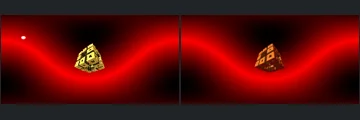

# Historical Warning Triage

[Reviewed showcase](../mandel-showcase/README.md) | [Needs-work audit](../mandel-showcase/needs-work.md) | [Catalogue](README.md)

Fresh reference-backed triage of the **18 experimental scenes** excluded from
routine selection by historical dark or single-colour screening warnings.
Checkpoint: `1752a41553338cd1cbe02c2ebcc53c417b943c51`.
This pass classifies the remaining warnings; it does not change the renderer,
silently waive a warning or retry already deferred reference cases.

## Outcome

| Result | Scenes |
| --- | ---: |
| Historical warning candidates attempted | 18 |
| FPT neutral geometry succeeded | 18 |
| FPT authored path succeeded | 18 |
| Native CPU references succeeded | 10 |
| Complete reference-backed triplets | 10 |
| Accepted with limitations | 2 |
| Explicit visual needs-work | 8 |
| Native timeouts, unpromoted | 8 |

The catalogue now contains **423 reviewed, 95 experimental and 228 blocked**
scenes. Blocked comprises 207 explicit visual holds and 21 historical screening
failures. All 620 prior evidence/decision rows and 1240 prior gallery images
are preserved; the original ranked 50-scene gallery remains unchanged.

## Settings And Evidence

- Authored camera/aspect, 300px maximum edge, FPT 32 SPP and existing bounce
  defaults. Chunked single-sample accumulation with eight-row Metal tiles.
- Native CPU at identical dimensions, authored sampling/effects unchanged.
  No reduced-MC cap, crop, flip or higher-SPP gate.
- Native timeout 120 seconds; FPT timeout 900 seconds. One native CPU reference
  overlaps sequential FPT neutral/authored captures, with a per-scene barrier.
- Temporary files stay on the external volume; the existing 1-GiB low-space
  guard remains enabled. No evidence or user assets were removed.
- FPT executable SHA256: `698f2967631d743065e1b9101921a52f70e954560ef0aecb6a88b5e17ec294e1`.
- Native executable SHA256: `ecf9de8f749c6c7956573d8c7e7b7ea151562f0db48856d51095f8892071bda8`.
- Upstream revision: `230456cee40968cbaa7f301bba91daa4865a29db`.

[Manual assessment](assessment-batch12-2026-09-13.json),
[capture evidence](review-evidence.json) and [bound decisions](reviews.json)
record individual observations with source/settings/image identities. All ten
complete triplets were visually inspected. Incomplete previews were also inspected
but were not accepted or given reference-backed geometry decisions.
New evidence is labelled `captured-2026-09-13`; previous records are unchanged.
Raw commands, captures, logs and previews remain locally in ignored
`reports/mandel-review-batch12-20260913/`.
Continuous FPT acceptance does not certify NAADF/CVOX interoperability.

## Throughput

Capture took **1319.80 seconds (22.0 minutes)**, with **zero native cache hits**.
All 36 FPT captures succeeded. Scene 464 took 287.2 seconds for authored FPT;
its native reference timed out. Elapsed workflow time is not GPU timing or
a controlled performance comparison. No timeout or sampling limits were raised.

## Accepted With Limitations

- **582, menger-coastn:** the small perforated central object and red environment
  band align. FPT differs in gold shading and omits the small native white source.
  The neutral darkness warning mostly reflects low object coverage, not missing
  main geometry. This is object-level acceptance, not exact lighting parity.
- **614, benesi_t1_pine_tree_001:** the blue radial interior and bright opening
  retain their arrangement. FPT is sharper, with less bloom/atmospheric softness.
  Detail hidden by the native bright centre is not certified.

## Visual Holds

- **095:** major native surrounding structures are missing or framed differently;
  FPT shows a small central pointed form on a nearly uniform background.
- **051:** the native golden reflective environment becomes predominantly black
  with saturated red/yellow contours. The source is equirectangular and enables
  volumetric fog; neither effect should be inferred correct from silhouette alone.
- **376:** underlying architecture is present in neutral FPT, but the bright
  yellow authored feature is missing. The source enables iteration fog.
- **556, 609, 714:** native volume/light effects are absent or substantially
  changed, and important authored areas become dark. Fog and volume fixes remain
  deferred, per scope; these are not disguised as surface-lighting successes.
- **568:** both native and FPT show a tiny dark object. The warning alone does
  not establish an FPT regression. Authored framing is unsuitable for meaningful
  gallery inspection; FPT additionally omits a small native white source.
- **663:** native gold illuminated arcs become effectively black despite a
  detailed neutral capture. The source enables circle orbit-trap fake lights
  and volumetric fog, which need separate controls before attributing the cause.

These are observed differences and relevant source settings, not completed
source-code diagnoses. No generic exposure multiplier or scene-specific lighting
override was added to make dark images appear acceptable.

## Incomplete References

**408, 425, 426, 464, 543, 653, 695 and 741** exceeded the 120-second native
budget. Both FPT modes completed for each. Scene 464 now has a visibly lit FPT
capture, but without a complete native comparison it cannot be promoted.
Several other authored FPT captures remain very dark, which is diagnostic
evidence rather than reference-backed geometry validation.

Their source hashes and statuses are retained in the
[incomplete inventory](incomplete-batch12-2026-09-13.json). The previous 87
deferred comparisons were excluded; these eight bring the total to **95**.
All remaining experimental scenes are now in that deferred inventory. There
are **zero untouched routine or historical-warning candidates**.

## Next Work

1. **Geometry control for 095:** reproduce native/FPT camera rays and first-hit
   depth under neutral shading before changing formulas or traversal. The source
   uses `DE_factor 0.04`; test its effect instead of assuming missing geometry is
   a colour problem. Preserve the current captures as the baseline.
2. **Separate light transport from volumes:** for 663 and similar dark scenes,
   compare explicit surface-light/orbit-trap controls with fog disabled on both
   sides. Keep the no-fog comparison distinct from authored gallery evidence.
   Fog/cloud implementation remains deferred.
3. **Reference recovery:** run a small, explicitly bounded longer native-only
   retry group, starting with the now-lit 464. Reuse FPT captures only after
   validating source, camera, settings and binary identities. Do not rerun all
   95 expensive cases blindly or lower reference quality without clear labels.
4. **Regression gate:** retain renderer fixes only after checking previously
   accepted controls; refresh evidence before changing gallery decisions.

No renderer fixes, reference-recovery reruns or push are included in this pass.

## Verification

All **130 Python tests** passed. Catalogue regeneration and `git diff --check`
passed. The gallery audit verified **1936 artifact hashes** and **8408 local
Markdown links**, plus unchanged renderer binary hashes. All 620 previous
evidence/decision rows, 1240 prior images and the original ranked gallery remain
unchanged. The assessment covers exactly all ten complete triplets; the eight
incomplete references remain unpromoted. The inventory check confirms zero
untouched routine or historical-warning candidates and exactly 95 experimental
scenes in the deferred inventory. A published comparison was visually checked
for labels/layout. No capture processes remain running.
