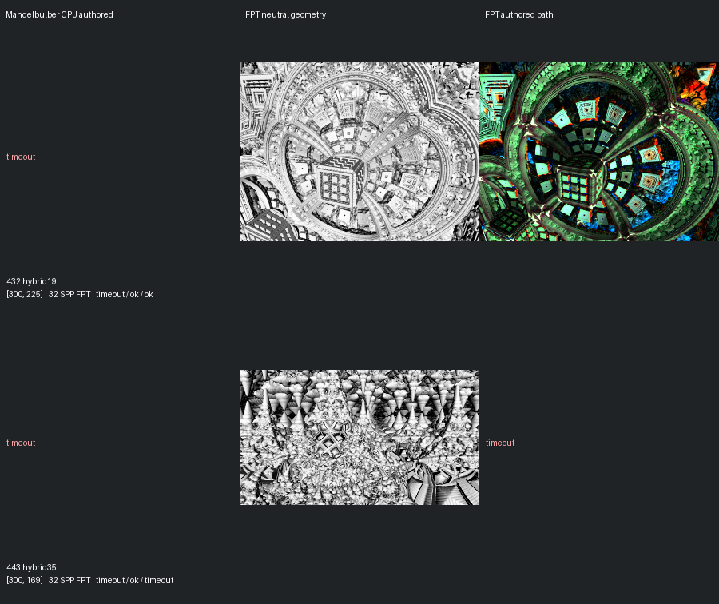
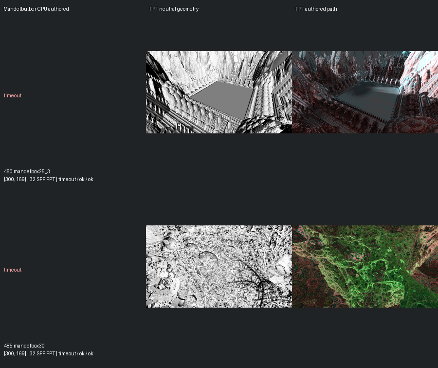
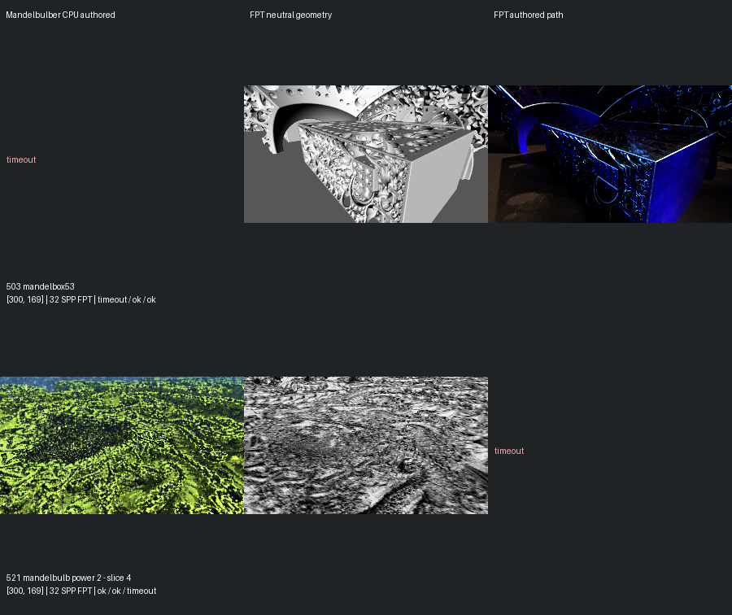
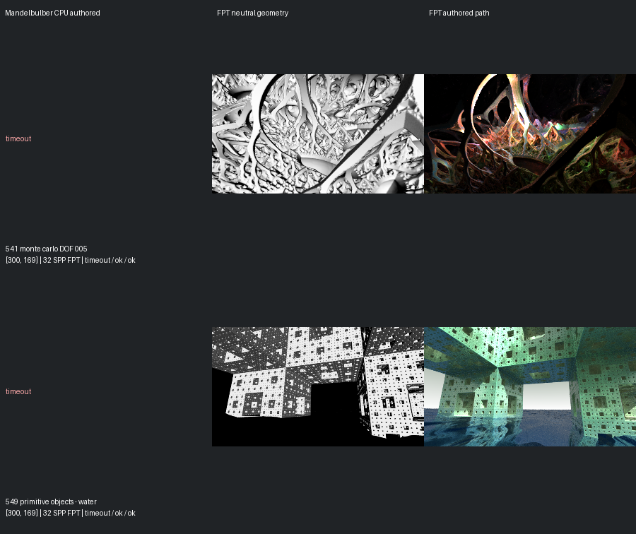
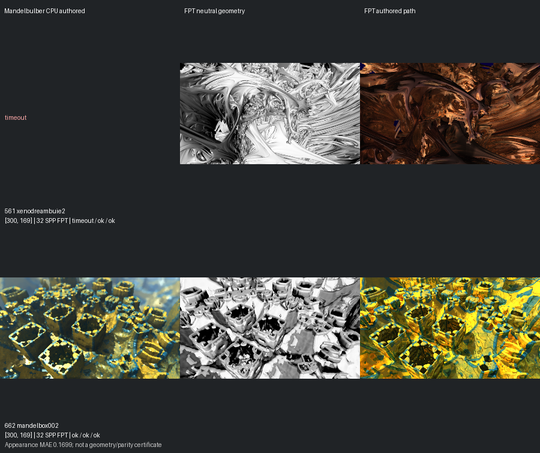

# Shortlist Confirmation — 14 September 2026

[Reviewed gallery](../mandel-showcase/README.md) | [Fast previews](../mandel-fast-expansion-20260914/README.md) | [Capture evidence](summary.json)

Confirmed **1 gallery additions** from ten shortlisted scenes. The reviewed gallery grows from 423 to **424**.

Promoted: [662](../mandel-showcase/662.md).
Visual holds: none.
Incomplete comparisons: 432, 443, 480, 485, 503, 521, 541, 549, 561.

All captures use authored framing at 300px maximum edge and 32 FPT samples. Native CPU references retain authored sampling and effects; no MC cap or lower-resolution reference is substituted. CPU and GPU work overlap within each scene, with 30 seconds per requested mode and no retries.

Capture wall time: **5.1 minutes**. This is workflow timing, not a GPU benchmark.

Previous review evidence, decisions, per-scene pages and gallery images are preserved. Renderer code, executable and scene inputs are unchanged. The 150px fast previews remain screening evidence; only the complete comparisons explicitly assessed here are promoted.

[Recorded command](command.json) | [Assessment](assessment.json) | [Incomplete inventory](incomplete.json)

## Comparison page 1

## Comparison page 2

## Comparison page 3

## Comparison page 4

## Comparison page 5

