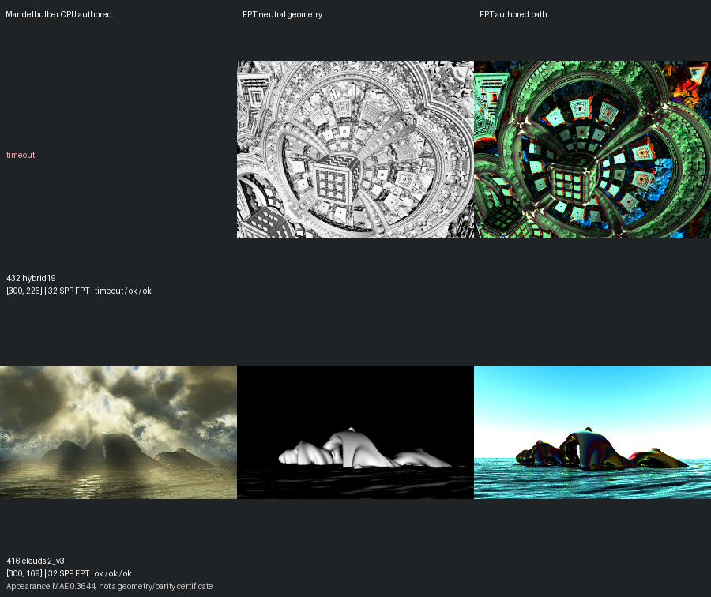
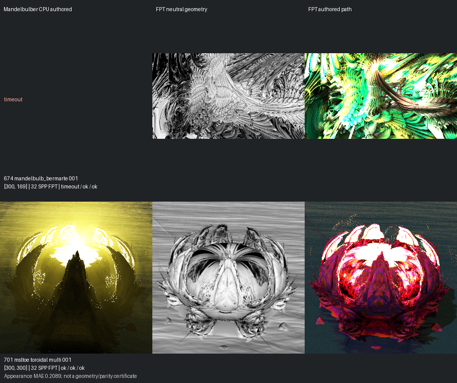
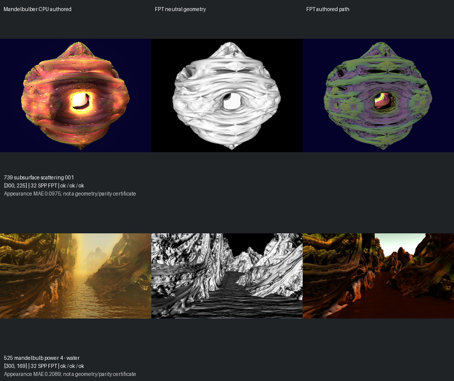
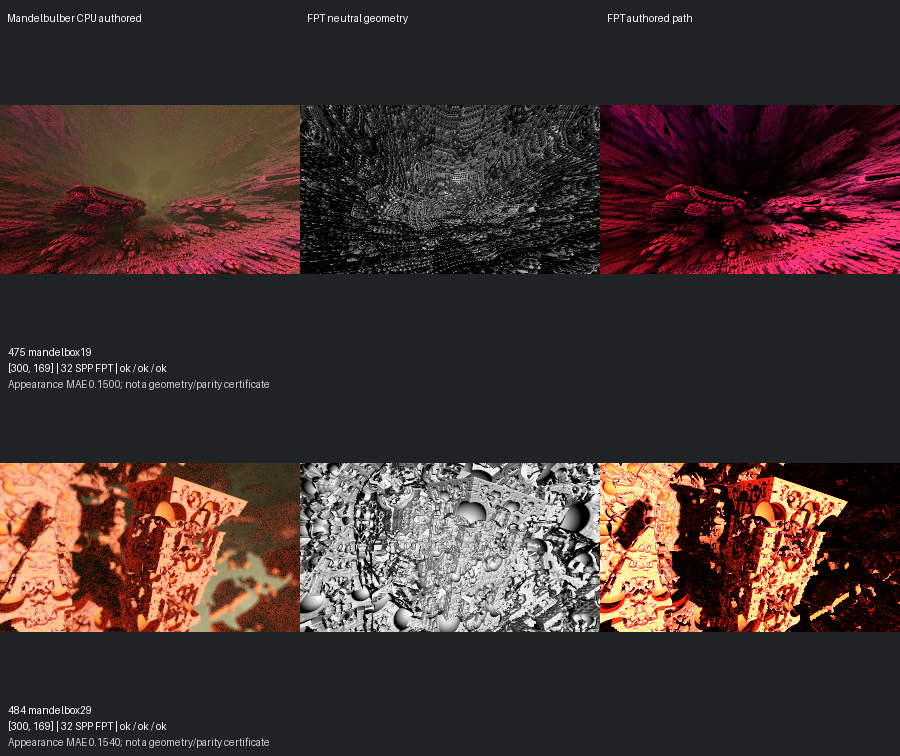

# Experimental Scene Recovery — 14 September 2026

[Reviewed gallery](../mandel-showcase/README.md) | [Capture evidence](summary.json) | [Remaining queue](remaining-queue.json)

Reviewed **6 complete comparisons** from eight experimental candidates: **3 accepted**, **3 visual holds**, **2 incomplete**.

The gallery now contains **427 accepted scenes**; **89 experimental scenes** remain.

Accepted: [701](../mandel-showcase/701.md), [475](../mandel-showcase/475.md), [484](../mandel-showcase/484.md).
Visual holds: 416, 739, 525.
Incomplete: 432, 674.

All 95 experimental scenes were inventoried. Of those, 92 lacked a completed full-quality native reference; the other three had FPT failures or incomplete captures. Historical full-size timeout logs supplied scheduling estimates for 90 scenes. Seven candidates were selected from scenes close to finishing within their old two-minute limits and with successful fast FPT previews. Scene 432 was already running under a longer allowance.

Captures retain authored framing, a 300px maximum edge and 32 FPT samples. Native CPU references retain authored sampling and effects. Scene 432 received a 600-second native limit; the next seven received 420 seconds for native and 120 seconds per FPT mode, with bounded CPU/GPU overlap. Its two completed FPT captures were verified and reused. Producer time estimates are approximate and current execution can be slower.

Capture wall time: **39.8 minutes**, including the unsuccessful scene 432 attempt. This is workflow timing, not a GPU benchmark. A [process-load snapshot](load-observation.json) found one native renderer and substantial CPU use by other applications; historical timing estimates are not directly comparable to this run.

Incomplete and timeout images do not count as visual acceptance. Every complete comparison received an explicit image-based assessment. Prior reviews and per-scene gallery assets are preserved. Renderer code, binaries and scene inputs are unchanged.

[Commands](command.json) | [Assessment](assessment.json) | [Incomplete inventory](incomplete.json) | [Historical costs](historical-native-costs.json)

| Scene | Native | FPT neutral | FPT authored | Decision |
| --- | --- | --- | --- | --- |
| 432 | timeout | ok | ok | incomplete |
| 416 | ok | ok | ok | needs-work |
| 674 | timeout | ok | ok | incomplete |
| 701 | ok | ok | ok | accepted-with-limitations |
| 739 | ok | ok | ok | needs-work |
| 525 | ok | ok | ok | needs-work |
| 475 | ok | ok | ok | accepted-with-limitations |
| 484 | ok | ok | ok | accepted-with-limitations |

## Comparison page 1

## Comparison page 2

## Comparison page 3

## Comparison page 4

