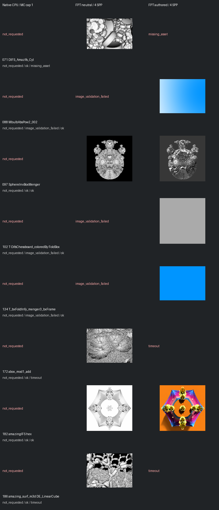

# Fast screening page 1

[Index](README.md)

150px maximum edge; native MC capped at one only when authored MC is enabled. FPT 4 SPP. No gallery promotion.

| ID | Scene | Native | Neutral | Authored |
| --- | --- | --- | --- | --- |
| 071 | DIFS_AmazIfs_Cyl | not requested | [geometry](images/071-geometry.png) | missing_asset |
| 088 | MbulbAbsPow2_002 | not requested | image_validation_failed | [authored](images/088-authored.png) |
| 097 | SphereInvBoxMenger | not requested | [geometry](images/097-geometry.png) | [authored](images/097-authored.png) |
| 102 | T-DifsChessboard_coloredBy FoldBox | not requested | image_validation_failed | [authored](images/102-authored.png) |
| 134 | T_bxFoldInfy_menger3_bxFrame | not requested | image_validation_failed | [authored](images/134-authored.png) |
| 172 | abox_mod1_add | not requested | [geometry](images/172-geometry.png) | timeout |
| 182 | amazingIFS hex | not requested | [geometry](images/182-geometry.png) | [authored](images/182-authored.png) |
| 186 | amazing_surf_m3d DE_LinearCube | not requested | [geometry](images/186-geometry.png) | timeout |
