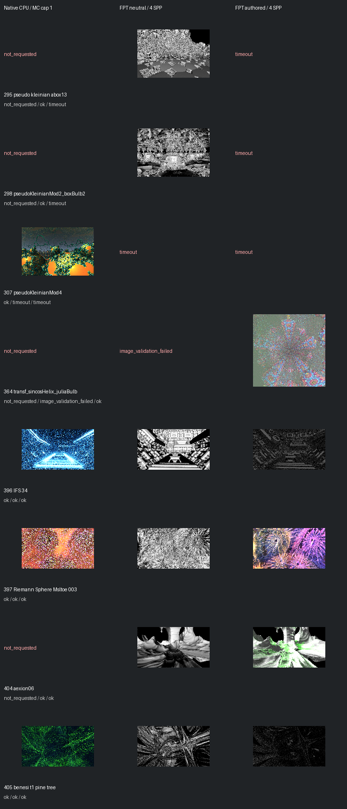

# Fast screening page 2

[Index](README.md)

150px maximum edge; native MC capped at one only when authored MC is enabled. FPT 4 SPP. No gallery promotion.

| ID | Scene | Native | Neutral | Authored |
| --- | --- | --- | --- | --- |
| 295 | pseudo kleinian abox13 | not requested | [geometry](images/295-geometry.png) | timeout |
| 298 | pseudoKleinianMod2_boxBulb2 | not requested | [geometry](images/298-geometry.png) | timeout |
| 307 | pseudoKleinianMod4 | [mandel](images/307-mandel.png) | timeout | timeout |
| 364 | transf_sincosHelix_juliaBulb | not requested | image_validation_failed | [authored](images/364-authored.png) |
| 396 | IFS 34 | [mandel](images/396-mandel.png) | [geometry](images/396-geometry.png) | [authored](images/396-authored.png) |
| 397 | Riemann Sphere Msltoe 003 | [mandel](images/397-mandel.png) | [geometry](images/397-geometry.png) | [authored](images/397-authored.png) |
| 404 | aexion06 | not requested | [geometry](images/404-geometry.png) | [authored](images/404-authored.png) |
| 405 | benesi t1 pine tree | [mandel](images/405-mandel.png) | [geometry](images/405-geometry.png) | [authored](images/405-authored.png) |
