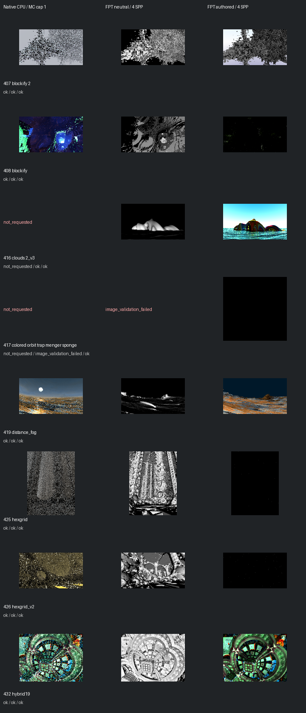

# Fast screening page 3

[Index](README.md)

150px maximum edge; native MC capped at one only when authored MC is enabled. FPT 4 SPP. No gallery promotion.

| ID | Scene | Native | Neutral | Authored |
| --- | --- | --- | --- | --- |
| 407 | blockify 2 | [mandel](images/407-mandel.png) | [geometry](images/407-geometry.png) | [authored](images/407-authored.png) |
| 408 | blockify | [mandel](images/408-mandel.png) | [geometry](images/408-geometry.png) | [authored](images/408-authored.png) |
| 416 | clouds 2_v3 | not requested | [geometry](images/416-geometry.png) | [authored](images/416-authored.png) |
| 417 | colored orbit trap menger sponge | not requested | image_validation_failed | [authored](images/417-authored.png) |
| 419 | distance_fog | [mandel](images/419-mandel.png) | [geometry](images/419-geometry.png) | [authored](images/419-authored.png) |
| 425 | hexgrid | [mandel](images/425-mandel.png) | [geometry](images/425-geometry.png) | [authored](images/425-authored.png) |
| 426 | hexgrid_v2 | [mandel](images/426-mandel.png) | [geometry](images/426-geometry.png) | [authored](images/426-authored.png) |
| 432 | hybrid19 | [mandel](images/432-mandel.png) | [geometry](images/432-geometry.png) | [authored](images/432-authored.png) |
