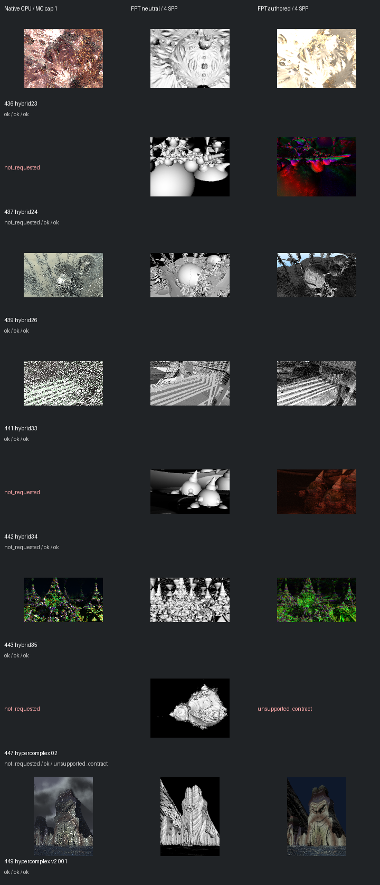

# Fast screening page 4

[Index](README.md)

150px maximum edge; native MC capped at one only when authored MC is enabled. FPT 4 SPP. No gallery promotion.

| ID | Scene | Native | Neutral | Authored |
| --- | --- | --- | --- | --- |
| 436 | hybrid23 | [mandel](images/436-mandel.png) | [geometry](images/436-geometry.png) | [authored](images/436-authored.png) |
| 437 | hybrid24 | not requested | [geometry](images/437-geometry.png) | [authored](images/437-authored.png) |
| 439 | hybrid26 | [mandel](images/439-mandel.png) | [geometry](images/439-geometry.png) | [authored](images/439-authored.png) |
| 441 | hybrid33 | [mandel](images/441-mandel.png) | [geometry](images/441-geometry.png) | [authored](images/441-authored.png) |
| 442 | hybrid34 | not requested | [geometry](images/442-geometry.png) | [authored](images/442-authored.png) |
| 443 | hybrid35 | [mandel](images/443-mandel.png) | [geometry](images/443-geometry.png) | [authored](images/443-authored.png) |
| 447 | hypercomplex 02 | not requested | [geometry](images/447-geometry.png) | unsupported_contract |
| 449 | hypercomplex v2 001 | [mandel](images/449-mandel.png) | [geometry](images/449-geometry.png) | [authored](images/449-authored.png) |
