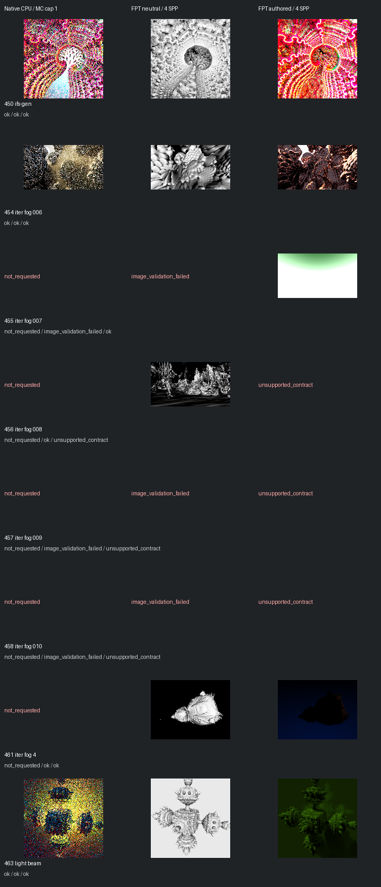

# Fast screening page 5

[Index](README.md)

150px maximum edge; native MC capped at one only when authored MC is enabled. FPT 4 SPP. No gallery promotion.

| ID | Scene | Native | Neutral | Authored |
| --- | --- | --- | --- | --- |
| 450 | ifs-gen | [mandel](images/450-mandel.png) | [geometry](images/450-geometry.png) | [authored](images/450-authored.png) |
| 454 | iter fog 006 | [mandel](images/454-mandel.png) | [geometry](images/454-geometry.png) | [authored](images/454-authored.png) |
| 455 | iter fog 007 | not requested | image_validation_failed | [authored](images/455-authored.png) |
| 456 | iter fog 008 | not requested | [geometry](images/456-geometry.png) | unsupported_contract |
| 457 | iter fog 009 | not requested | image_validation_failed | unsupported_contract |
| 458 | iter fog 010 | not requested | image_validation_failed | unsupported_contract |
| 461 | iter fog 4 | not requested | [geometry](images/461-geometry.png) | [authored](images/461-authored.png) |
| 463 | light beam | [mandel](images/463-mandel.png) | [geometry](images/463-geometry.png) | [authored](images/463-authored.png) |
