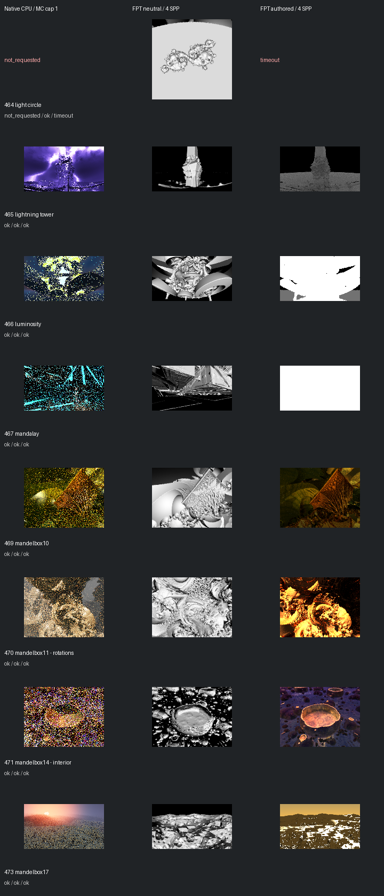

# Fast screening page 6

[Index](README.md)

150px maximum edge; native MC capped at one only when authored MC is enabled. FPT 4 SPP. No gallery promotion.

| ID | Scene | Native | Neutral | Authored |
| --- | --- | --- | --- | --- |
| 464 | light circle | not requested | [geometry](images/464-geometry.png) | timeout |
| 465 | lightning tower | [mandel](images/465-mandel.png) | [geometry](images/465-geometry.png) | [authored](images/465-authored.png) |
| 466 | luminosity | [mandel](images/466-mandel.png) | [geometry](images/466-geometry.png) | [authored](images/466-authored.png) |
| 467 | mandalay | [mandel](images/467-mandel.png) | [geometry](images/467-geometry.png) | [authored](images/467-authored.png) |
| 469 | mandelbox10 | [mandel](images/469-mandel.png) | [geometry](images/469-geometry.png) | [authored](images/469-authored.png) |
| 470 | mandelbox11 - rotations | [mandel](images/470-mandel.png) | [geometry](images/470-geometry.png) | [authored](images/470-authored.png) |
| 471 | mandelbox14 - interior | [mandel](images/471-mandel.png) | [geometry](images/471-geometry.png) | [authored](images/471-authored.png) |
| 473 | mandelbox17 | [mandel](images/473-mandel.png) | [geometry](images/473-geometry.png) | [authored](images/473-authored.png) |
