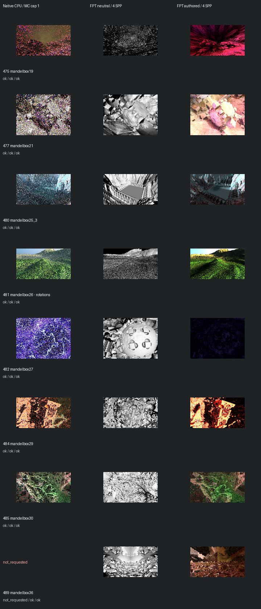

# Fast screening page 7

[Index](README.md)

150px maximum edge; native MC capped at one only when authored MC is enabled. FPT 4 SPP. No gallery promotion.

| ID | Scene | Native | Neutral | Authored |
| --- | --- | --- | --- | --- |
| 475 | mandelbox19 | [mandel](images/475-mandel.png) | [geometry](images/475-geometry.png) | [authored](images/475-authored.png) |
| 477 | mandelbox21 | [mandel](images/477-mandel.png) | [geometry](images/477-geometry.png) | [authored](images/477-authored.png) |
| 480 | mandelbox25_3 | [mandel](images/480-mandel.png) | [geometry](images/480-geometry.png) | [authored](images/480-authored.png) |
| 481 | mandelbox26 - rotations | [mandel](images/481-mandel.png) | [geometry](images/481-geometry.png) | [authored](images/481-authored.png) |
| 482 | mandelbox27 | [mandel](images/482-mandel.png) | [geometry](images/482-geometry.png) | [authored](images/482-authored.png) |
| 484 | mandelbox29 | [mandel](images/484-mandel.png) | [geometry](images/484-geometry.png) | [authored](images/484-authored.png) |
| 485 | mandelbox30 | [mandel](images/485-mandel.png) | [geometry](images/485-geometry.png) | [authored](images/485-authored.png) |
| 489 | mandelbox36 | not requested | [geometry](images/489-geometry.png) | [authored](images/489-authored.png) |
