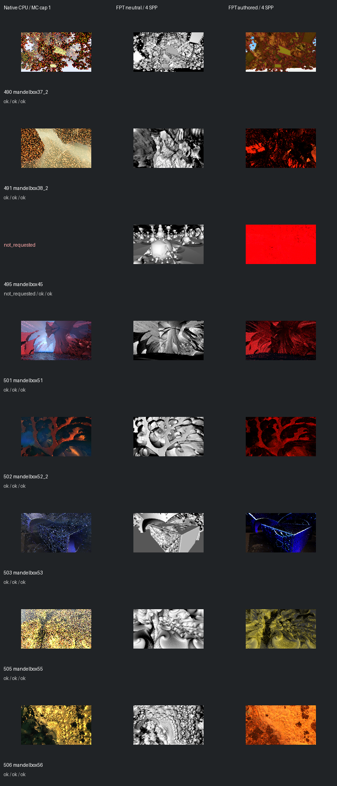

# Fast screening page 8

[Index](README.md)

150px maximum edge; native MC capped at one only when authored MC is enabled. FPT 4 SPP. No gallery promotion.

| ID | Scene | Native | Neutral | Authored |
| --- | --- | --- | --- | --- |
| 490 | mandelbox37_2 | [mandel](images/490-mandel.png) | [geometry](images/490-geometry.png) | [authored](images/490-authored.png) |
| 491 | mandelbox38_2 | [mandel](images/491-mandel.png) | [geometry](images/491-geometry.png) | [authored](images/491-authored.png) |
| 495 | mandelbox45 | not requested | [geometry](images/495-geometry.png) | [authored](images/495-authored.png) |
| 501 | mandelbox51 | [mandel](images/501-mandel.png) | [geometry](images/501-geometry.png) | [authored](images/501-authored.png) |
| 502 | mandelbox52_2 | [mandel](images/502-mandel.png) | [geometry](images/502-geometry.png) | [authored](images/502-authored.png) |
| 503 | mandelbox53 | [mandel](images/503-mandel.png) | [geometry](images/503-geometry.png) | [authored](images/503-authored.png) |
| 505 | mandelbox55 | [mandel](images/505-mandel.png) | [geometry](images/505-geometry.png) | [authored](images/505-authored.png) |
| 506 | mandelbox56 | [mandel](images/506-mandel.png) | [geometry](images/506-geometry.png) | [authored](images/506-authored.png) |
