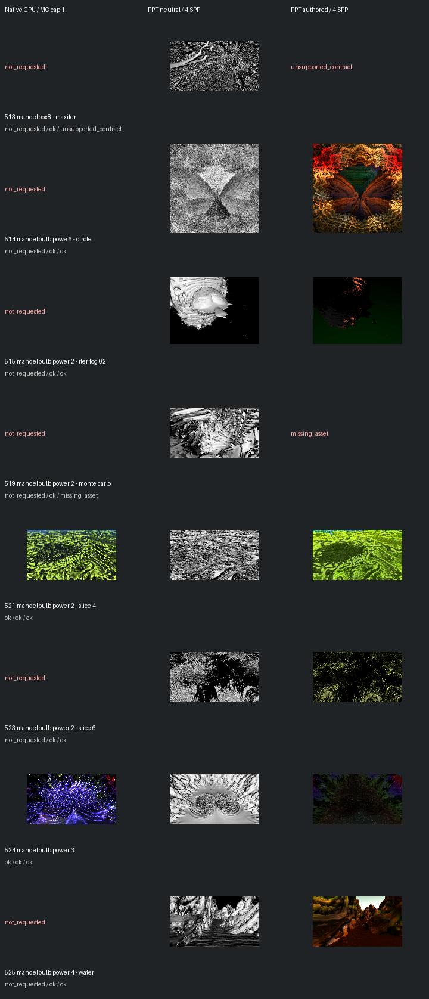

# Fast screening page 9

[Index](README.md)

150px maximum edge; native MC capped at one only when authored MC is enabled. FPT 4 SPP. No gallery promotion.

| ID | Scene | Native | Neutral | Authored |
| --- | --- | --- | --- | --- |
| 513 | mandelbox8 - maxiter | not requested | [geometry](images/513-geometry.png) | unsupported_contract |
| 514 | mandelbulb powe 6 - circle | not requested | [geometry](images/514-geometry.png) | [authored](images/514-authored.png) |
| 515 | mandelbulb power 2 - iter fog 02 | not requested | [geometry](images/515-geometry.png) | [authored](images/515-authored.png) |
| 519 | mandelbulb power 2 - monte carlo | not requested | [geometry](images/519-geometry.png) | missing_asset |
| 521 | mandelbulb power 2 - slice 4 | [mandel](images/521-mandel.png) | [geometry](images/521-geometry.png) | [authored](images/521-authored.png) |
| 523 | mandelbulb power 2 - slice 6 | not requested | [geometry](images/523-geometry.png) | [authored](images/523-authored.png) |
| 524 | mandelbulb power 3 | [mandel](images/524-mandel.png) | [geometry](images/524-geometry.png) | [authored](images/524-authored.png) |
| 525 | mandelbulb power 4 - water | not requested | [geometry](images/525-geometry.png) | [authored](images/525-authored.png) |
