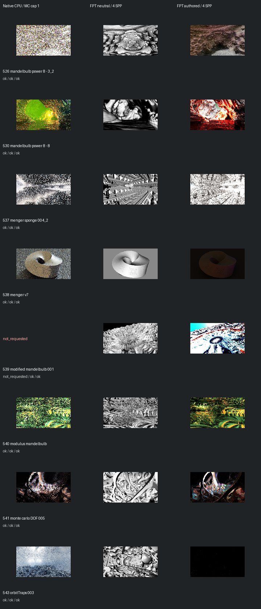

# Fast screening page 10

[Index](README.md)

150px maximum edge; native MC capped at one only when authored MC is enabled. FPT 4 SPP. No gallery promotion.

| ID | Scene | Native | Neutral | Authored |
| --- | --- | --- | --- | --- |
| 526 | mandelbulb power 8 - 3_2 | [mandel](images/526-mandel.png) | [geometry](images/526-geometry.png) | [authored](images/526-authored.png) |
| 530 | mandelbulb power 8 - 8 | [mandel](images/530-mandel.png) | [geometry](images/530-geometry.png) | [authored](images/530-authored.png) |
| 537 | menger sponge 004_2 | [mandel](images/537-mandel.png) | [geometry](images/537-geometry.png) | [authored](images/537-authored.png) |
| 538 | menger v7 | [mandel](images/538-mandel.png) | [geometry](images/538-geometry.png) | [authored](images/538-authored.png) |
| 539 | modified mandelbulb 001 | not requested | [geometry](images/539-geometry.png) | [authored](images/539-authored.png) |
| 540 | modulus mandelbulb | [mandel](images/540-mandel.png) | [geometry](images/540-geometry.png) | [authored](images/540-authored.png) |
| 541 | monte carlo DOF 005 | [mandel](images/541-mandel.png) | [geometry](images/541-geometry.png) | [authored](images/541-authored.png) |
| 543 | orbitTraps 003 | [mandel](images/543-mandel.png) | [geometry](images/543-geometry.png) | [authored](images/543-authored.png) |
