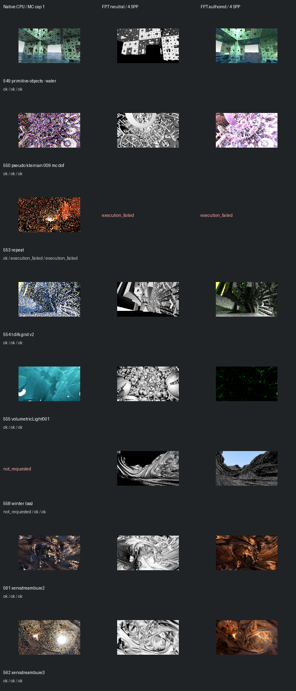

# Fast screening page 11

[Index](README.md)

150px maximum edge; native MC capped at one only when authored MC is enabled. FPT 4 SPP. No gallery promotion.

| ID | Scene | Native | Neutral | Authored |
| --- | --- | --- | --- | --- |
| 549 | primitive objects - water | [mandel](images/549-mandel.png) | [geometry](images/549-geometry.png) | [authored](images/549-authored.png) |
| 550 | pseudo kleinian 009 mc dof | [mandel](images/550-mandel.png) | [geometry](images/550-geometry.png) | [authored](images/550-authored.png) |
| 553 | repeat | [mandel](images/553-mandel.png) | execution_failed | execution_failed |
| 554 | t difs grid v2 | [mandel](images/554-mandel.png) | [geometry](images/554-geometry.png) | [authored](images/554-authored.png) |
| 555 | volumetricLight001 | [mandel](images/555-mandel.png) | [geometry](images/555-geometry.png) | [authored](images/555-authored.png) |
| 558 | winter (sss) | not requested | [geometry](images/558-geometry.png) | [authored](images/558-authored.png) |
| 561 | xenodreambuie2 | [mandel](images/561-mandel.png) | [geometry](images/561-geometry.png) | [authored](images/561-authored.png) |
| 562 | xenodreambuie3 | [mandel](images/562-mandel.png) | [geometry](images/562-geometry.png) | [authored](images/562-authored.png) |
