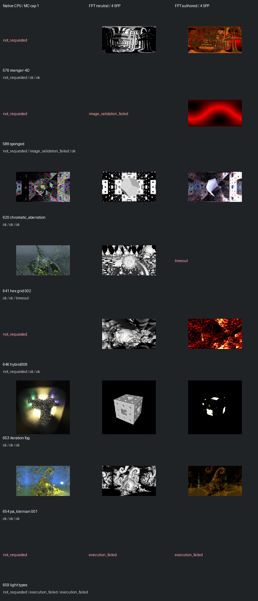

# Fast screening page 12

[Index](README.md)

150px maximum edge; native MC capped at one only when authored MC is enabled. FPT 4 SPP. No gallery promotion.

| ID | Scene | Native | Neutral | Authored |
| --- | --- | --- | --- | --- |
| 576 | menger-4D | not requested | [geometry](images/576-geometry.png) | [authored](images/576-authored.png) |
| 589 | sponged | not requested | image_validation_failed | [authored](images/589-authored.png) |
| 620 | chromatic_aberration | [mandel](images/620-mandel.png) | [geometry](images/620-geometry.png) | [authored](images/620-authored.png) |
| 641 | hex grid 002 | [mandel](images/641-mandel.png) | [geometry](images/641-geometry.png) | timeout |
| 646 | hybrid006 | not requested | [geometry](images/646-geometry.png) | [authored](images/646-authored.png) |
| 653 | iteration fog | [mandel](images/653-mandel.png) | [geometry](images/653-geometry.png) | [authored](images/653-authored.png) |
| 654 | jos_kleinian 001 | [mandel](images/654-mandel.png) | [geometry](images/654-geometry.png) | [authored](images/654-authored.png) |
| 659 | light types | not requested | execution_failed | execution_failed |
