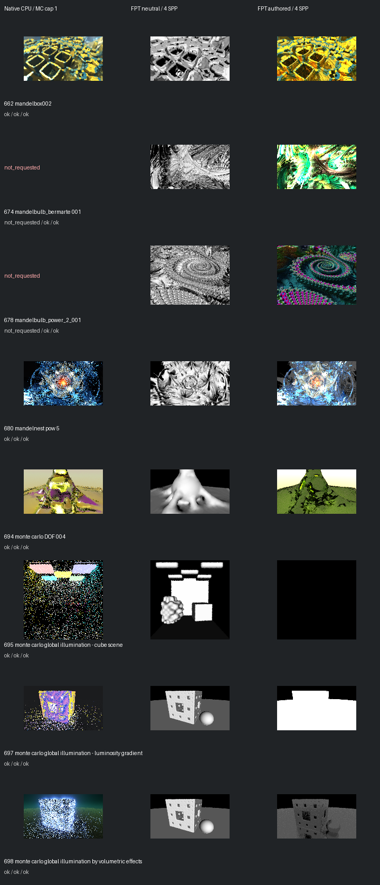

# Fast screening page 13

[Index](README.md)

150px maximum edge; native MC capped at one only when authored MC is enabled. FPT 4 SPP. No gallery promotion.

| ID | Scene | Native | Neutral | Authored |
| --- | --- | --- | --- | --- |
| 662 | mandelbox002 | [mandel](images/662-mandel.png) | [geometry](images/662-geometry.png) | [authored](images/662-authored.png) |
| 674 | mandelbulb_bermarte 001 | not requested | [geometry](images/674-geometry.png) | [authored](images/674-authored.png) |
| 678 | mandelbulb_power_2_001 | not requested | [geometry](images/678-geometry.png) | [authored](images/678-authored.png) |
| 680 | mandelnest pow 5 | [mandel](images/680-mandel.png) | [geometry](images/680-geometry.png) | [authored](images/680-authored.png) |
| 694 | monte carlo DOF 004 | [mandel](images/694-mandel.png) | [geometry](images/694-geometry.png) | [authored](images/694-authored.png) |
| 695 | monte carlo global illumination - cube scene | [mandel](images/695-mandel.png) | [geometry](images/695-geometry.png) | [authored](images/695-authored.png) |
| 697 | monte carlo global illumination - luminosity gradient | [mandel](images/697-mandel.png) | [geometry](images/697-geometry.png) | [authored](images/697-authored.png) |
| 698 | monte carlo global illumination by volumetric effects | [mandel](images/698-mandel.png) | [geometry](images/698-geometry.png) | [authored](images/698-authored.png) |
