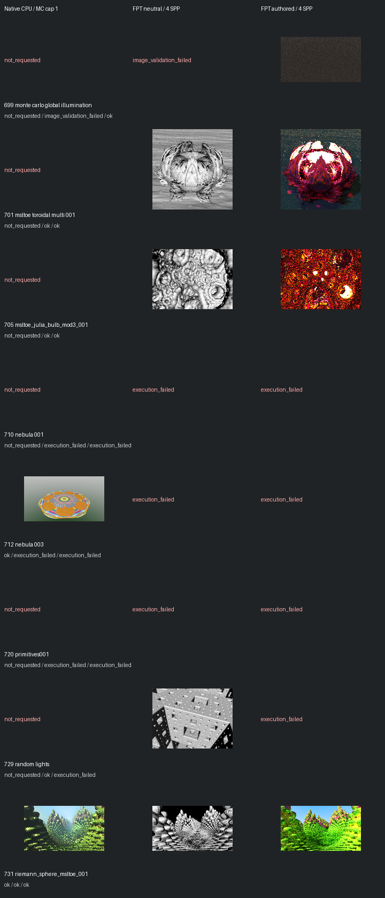

# Fast screening page 14

[Index](README.md)

150px maximum edge; native MC capped at one only when authored MC is enabled. FPT 4 SPP. No gallery promotion.

| ID | Scene | Native | Neutral | Authored |
| --- | --- | --- | --- | --- |
| 699 | monte carlo global illumination | not requested | image_validation_failed | [authored](images/699-authored.png) |
| 701 | msltoe toroidal multi 001 | not requested | [geometry](images/701-geometry.png) | [authored](images/701-authored.png) |
| 705 | msltoe_julia_bulb_mod3_001 | not requested | [geometry](images/705-geometry.png) | [authored](images/705-authored.png) |
| 710 | nebula 001 | not requested | execution_failed | execution_failed |
| 712 | nebula 003 | [mandel](images/712-mandel.png) | execution_failed | execution_failed |
| 720 | primitives001 | not requested | execution_failed | execution_failed |
| 729 | random lights | not requested | [geometry](images/729-geometry.png) | execution_failed |
| 731 | riemann_sphere_msltoe_001 | [mandel](images/731-mandel.png) | [geometry](images/731-geometry.png) | [authored](images/731-authored.png) |
