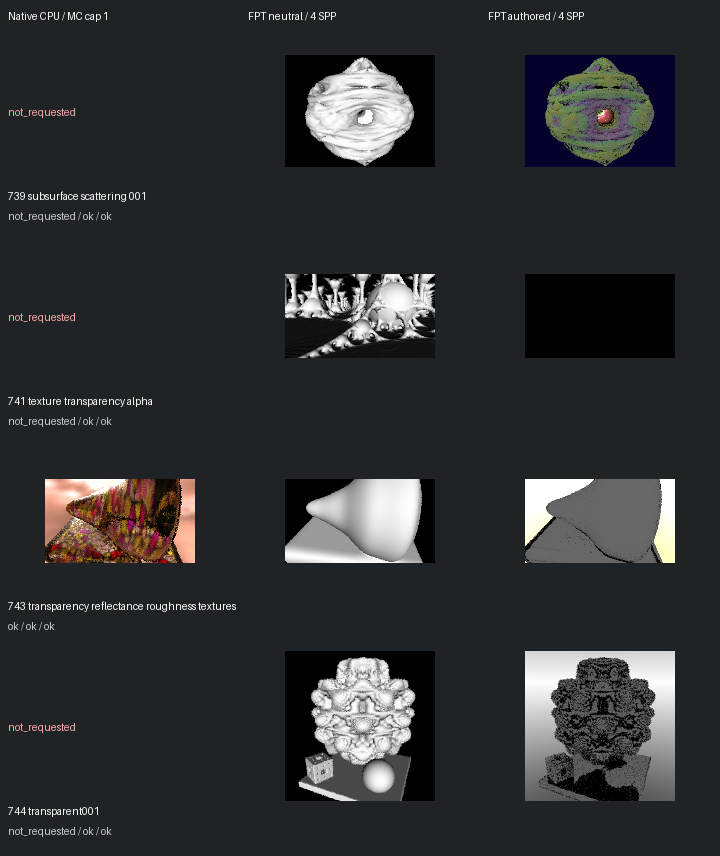

# Fast screening page 15

[Index](README.md)

150px maximum edge; native MC capped at one only when authored MC is enabled. FPT 4 SPP. No gallery promotion.

| ID | Scene | Native | Neutral | Authored |
| --- | --- | --- | --- | --- |
| 739 | subsurface scattering 001 | not requested | [geometry](images/739-geometry.png) | [authored](images/739-authored.png) |
| 741 | texture transparency alpha | not requested | [geometry](images/741-geometry.png) | [authored](images/741-authored.png) |
| 743 | transparency reflectance roughness textures | [mandel](images/743-mandel.png) | [geometry](images/743-geometry.png) | [authored](images/743-authored.png) |
| 744 | transparent001 | not requested | [geometry](images/744-geometry.png) | [authored](images/744-authored.png) |
