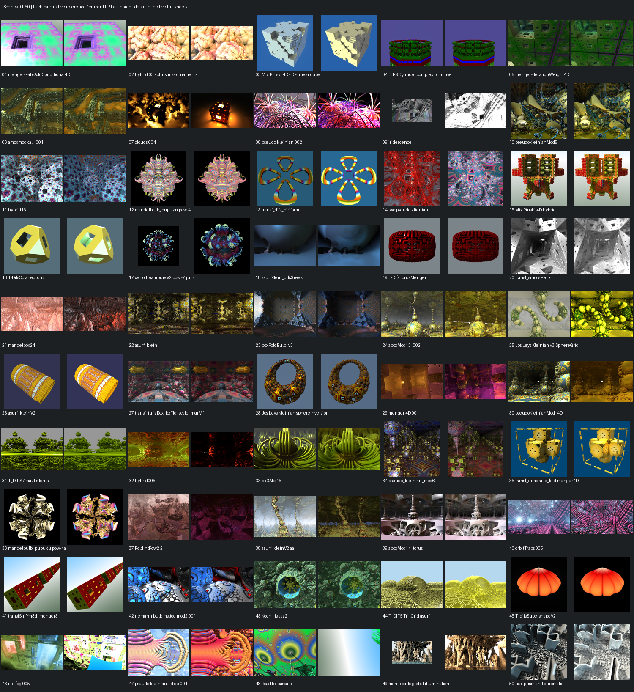
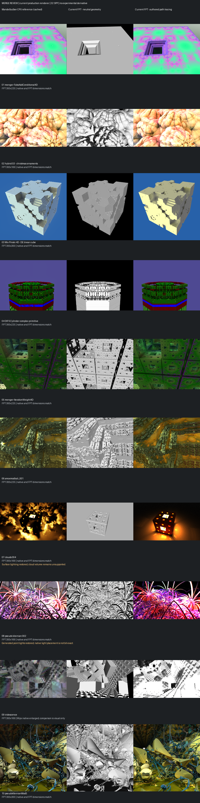
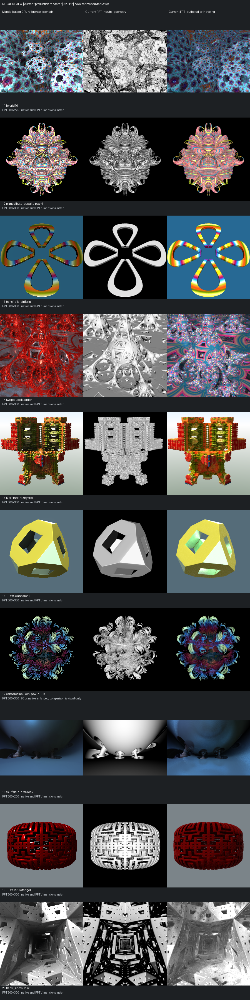
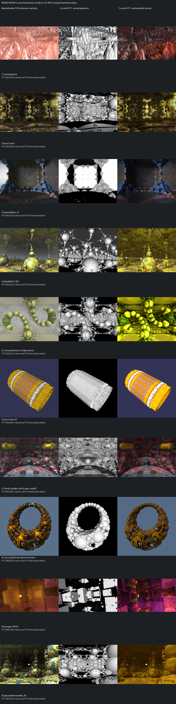
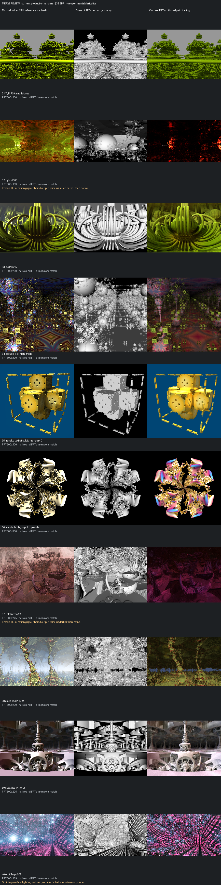
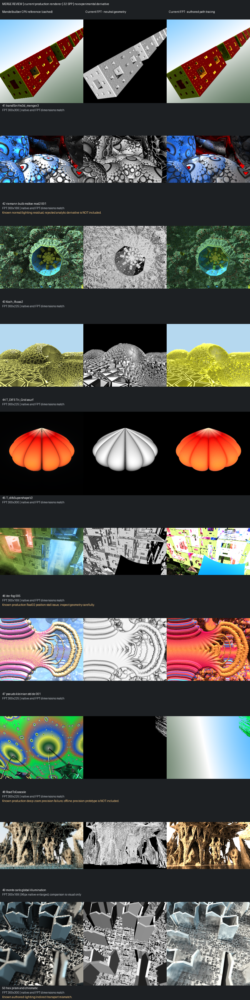

# Mandelbulber Ranked-50 Review Gallery

[Back to FPT Metal](../../README.md)

**All 50 scenes rendered in both FPT modes. This is a review gallery, not a claim of full Mandelbulber parity.**

These are continuous procedural **FPT Metal** renders, not NAADF voxel images. FPT captures were regenerated after the point, generated-light and orbit-trap surface-lighting fixes, at **300 pixels on the longest edge, 32 SPP**, with authored aspect ratio and unchanged default bounce settings. No rejected analytic-derivative or offline precision prototype is substituted.

Each detailed row shows **cached Mandelbulber CPU reference / FPT neutral geometry / FPT authored path tracing**. Neutral geometry intentionally uses different material/lighting controls; it is not an appearance-parity target.

Native references are hash-verified earlier captures, not a new native render run. References for **09, 17 and 49** have only 96 pixels on their longest edge and are explicitly enlarged. The other 47 references match the FPT dimensions. Native sampling/lighting are not identical to FPT.

## Known Limitations

- **46:** unresolved float32 position stalls; geometry is not certified.
- **48:** major deep-zoom geometry failure in the production renderer. Included for transparency, not as a supported showcase.
- **07 and 40:** restored surface lighting does not implement clouds or volumetric light halos.
- **08:** generated lights restore illumination, but native light placement/colour is not certified byte-exact.
- **42:** normal/lighting residual remains; the rejected derivative experiment is not enabled.
- **32 and 37:** substantial authored illumination gaps remain; these are still darker than the native references.
- Palettes, exposure, materials, sky and indirect illumination can still differ. These images are not new performance benchmarks.

## Overview

Each pair: native reference on the left, current FPT authored on the right.

## Detailed Comparisons

### Scenes 01-10

### Scenes 11-20

### Scenes 21-30

### Scenes 31-40

### Scenes 41-50

## Sources and Capture Identity

Scene names and collection credits are retained below; links point to the source examples. This gallery does not bundle the source `.fract` files, generated formula code, metallibs, or voxel volumes. Source collection licence labels are preserved, not replaced by this repository's licence.

| Scene | Source | Collection credit |
| --- | --- | --- |
| 01 | [menger-FabsAddConditional4D](https://github.com/buddhi1980/mandelbulber2/blob/230456cee40968cbaa7f301bba91daa4865a29db/mandelbulber2/deploy/share/mandelbulber2/examples/Robert%20Pancoast%20collection%20-%20license%20Creative%20Commons%20%28CC-BY%204.0%29/menger-FabsAddConditional4D.fract) | Robert Pancoast collection - license Creative Commons (CC-BY 4.0) |
| 02 | [hybrid 03 - christmas ornaments](https://github.com/buddhi1980/mandelbulber2/blob/230456cee40968cbaa7f301bba91daa4865a29db/mandelbulber2/deploy/share/mandelbulber2/examples/Sebastian%20Jennen%20collection%20-%20license%20Creative%20Commons%20%20%28CC-BY%204.0%29/hybrid%2003%20-%20christmas%20ornaments.fract) | Sebastian Jennen collection - license Creative Commons  (CC-BY 4.0) |
| 03 | [Mix Pinski 4D - DE linear cube](https://github.com/buddhi1980/mandelbulber2/blob/230456cee40968cbaa7f301bba91daa4865a29db/mandelbulber2/deploy/share/mandelbulber2/examples/Graeme%20McLaren%20%20collection%20-%20license%20Creative%20Commons%20%20%28CC-BY%204.0%29/Mix%20Pinski%204D%20-%20DE%20linear%20cube.fract) | Graeme McLaren  collection - license Creative Commons  (CC-BY 4.0) |
| 04 | [DIFS Cylinder complex primitive](https://github.com/buddhi1980/mandelbulber2/blob/230456cee40968cbaa7f301bba91daa4865a29db/mandelbulber2/deploy/share/mandelbulber2/examples/Graeme%20McLaren%20%20collection%20-%20license%20Creative%20Commons%20%20%28CC-BY%204.0%29/DIFS%20Cylinder%20complex%20primitive.fract) | Graeme McLaren  collection - license Creative Commons  (CC-BY 4.0) |
| 05 | [menger-IterationWeight4D](https://github.com/buddhi1980/mandelbulber2/blob/230456cee40968cbaa7f301bba91daa4865a29db/mandelbulber2/deploy/share/mandelbulber2/examples/Robert%20Pancoast%20collection%20-%20license%20Creative%20Commons%20%28CC-BY%204.0%29/menger-IterationWeight4D.fract) | Robert Pancoast collection - license Creative Commons (CC-BY 4.0) |
| 06 | [amoxmodkali_001](https://github.com/buddhi1980/mandelbulber2/blob/230456cee40968cbaa7f301bba91daa4865a29db/mandelbulber2/deploy/share/mandelbulber2/examples/amoxmodkali_001.fract) | Mandelbulber example collection |
| 07 | [clouds 004](https://github.com/buddhi1980/mandelbulber2/blob/230456cee40968cbaa7f301bba91daa4865a29db/mandelbulber2/deploy/share/mandelbulber2/examples/clouds%20004.fract) | Mandelbulber example collection |
| 08 | [pseudo kleinian 002](https://github.com/buddhi1980/mandelbulber2/blob/230456cee40968cbaa7f301bba91daa4865a29db/mandelbulber2/deploy/share/mandelbulber2/examples/pseudo%20kleinian%20002.fract) | Mandelbulber example collection |
| 09 | [iridescence](https://github.com/buddhi1980/mandelbulber2/blob/230456cee40968cbaa7f301bba91daa4865a29db/mandelbulber2/deploy/share/mandelbulber2/examples/Krzysztof%20Marczak%20collection%20-%20license%20Creative%20Commons%20%28CC-BY%204.0%29/iridescence.fract) | Krzysztof Marczak collection - license Creative Commons (CC-BY 4.0) |
| 10 | [pseudoKleinianMod5](https://github.com/buddhi1980/mandelbulber2/blob/230456cee40968cbaa7f301bba91daa4865a29db/mandelbulber2/deploy/share/mandelbulber2/examples/Graeme%20McLaren%20%20collection%20-%20license%20Creative%20Commons%20%20%28CC-BY%204.0%29/pseudoKleinianMod5.fract) | Graeme McLaren  collection - license Creative Commons  (CC-BY 4.0) |
| 11 | [hybrid16](https://github.com/buddhi1980/mandelbulber2/blob/230456cee40968cbaa7f301bba91daa4865a29db/mandelbulber2/deploy/share/mandelbulber2/examples/Krzysztof%20Marczak%20collection%20-%20license%20Creative%20Commons%20%28CC-BY%204.0%29/hybrid16.fract) | Krzysztof Marczak collection - license Creative Commons (CC-BY 4.0) |
| 12 | [mandelbulb_pupuku pow-4](https://github.com/buddhi1980/mandelbulber2/blob/230456cee40968cbaa7f301bba91daa4865a29db/mandelbulber2/deploy/share/mandelbulber2/examples/Graeme%20McLaren%20%20collection%20-%20license%20Creative%20Commons%20%20%28CC-BY%204.0%29/mandelbulb_pupuku%20pow-4.fract) | Graeme McLaren  collection - license Creative Commons  (CC-BY 4.0) |
| 13 | [transf_difs_piriform](https://github.com/buddhi1980/mandelbulber2/blob/230456cee40968cbaa7f301bba91daa4865a29db/mandelbulber2/deploy/share/mandelbulber2/examples/Graeme%20McLaren%20%20collection%20-%20license%20Creative%20Commons%20%20%28CC-BY%204.0%29/transf_difs_piriform.fract) | Graeme McLaren  collection - license Creative Commons  (CC-BY 4.0) |
| 14 | [two pseudo klienian](https://github.com/buddhi1980/mandelbulber2/blob/230456cee40968cbaa7f301bba91daa4865a29db/mandelbulber2/deploy/share/mandelbulber2/examples/Krzysztof%20Marczak%20collection%20-%20license%20Creative%20Commons%20%28CC-BY%204.0%29/two%20pseudo%20klienian.fract) | Krzysztof Marczak collection - license Creative Commons (CC-BY 4.0) |
| 15 | [Mix Pinski 4D hybrid](https://github.com/buddhi1980/mandelbulber2/blob/230456cee40968cbaa7f301bba91daa4865a29db/mandelbulber2/deploy/share/mandelbulber2/examples/Graeme%20McLaren%20%20collection%20-%20license%20Creative%20Commons%20%20%28CC-BY%204.0%29/Mix%20Pinski%204D%20hybrid.fract) | Graeme McLaren  collection - license Creative Commons  (CC-BY 4.0) |
| 16 | [T-DifsOctahedron2](https://github.com/buddhi1980/mandelbulber2/blob/230456cee40968cbaa7f301bba91daa4865a29db/mandelbulber2/deploy/share/mandelbulber2/examples/Graeme%20McLaren%20%20collection%20-%20license%20Creative%20Commons%20%20%28CC-BY%204.0%29/T-DifsOctahedron2.fract) | Graeme McLaren  collection - license Creative Commons  (CC-BY 4.0) |
| 17 | [xenodreambuieV2  pow -7 julia](https://github.com/buddhi1980/mandelbulber2/blob/230456cee40968cbaa7f301bba91daa4865a29db/mandelbulber2/deploy/share/mandelbulber2/examples/Graeme%20McLaren%20%20collection%20-%20license%20Creative%20Commons%20%20%28CC-BY%204.0%29/xenodreambuieV2%20%20pow%20-7%20julia.fract) | Graeme McLaren  collection - license Creative Commons  (CC-BY 4.0) |
| 18 | [asurfKlein_difsGreek](https://github.com/buddhi1980/mandelbulber2/blob/230456cee40968cbaa7f301bba91daa4865a29db/mandelbulber2/deploy/share/mandelbulber2/examples/Graeme%20McLaren%20%20collection%20-%20license%20Creative%20Commons%20%20%28CC-BY%204.0%29/asurfKlein_difsGreek.fract) | Graeme McLaren  collection - license Creative Commons  (CC-BY 4.0) |
| 19 | [T-DifsTorusMenger](https://github.com/buddhi1980/mandelbulber2/blob/230456cee40968cbaa7f301bba91daa4865a29db/mandelbulber2/deploy/share/mandelbulber2/examples/Graeme%20McLaren%20%20collection%20-%20license%20Creative%20Commons%20%20%28CC-BY%204.0%29/T-DifsTorusMenger.fract) | Graeme McLaren  collection - license Creative Commons  (CC-BY 4.0) |
| 20 | [transf_sincosHelix](https://github.com/buddhi1980/mandelbulber2/blob/230456cee40968cbaa7f301bba91daa4865a29db/mandelbulber2/deploy/share/mandelbulber2/examples/Graeme%20McLaren%20%20collection%20-%20license%20Creative%20Commons%20%20%28CC-BY%204.0%29/transf_sincosHelix.fract) | Graeme McLaren  collection - license Creative Commons  (CC-BY 4.0) |
| 21 | [mandelbox24](https://github.com/buddhi1980/mandelbulber2/blob/230456cee40968cbaa7f301bba91daa4865a29db/mandelbulber2/deploy/share/mandelbulber2/examples/Krzysztof%20Marczak%20collection%20-%20license%20Creative%20Commons%20%28CC-BY%204.0%29/mandelbox24.fract) | Krzysztof Marczak collection - license Creative Commons (CC-BY 4.0) |
| 22 | [asurf_klein](https://github.com/buddhi1980/mandelbulber2/blob/230456cee40968cbaa7f301bba91daa4865a29db/mandelbulber2/deploy/share/mandelbulber2/examples/Graeme%20McLaren%20%20collection%20-%20license%20Creative%20Commons%20%20%28CC-BY%204.0%29/asurf_klein.fract) | Graeme McLaren  collection - license Creative Commons  (CC-BY 4.0) |
| 23 | [boxFoldBulb_v3](https://github.com/buddhi1980/mandelbulber2/blob/230456cee40968cbaa7f301bba91daa4865a29db/mandelbulber2/deploy/share/mandelbulber2/examples/Graeme%20McLaren%20%20collection%20-%20license%20Creative%20Commons%20%20%28CC-BY%204.0%29/boxFoldBulb_v3.fract) | Graeme McLaren  collection - license Creative Commons  (CC-BY 4.0) |
| 24 | [aboxMod13_002](https://github.com/buddhi1980/mandelbulber2/blob/230456cee40968cbaa7f301bba91daa4865a29db/mandelbulber2/deploy/share/mandelbulber2/examples/Graeme%20McLaren%20%20collection%20-%20license%20Creative%20Commons%20%20%28CC-BY%204.0%29/aboxMod13_002.fract) | Graeme McLaren  collection - license Creative Commons  (CC-BY 4.0) |
| 25 | [Jos Leys Kleinian v3 SphereGrid](https://github.com/buddhi1980/mandelbulber2/blob/230456cee40968cbaa7f301bba91daa4865a29db/mandelbulber2/deploy/share/mandelbulber2/examples/Graeme%20McLaren%20%20collection%20-%20license%20Creative%20Commons%20%20%28CC-BY%204.0%29/Jos%20Leys%20Kleinian%20v3%20SphereGrid.fract) | Graeme McLaren  collection - license Creative Commons  (CC-BY 4.0) |
| 26 | [asurf_kleinV2](https://github.com/buddhi1980/mandelbulber2/blob/230456cee40968cbaa7f301bba91daa4865a29db/mandelbulber2/deploy/share/mandelbulber2/examples/Graeme%20McLaren%20%20collection%20-%20license%20Creative%20Commons%20%20%28CC-BY%204.0%29/asurf_kleinV2.fract) | Graeme McLaren  collection - license Creative Commons  (CC-BY 4.0) |
| 27 | [transf_juliaBox_bxFld_scale_mgrM1](https://github.com/buddhi1980/mandelbulber2/blob/230456cee40968cbaa7f301bba91daa4865a29db/mandelbulber2/deploy/share/mandelbulber2/examples/Graeme%20McLaren%20%20collection%20-%20license%20Creative%20Commons%20%20%28CC-BY%204.0%29/transf_juliaBox_bxFld_scale_mgrM1.fract) | Graeme McLaren  collection - license Creative Commons  (CC-BY 4.0) |
| 28 | [Jos Leys Kleinian sphereInversion](https://github.com/buddhi1980/mandelbulber2/blob/230456cee40968cbaa7f301bba91daa4865a29db/mandelbulber2/deploy/share/mandelbulber2/examples/Graeme%20McLaren%20%20collection%20-%20license%20Creative%20Commons%20%20%28CC-BY%204.0%29/Jos%20Leys%20Kleinian%20sphereInversion.fract) | Graeme McLaren  collection - license Creative Commons  (CC-BY 4.0) |
| 29 | [menger 4D 001](https://github.com/buddhi1980/mandelbulber2/blob/230456cee40968cbaa7f301bba91daa4865a29db/mandelbulber2/deploy/share/mandelbulber2/examples/menger%204D%20001.fract) | Mandelbulber example collection |
| 30 | [pseudoKleinianMod_4D](https://github.com/buddhi1980/mandelbulber2/blob/230456cee40968cbaa7f301bba91daa4865a29db/mandelbulber2/deploy/share/mandelbulber2/examples/Graeme%20McLaren%20%20collection%20-%20license%20Creative%20Commons%20%20%28CC-BY%204.0%29/pseudoKleinianMod_4D.fract) | Graeme McLaren  collection - license Creative Commons  (CC-BY 4.0) |
| 31 | [T_DIFS AmazIfs torus](https://github.com/buddhi1980/mandelbulber2/blob/230456cee40968cbaa7f301bba91daa4865a29db/mandelbulber2/deploy/share/mandelbulber2/examples/Graeme%20McLaren%20%20collection%20-%20license%20Creative%20Commons%20%20%28CC-BY%204.0%29/T_DIFS%20AmazIfs%20torus.fract) | Graeme McLaren  collection - license Creative Commons  (CC-BY 4.0) |
| 32 | [hybrid005](https://github.com/buddhi1980/mandelbulber2/blob/230456cee40968cbaa7f301bba91daa4865a29db/mandelbulber2/deploy/share/mandelbulber2/examples/hybrid005.fract) | Mandelbulber example collection |
| 33 | [pk3Abx15](https://github.com/buddhi1980/mandelbulber2/blob/230456cee40968cbaa7f301bba91daa4865a29db/mandelbulber2/deploy/share/mandelbulber2/examples/Graeme%20McLaren%20%20collection%20-%20license%20Creative%20Commons%20%20%28CC-BY%204.0%29/pk3Abx15.fract) | Graeme McLaren  collection - license Creative Commons  (CC-BY 4.0) |
| 34 | [pseudo_kleinian_mod6](https://github.com/buddhi1980/mandelbulber2/blob/230456cee40968cbaa7f301bba91daa4865a29db/mandelbulber2/deploy/share/mandelbulber2/examples/Graeme%20McLaren%20%20collection%20-%20license%20Creative%20Commons%20%20%28CC-BY%204.0%29/pseudo_kleinian_mod6.fract) | Graeme McLaren  collection - license Creative Commons  (CC-BY 4.0) |
| 35 | [transf_quadratic_fold menger4D](https://github.com/buddhi1980/mandelbulber2/blob/230456cee40968cbaa7f301bba91daa4865a29db/mandelbulber2/deploy/share/mandelbulber2/examples/Graeme%20McLaren%20%20collection%20-%20license%20Creative%20Commons%20%20%28CC-BY%204.0%29/transf_quadratic_fold%20menger4D.fract) | Graeme McLaren  collection - license Creative Commons  (CC-BY 4.0) |
| 36 | [mandelbulb_pupuku pow-4a](https://github.com/buddhi1980/mandelbulber2/blob/230456cee40968cbaa7f301bba91daa4865a29db/mandelbulber2/deploy/share/mandelbulber2/examples/Graeme%20McLaren%20%20collection%20-%20license%20Creative%20Commons%20%20%28CC-BY%204.0%29/mandelbulb_pupuku%20pow-4a.fract) | Graeme McLaren  collection - license Creative Commons  (CC-BY 4.0) |
| 37 | [FoldIntPow2 2](https://github.com/buddhi1980/mandelbulber2/blob/230456cee40968cbaa7f301bba91daa4865a29db/mandelbulber2/deploy/share/mandelbulber2/examples/Krzysztof%20Marczak%20collection%20-%20license%20Creative%20Commons%20%28CC-BY%204.0%29/FoldIntPow2%202.fract) | Krzysztof Marczak collection - license Creative Commons (CC-BY 4.0) |
| 38 | [asurf_kleinV2 aa](https://github.com/buddhi1980/mandelbulber2/blob/230456cee40968cbaa7f301bba91daa4865a29db/mandelbulber2/deploy/share/mandelbulber2/examples/Graeme%20McLaren%20%20collection%20-%20license%20Creative%20Commons%20%20%28CC-BY%204.0%29/asurf_kleinV2%20aa.fract) | Graeme McLaren  collection - license Creative Commons  (CC-BY 4.0) |
| 39 | [aboxMod14_torus](https://github.com/buddhi1980/mandelbulber2/blob/230456cee40968cbaa7f301bba91daa4865a29db/mandelbulber2/deploy/share/mandelbulber2/examples/Graeme%20McLaren%20%20collection%20-%20license%20Creative%20Commons%20%20%28CC-BY%204.0%29/aboxMod14_torus.fract) | Graeme McLaren  collection - license Creative Commons  (CC-BY 4.0) |
| 40 | [orbitTraps 005](https://github.com/buddhi1980/mandelbulber2/blob/230456cee40968cbaa7f301bba91daa4865a29db/mandelbulber2/deploy/share/mandelbulber2/examples/Krzysztof%20Marczak%20collection%20-%20license%20Creative%20Commons%20%28CC-BY%204.0%29/orbitTraps%20005.fract) | Krzysztof Marczak collection - license Creative Commons (CC-BY 4.0) |
| 41 | [transfSinYm3d_menger3](https://github.com/buddhi1980/mandelbulber2/blob/230456cee40968cbaa7f301bba91daa4865a29db/mandelbulber2/deploy/share/mandelbulber2/examples/Graeme%20McLaren%20%20collection%20-%20license%20Creative%20Commons%20%20%28CC-BY%204.0%29/transfSinYm3d_menger3.fract) | Graeme McLaren  collection - license Creative Commons  (CC-BY 4.0) |
| 42 | [riemann bulb msltoe mod2 001](https://github.com/buddhi1980/mandelbulber2/blob/230456cee40968cbaa7f301bba91daa4865a29db/mandelbulber2/deploy/share/mandelbulber2/examples/riemann%20bulb%20msltoe%20mod2%20001.fract) | Mandelbulber example collection |
| 43 | [Koch_Ifs aaa2](https://github.com/buddhi1980/mandelbulber2/blob/230456cee40968cbaa7f301bba91daa4865a29db/mandelbulber2/deploy/share/mandelbulber2/examples/Graeme%20McLaren%20%20collection%20-%20license%20Creative%20Commons%20%20%28CC-BY%204.0%29/Koch_Ifs%20aaa2.fract) | Graeme McLaren  collection - license Creative Commons  (CC-BY 4.0) |
| 44 | [T_DIFS Tri_Grid asurf](https://github.com/buddhi1980/mandelbulber2/blob/230456cee40968cbaa7f301bba91daa4865a29db/mandelbulber2/deploy/share/mandelbulber2/examples/Graeme%20McLaren%20%20collection%20-%20license%20Creative%20Commons%20%20%28CC-BY%204.0%29/T_DIFS%20Tri_Grid%20asurf.fract) | Graeme McLaren  collection - license Creative Commons  (CC-BY 4.0) |
| 45 | [T_difsSupershapeV2](https://github.com/buddhi1980/mandelbulber2/blob/230456cee40968cbaa7f301bba91daa4865a29db/mandelbulber2/deploy/share/mandelbulber2/examples/Graeme%20McLaren%20%20collection%20-%20license%20Creative%20Commons%20%20%28CC-BY%204.0%29/T_difsSupershapeV2.fract) | Graeme McLaren  collection - license Creative Commons  (CC-BY 4.0) |
| 46 | [iter fog 005](https://github.com/buddhi1980/mandelbulber2/blob/230456cee40968cbaa7f301bba91daa4865a29db/mandelbulber2/deploy/share/mandelbulber2/examples/Krzysztof%20Marczak%20collection%20-%20license%20Creative%20Commons%20%28CC-BY%204.0%29/iter%20fog%20005.fract) | Krzysztof Marczak collection - license Creative Commons (CC-BY 4.0) |
| 47 | [pseudo kleinian std de 001](https://github.com/buddhi1980/mandelbulber2/blob/230456cee40968cbaa7f301bba91daa4865a29db/mandelbulber2/deploy/share/mandelbulber2/examples/pseudo%20kleinian%20std%20de%20001.fract) | Mandelbulber example collection |
| 48 | [RoadToExascale](https://github.com/buddhi1980/mandelbulber2/blob/230456cee40968cbaa7f301bba91daa4865a29db/mandelbulber2/deploy/share/mandelbulber2/examples/Robert%20Pancoast%20collection%20-%20license%20Creative%20Commons%20%28CC-BY%204.0%29/RoadToExascale.fract) | Robert Pancoast collection - license Creative Commons (CC-BY 4.0) |
| 49 | [monte carlo global illumination](https://github.com/buddhi1980/mandelbulber2/blob/230456cee40968cbaa7f301bba91daa4865a29db/mandelbulber2/deploy/share/mandelbulber2/examples/Krzysztof%20Marczak%20collection%20-%20license%20Creative%20Commons%20%28CC-BY%204.0%29/monte%20carlo%20global%20illumination.fract) | Krzysztof Marczak collection - license Creative Commons (CC-BY 4.0) |
| 50 | [hex prism and chromatic](https://github.com/buddhi1980/mandelbulber2/blob/230456cee40968cbaa7f301bba91daa4865a29db/mandelbulber2/deploy/share/mandelbulber2/examples/Krzysztof%20Marczak%20collection%20-%20license%20Creative%20Commons%20%28CC-BY%204.0%29/hex%20prism%20and%20chromatic.fract) | Krzysztof Marczak collection - license Creative Commons (CC-BY 4.0) |

[Capture hashes, dimensions and per-scene notes](manifest.json).

The manifest intentionally contains no machine-local absolute paths. Original PNG pixels and metadata were hash-checked before sheet generation. Detailed FPT tiles retain the captured pixels. Overview thumbnails are downsampled, and the three small native references are enlarged as labelled. Sheets use lossless PNG compression; no colour correction, cropping or orientation changes are applied.

For reproduction, use `scripts/refresh_mandel_merge_sheets.py` with the ranked-50 audit and native retry reports, then `scripts/publish_mandel_gallery.py`. Supply an external Mandelbulber checkout; local raw reports remain ignored by Git.
