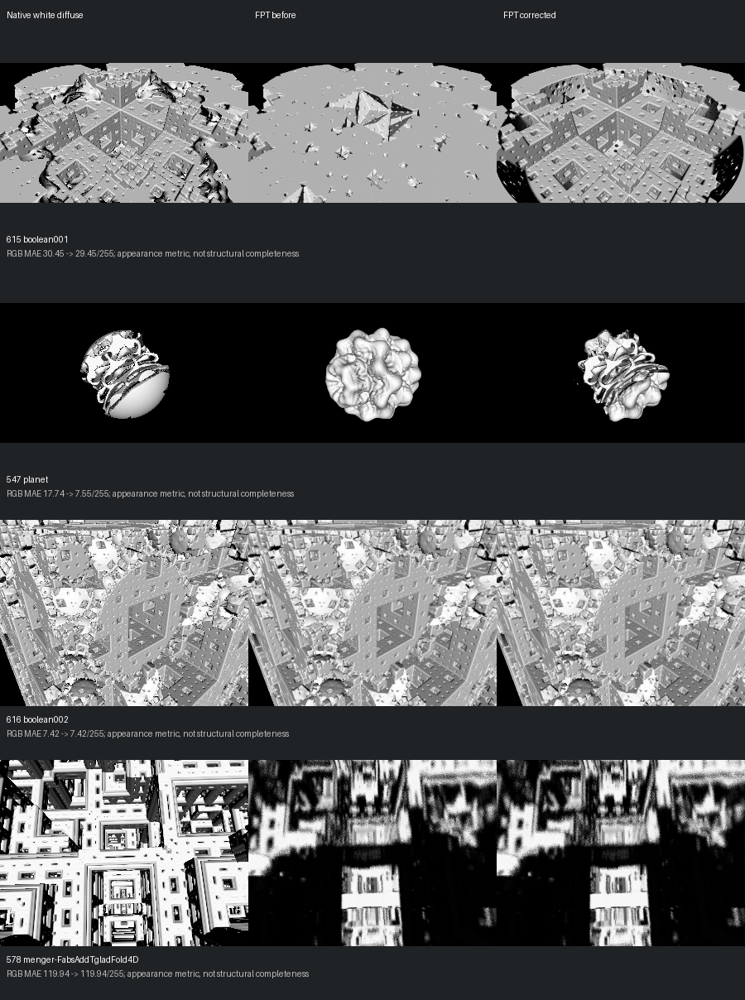
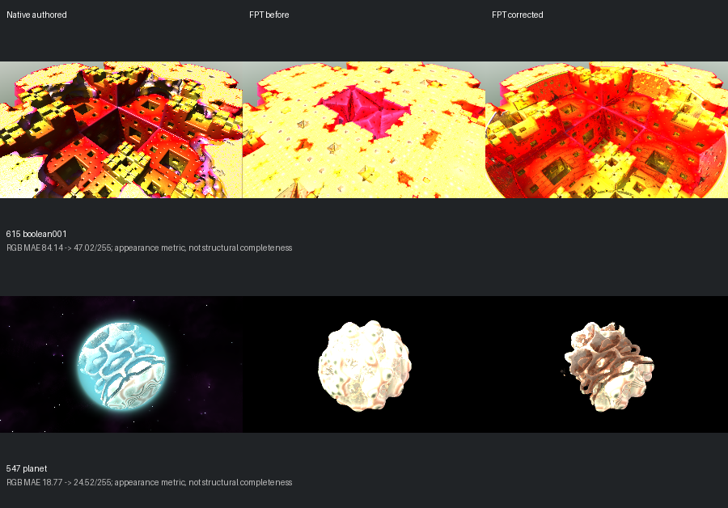

# Boolean Geometry Correction

[Catalogue](../mandel-catalog/README.md) | [Frozen gallery](../mandel-showcase/README.md) | [Raw comparison data](summary.json)

This is a targeted continuous FPT Metal correction after checkpoint `0b4bd39`,
not a gallery promotion, performance optimization or NAADF voxel certification.
The 423 reviewed scenes and their historical evidence remain unchanged.

## Geometry Controls

Native white diffuse / previous FPT white diffuse / corrected FPT white diffuse.
All panels retain the authored camera, aspect ratio and 300px maximum edge.
FPT uses 32 SPP; native CPU sampling is not identical. Native controls disable
AO, specular, shadows, fog, clouds and post effects and use a camera-facing light.
No image registration, flipping, cropping or exposure adjustment was applied.

- **615, boolean001:** restored the large square cavities that the previous
  renderer filled. Peripheral detail and shading still differ from native.
- **547, planet:** restored cut openings. The lower smooth cut face still
  differs; this is an improvement, not complete geometry parity.
- **616, boolean002:** its major partitions correspond under neutral lighting.
  The original appearance made this look like a geometry failure. Its FPT output
  is byte-exact before/after; no speculative geometry edit was applied.
- **578, menger-FabsAddTgladFold4D:** genuinely smeared geometry remains. Its
  output is unchanged by this subtraction-only correction.

## Root Cause

Each generated boolean formula returned a nonnegative distance. Subtraction
then used `max(distanceA, -distanceB)`, a signed-SDF operation. With nonnegative
inputs this cannot carve the first operand.

The correction follows the native `CalculateDistance` unsigned-DE policy:
only inside the first operand's detail threshold, test the subtractor against
1.5 times that threshold. Primary evaluation returns the boundary threshold
inside the subtractor; normal sampling uses the corresponding distance ramp.
Colour ownership uses the native 2.25-threshold boundary selection.

Only active subtraction operators enable the additional generated path.
Ordinary fields, union and intersection keep their existing evaluator. Normal
sampling receives the centre detail size, and topology sampling receives its
explicit iso-distance instead of inheriting a camera footprint.

The source of truth is the local, pinned Mandelbulber implementation at
`230456cee40968cbaa7f301bba91daa4865a29db`,
`mandelbulber2/src/calculate_distance.cpp`, `booleanOperatorSUB`.

## Authored Appearance

| Scene / comparison | Previous MAE / 255 | Corrected MAE / 255 |
| --- | ---: | ---: |
| 615 white diffuse | 30.45 | 29.45 |
| 547 white diffuse | 17.74 | 7.55 |
| 615 authored | 84.14 | 47.02 |
| 547 authored | 18.77 | 24.52 |

These are appearance errors, not geometry completeness scores. In particular,
547's authored RGB metric worsens despite restored openings: native cyan
illumination and atmosphere remain absent. 615 still clips bright surfaces.
Fog/cloud work remains deferred. Neither scene is automatically promoted.

## Verification

- Release executable builds successfully.
- 167 library tests, 62 binary tests, 27 integration tests and 139 Python tests pass.
- The new generated-Metal subtraction test covers 24 cases: interior/exterior,
  strict threshold boundaries, primary/normal context, and three scales.
- Fresh 300px-max-edge, 32-SPP baseline/candidate captures cover 01, 14, 202,
  420, 547, 578, 615 and 616 in neutral and authored modes.
- **01, 14, 202, 420, 578 and 616 are byte-exact in both modes.** This includes
  reviewed ordinary and boolean-union scenes plus the intersection control.
- All 16 final-build captures are byte-exact with the first candidate run.
- Reviewed gallery/catalogue files are preserved; no push.

[Native point audit for 615](native-point-probe-615.json) compares 264 candidate
hit points at identical float-rounded positions and thresholds against the
linked native double-precision evaluator. Median errors are approximately
0.00000083 thresholds for primary and 0.00000084 for normal evaluation.
However, 37 primary and 14 normal samples differ by more than one threshold;
near-boundary/formula differences remain. This is not a whole-scene completeness
test or a claim of exact native parity.

The existing generic native point adapter explicitly rejected boolean input.
The added `boolean-primary` and `boolean-normal` diagnostic modes permit plain
boolean fields while continuing to reject object trees, enabled primitives and
displacement/texture-fractalization dependencies. Native renderer source and
objects were not modified. The linked GPL diagnostic binary is not bundled.

## Remaining Work

1. Diagnose 578's orbit/estimator divergence, then residual 547/615 cut surfaces.
2. Address shared missing surface illumination and clipping with neutral
   geometry controls retained alongside authored comparisons.
3. Recheck reviewed canaries for each renderer change before retaining it.

The [578 probe](hybrid-point-probe-578.json) found ray-direction disagreement
below 0.000008 degrees, but only 83/128 iteration counts matched at sampled
FPT hit points. Median relative distance error was 20.4%; forcing native delta
DE made that comparison worse. The diagnostic used 300x158 with stereo disabled,
not the gallery aspect, so it cannot certify complete camera or image parity.
No estimator, precision, camera or scene-data change for 578 was retained.

## Reproduction And Evidence

Raw runs are under `reports/mandel-boolean-fix-20260913/`; immutable native
controls are under `reports/mandel-geometry-outliers-20260913/`.
The comparison JSON records source/binary/settings identities, capture paths
and errors. The local image copies and reports are covered by `manifest.json`.

Use `scripts/run_mandel_support_suite.py` with the recorded eight-scene manifest
for image reruns. Use `scripts/build_native_distance_probe.py` and
`scripts/run_mandel_boolean_points.py` for the native boolean point audit.
The latter is diagnostic-only and keeps the authored aspect ratio at 300px.
