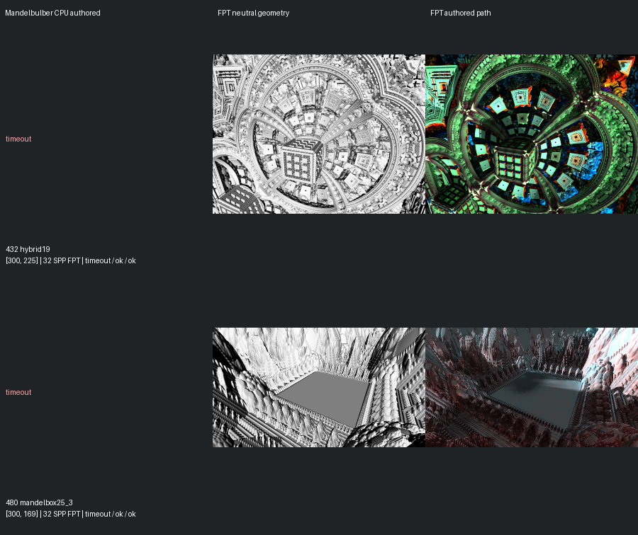
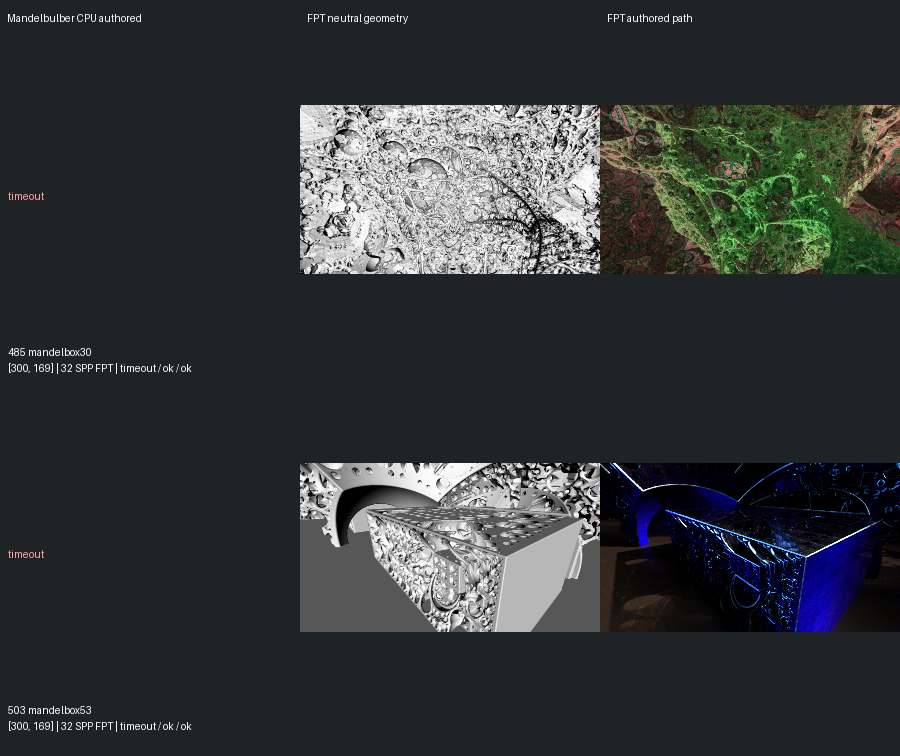
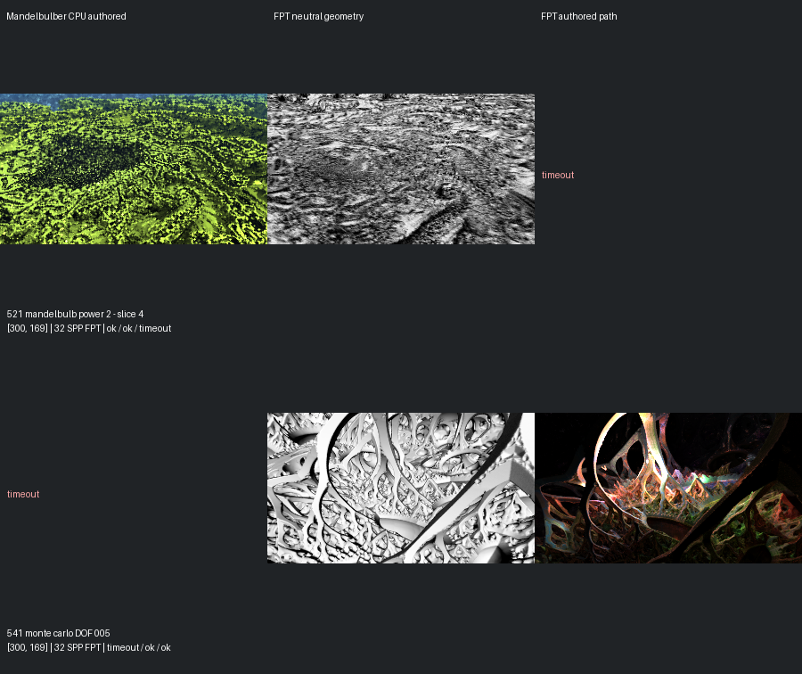
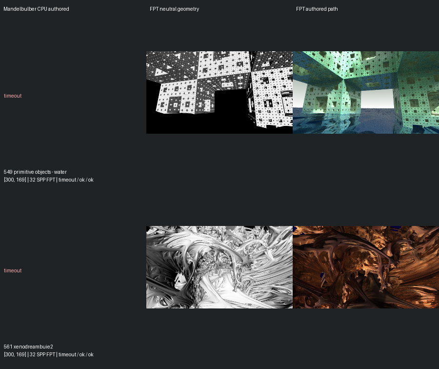

# Missing-Capture Recovery — 14 September 2026

[Reviewed gallery](../mandel-showcase/README.md) | [Fast previews](../mandel-fast-expansion-20260914/README.md) | [Capture evidence](summary.json)

Confirmed **0 gallery additions** from eight recovery candidates. Reviewed gallery: **424** (previously 424).

Promoted: none.
Visual holds: none.
Incomplete comparisons: 432, 480, 485, 503, 521, 541, 549, 561.

All captures retain authored framing at 300px maximum edge and 32 FPT samples. Native CPU references retain authored sampling and effects. Only eight missing captures were requested, each with a 120-second ceiling; 16 completed captures were verified and reused. Scene 443 was excluded because it lacks both sides. No second retry or scene-specific fix was attempted in this pass.

Capture wall time: **16.0 minutes**. This is workflow timing, not a GPU benchmark.

Previous review evidence, decisions, per-scene pages and gallery images are preserved. Renderer code, executable and scene inputs are unchanged. The 150px fast previews remain screening evidence; only the complete comparisons explicitly assessed here are promoted.

[Recorded command](command.json) | [Assessment](assessment.json) | [Incomplete inventory](incomplete.json)

## Missing-Capture Results

| Scene | Requested mode | Result | Last native progress | Native remaining estimate |
| --- | --- | --- | --- | --- |
| 432 | mandel | timeout | 44.0% | 2m 20.5s |
| 480 | mandel | timeout | 23.08% | 5m 44.8s |
| 485 | mandel | timeout | 17.75% | 6m 54.8s |
| 503 | mandel | timeout | 7.69% | 22m 9.8s |
| 521 | authored | timeout | not reported | not reported |
| 541 | mandel | timeout | 0.0% | n/a |
| 549 | mandel | timeout | 12.43% | 13m 32.5s |
| 561 | mandel | timeout | 22.49% | 6m 2.3s |

Producer estimates are recorded observations, not guaranteed completion times. [Native cost queue](native-cost-queue.json) orders incomplete references by these observations. Completed images were not rerendered.

## Comparison page 1

## Comparison page 2

## Comparison page 3

## Comparison page 4

