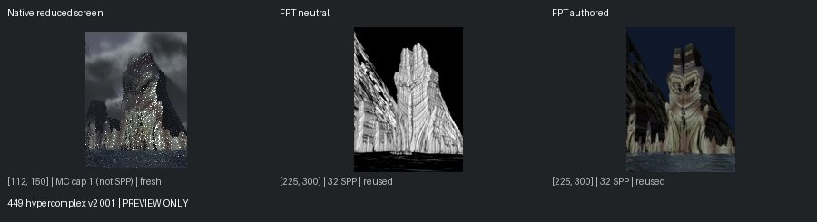
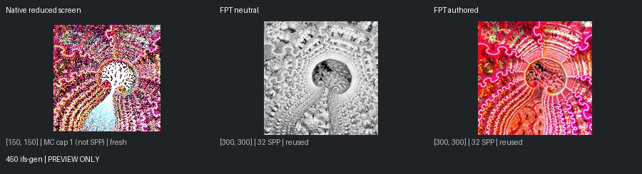
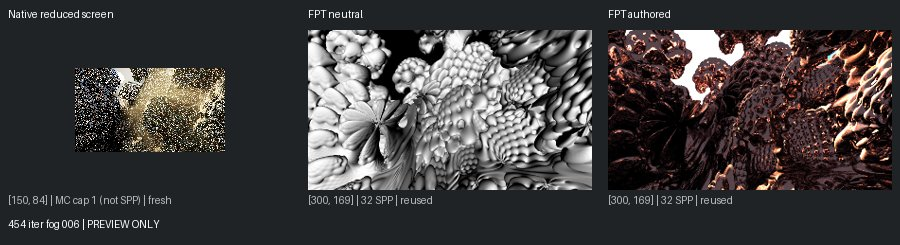
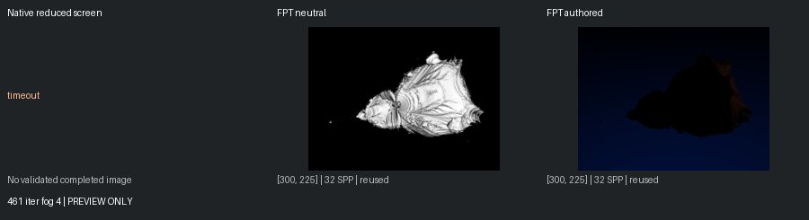
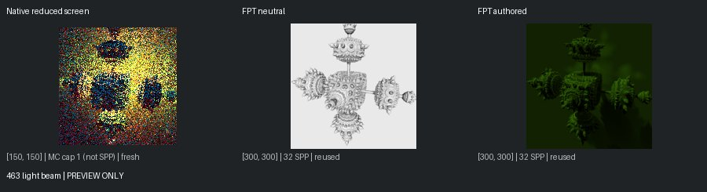

# Unreviewed Screening Previews

[Status](README.md)

**Not matched-quality comparisons or reviewed-gallery approvals.** Native: 150px max, authored effects, enabled MC capped at one. Reused FPT: 300px/32 SPP. Execution retests: 96px/1 SPP. Images are fit without cropping or upscaling.

## 449 hypercomplex v2 001

mandel: ok | geometry: ok | authored: ok

## 450 ifs-gen

mandel: ok | geometry: ok | authored: ok

## 454 iter fog 006

mandel: ok | geometry: ok | authored: ok

## 461 iter fog 4

mandel: timeout | geometry: ok | authored: ok

## 463 light beam

mandel: ok | geometry: ok | authored: ok
