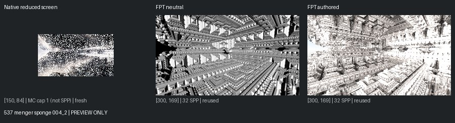
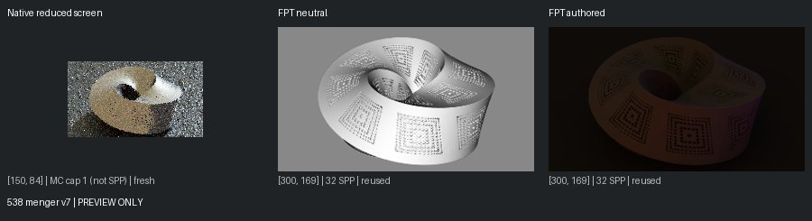
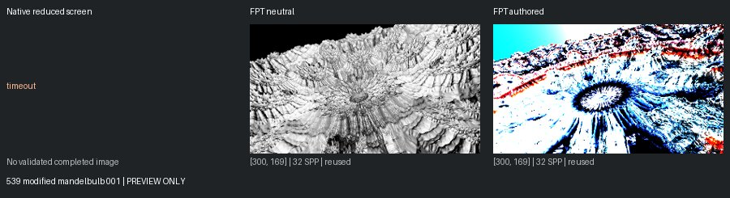
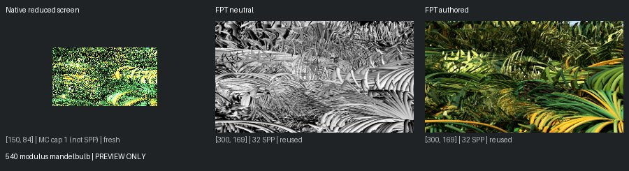
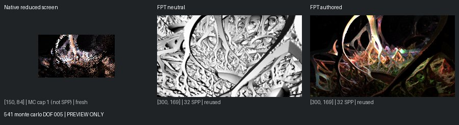

# Unreviewed Screening Previews

[Status](README.md)

**Not matched-quality comparisons or reviewed-gallery approvals.** Native: 150px max, authored effects, enabled MC capped at one. Reused FPT: 300px/32 SPP. Execution retests: 96px/1 SPP. Images are fit without cropping or upscaling.

## 537 menger sponge 004_2

mandel: ok | geometry: ok | authored: ok

## 538 menger v7

mandel: ok | geometry: ok | authored: ok

## 539 modified mandelbulb 001

mandel: timeout | geometry: ok | authored: ok

## 540 modulus mandelbulb

mandel: ok | geometry: ok | authored: ok

## 541 monte carlo DOF 005

mandel: ok | geometry: ok | authored: ok
