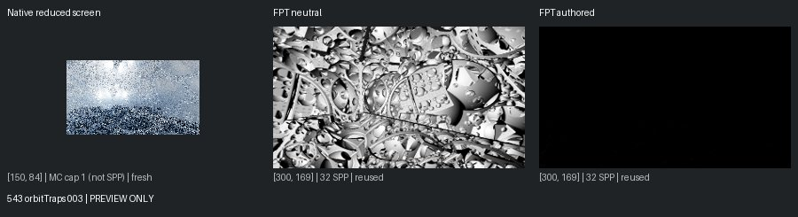
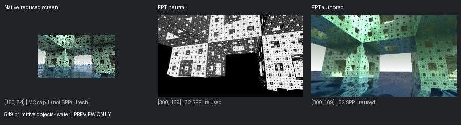
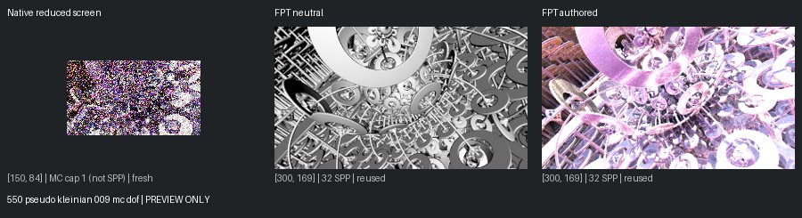
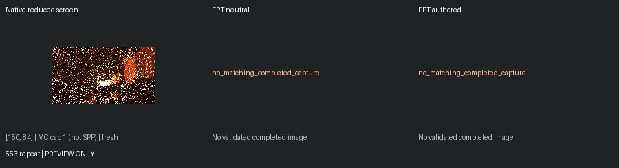
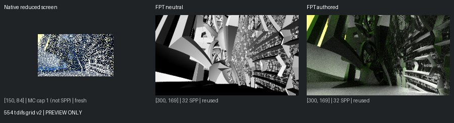

# Unreviewed Screening Previews

[Status](README.md)

**Not matched-quality comparisons or reviewed-gallery approvals.** Native: 150px max, authored effects, enabled MC capped at one. Reused FPT: 300px/32 SPP. Execution retests: 96px/1 SPP. Images are fit without cropping or upscaling.

## 543 orbitTraps 003

mandel: ok | geometry: ok | authored: ok

## 549 primitive objects - water

mandel: ok | geometry: ok | authored: ok

## 550 pseudo kleinian 009 mc dof

mandel: ok | geometry: ok | authored: ok

## 553 repeat

mandel: ok | geometry: no_matching_completed_capture | authored: no_matching_completed_capture

## 554 t difs grid v2

mandel: ok | geometry: ok | authored: ok
