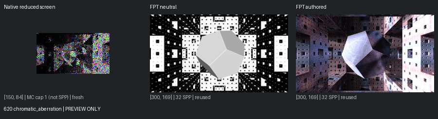
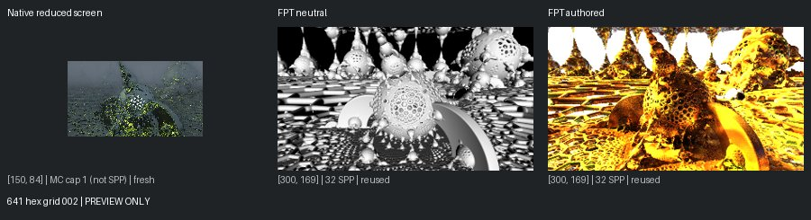
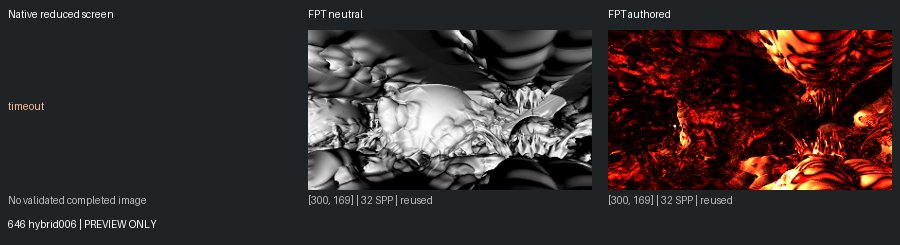
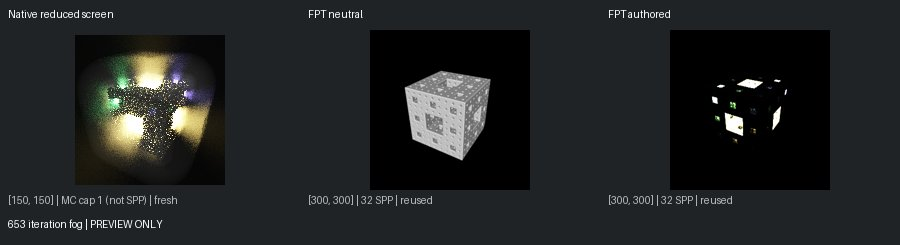
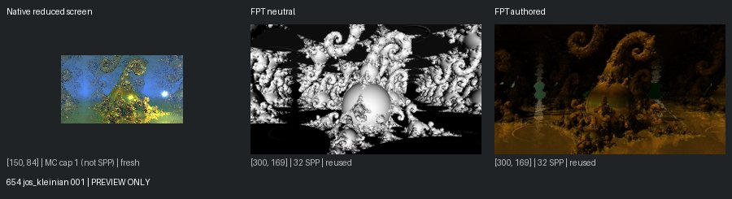

# Unreviewed Screening Previews

[Status](README.md)

**Not matched-quality comparisons or reviewed-gallery approvals.** Native: 150px max, authored effects, enabled MC capped at one. Reused FPT: 300px/32 SPP. Execution retests: 96px/1 SPP. Images are fit without cropping or upscaling.

## 620 chromatic_aberration

mandel: ok | geometry: ok | authored: ok

## 641 hex grid 002

mandel: ok | geometry: ok | authored: ok

## 646 hybrid006

mandel: timeout | geometry: ok | authored: ok

## 653 iteration fog

mandel: ok | geometry: ok | authored: ok

## 654 jos_kleinian 001

mandel: ok | geometry: ok | authored: ok
