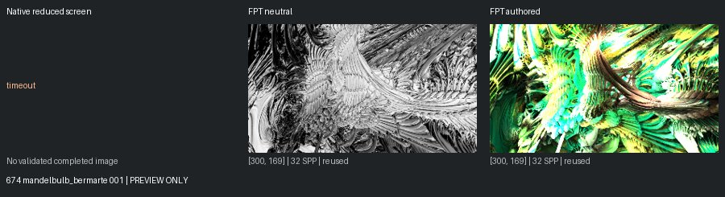
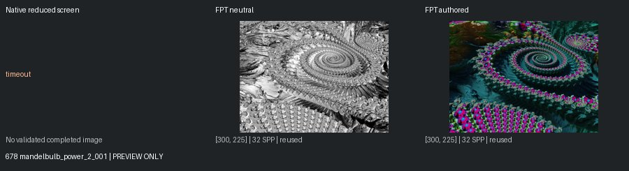
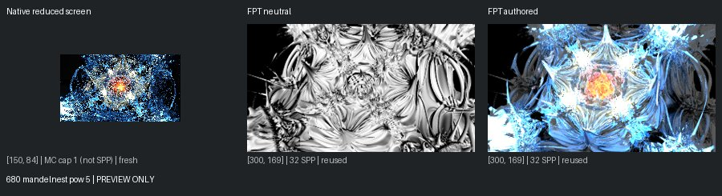
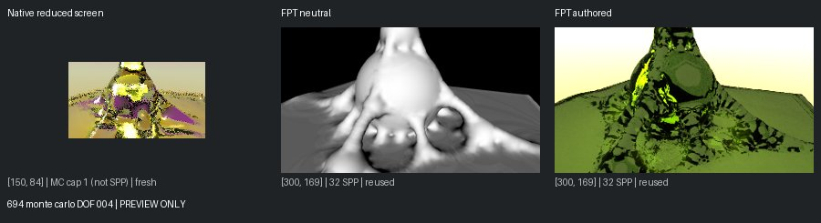
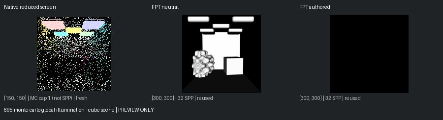

# Unreviewed Screening Previews

[Status](README.md)

**Not matched-quality comparisons or reviewed-gallery approvals.** Native: 150px max, authored effects, enabled MC capped at one. Reused FPT: 300px/32 SPP. Execution retests: 96px/1 SPP. Images are fit without cropping or upscaling.

## 674 mandelbulb_bermarte 001

mandel: timeout | geometry: ok | authored: ok

## 678 mandelbulb_power_2_001

mandel: timeout | geometry: ok | authored: ok

## 680 mandelnest pow 5

mandel: ok | geometry: ok | authored: ok

## 694 monte carlo DOF 004

mandel: ok | geometry: ok | authored: ok

## 695 monte carlo global illumination - cube scene

mandel: ok | geometry: ok | authored: ok
