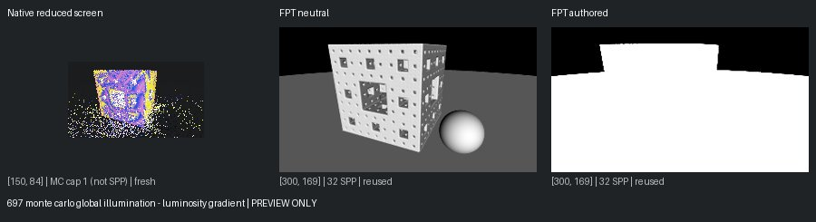
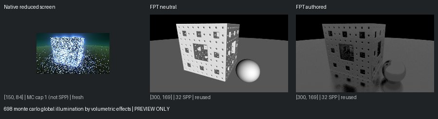
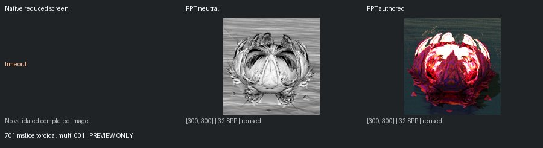
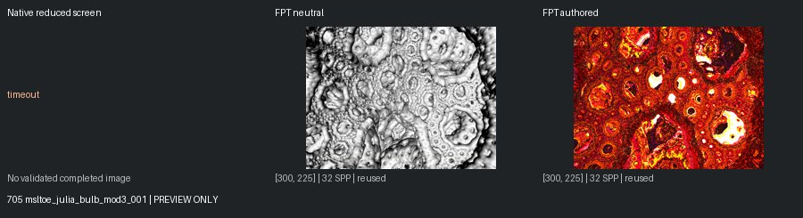
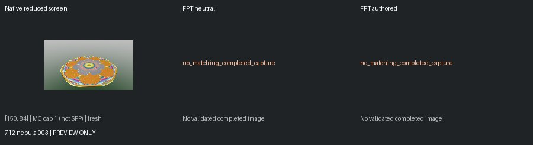

# Unreviewed Screening Previews

[Status](README.md)

**Not matched-quality comparisons or reviewed-gallery approvals.** Native: 150px max, authored effects, enabled MC capped at one. Reused FPT: 300px/32 SPP. Execution retests: 96px/1 SPP. Images are fit without cropping or upscaling.

## 697 monte carlo global illumination - luminosity gradient

mandel: ok | geometry: ok | authored: ok

## 698 monte carlo global illumination by volumetric effects

mandel: ok | geometry: ok | authored: ok

## 701 msltoe toroidal multi 001

mandel: timeout | geometry: ok | authored: ok

## 705 msltoe_julia_bulb_mod3_001

mandel: timeout | geometry: ok | authored: ok

## 712 nebula 003

mandel: ok | geometry: no_matching_completed_capture | authored: no_matching_completed_capture
