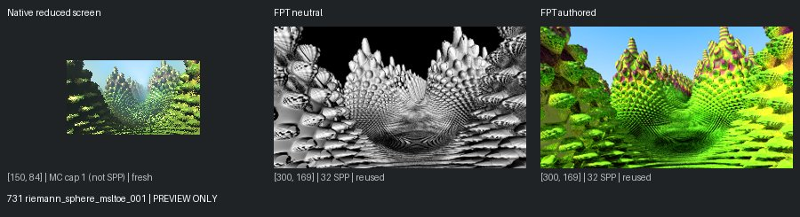
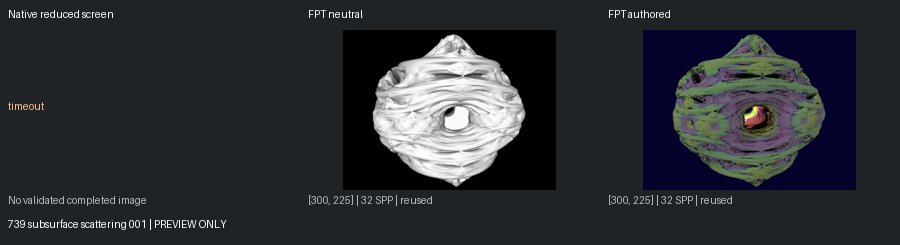
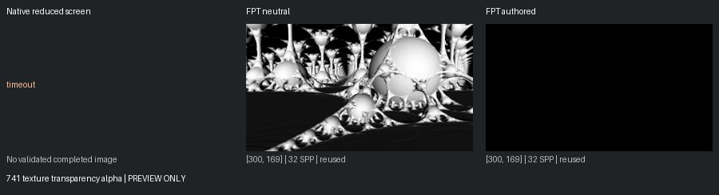
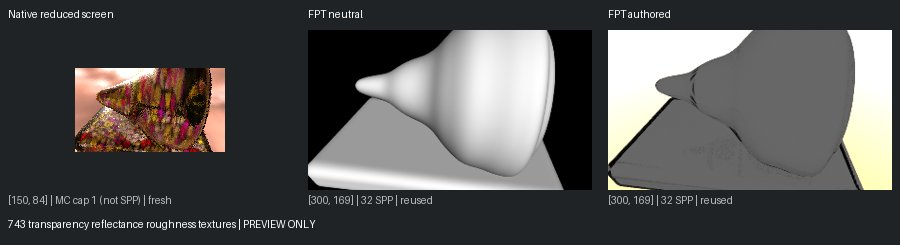
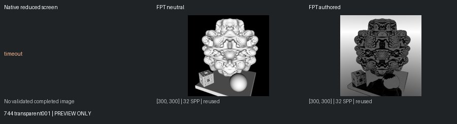

# Unreviewed Screening Previews

[Status](README.md)

**Not matched-quality comparisons or reviewed-gallery approvals.** Native: 150px max, authored effects, enabled MC capped at one. Reused FPT: 300px/32 SPP. Execution retests: 96px/1 SPP. Images are fit without cropping or upscaling.

## 731 riemann_sphere_msltoe_001

mandel: ok | geometry: ok | authored: ok

## 739 subsurface scattering 001

mandel: timeout | geometry: ok | authored: ok

## 741 texture transparency alpha

mandel: timeout | geometry: ok | authored: ok

## 743 transparency reflectance roughness textures

mandel: ok | geometry: ok | authored: ok

## 744 transparent001

mandel: timeout | geometry: ok | authored: ok
