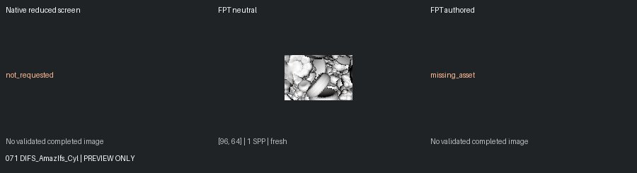
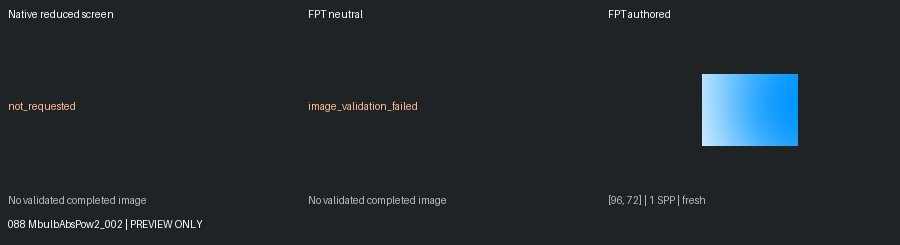
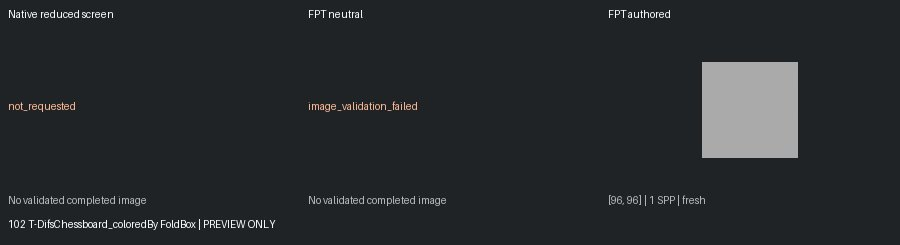
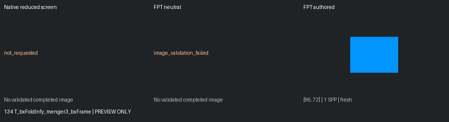
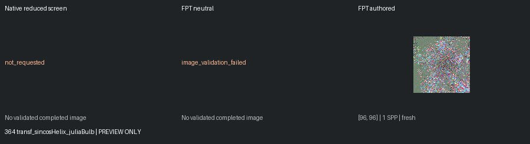

# Unreviewed Screening Previews

[Status](README.md)

**Not matched-quality comparisons or reviewed-gallery approvals.** Native: 150px max, authored effects, enabled MC capped at one. Reused FPT: 300px/32 SPP. Execution retests: 96px/1 SPP. Images are fit without cropping or upscaling.

## 071 DIFS_AmazIfs_Cyl

geometry: ok | authored: missing_asset

## 088 MbulbAbsPow2_002

geometry: image_validation_failed | authored: ok

## 102 T-DifsChessboard_coloredBy FoldBox

geometry: image_validation_failed | authored: ok

## 134 T_bxFoldInfy_menger3_bxFrame

geometry: image_validation_failed | authored: ok

## 364 transf_sincosHelix_juliaBulb

geometry: image_validation_failed | authored: ok
