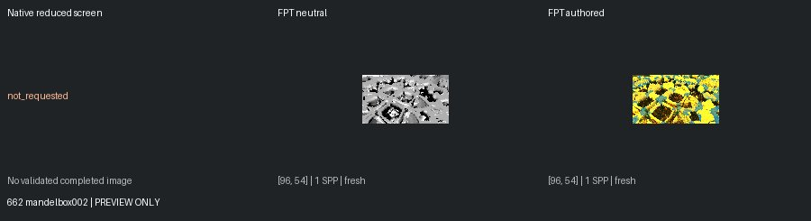
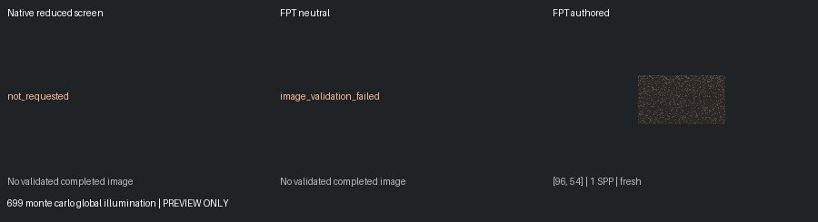
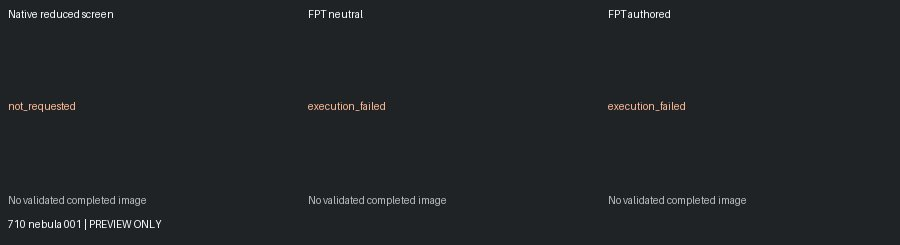
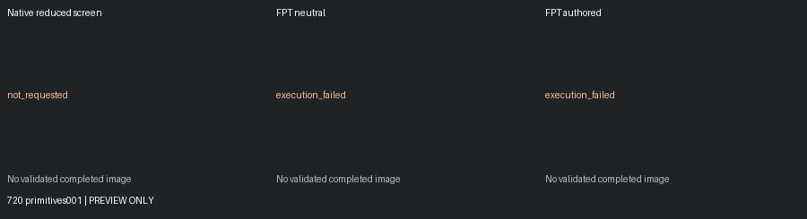

# Unreviewed Screening Previews

[Status](README.md)

**Not matched-quality comparisons or reviewed-gallery approvals.** Native: 150px max, authored effects, enabled MC capped at one. Reused FPT: 300px/32 SPP. Execution retests: 96px/1 SPP. Images are fit without cropping or upscaling.

## 659 light types

geometry: execution_failed | authored: execution_failed

## 662 mandelbox002

geometry: ok | authored: ok

## 699 monte carlo global illumination

geometry: image_validation_failed | authored: ok

## 710 nebula 001

geometry: execution_failed | authored: execution_failed

## 720 primitives001

geometry: execution_failed | authored: execution_failed
