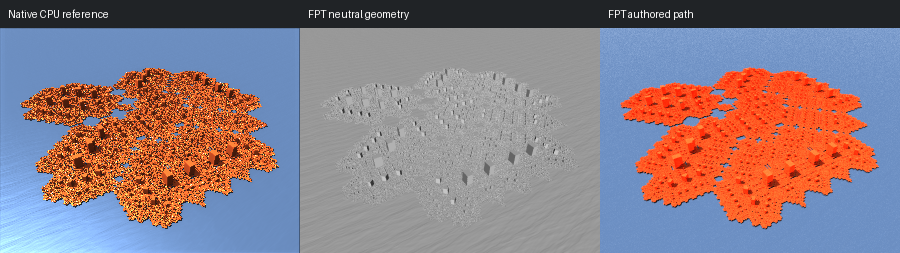

# 052: DIFS Box DiagV1 complex primitive

[Reviewed gallery](README.md) | [Needs-work audit](needs-work.md) | [Full catalogue](../mandel-catalog/README.md)

**accepted-with-limitations**. Authored silhouette and framing align after water support. Neutral water dominates the white control; authored orange material is flatter and the reflected sky differs. Accept broad structure, not water transport parity.

FPT: 300x225, 32 SPP; FPT scene/config default; metadata records effective configuration.
Native CPU: authored sampling/lighting, not an identical integrator. Neutral FPT uses a white geometry control, not matched authored lighting.

Capture: **refreshed-2026-09-11**, renderer revision `e3477bd7fb106669d35e21b903ea87fdf383a590`.
Renderer SHA256: `698f2967631d743065e1b9101921a52f70e954560ef0aecb6a88b5e17ec294e1`.

Review: 2026-09-11, Codex visual comparison of reference/neutral/authored sheets; colour differences allowed by user. Geometry: acceptable; illumination: acceptable.

[Upstream scene](https://github.com/buddhi1980/mandelbulber2/blob/230456cee40968cbaa7f301bba91daa4865a29db/mandelbulber2/deploy/share/mandelbulber2/examples/Graeme%20McLaren%20%20collection%20-%20license%20Creative%20Commons%20%20%28CC-BY%204.0%29/DIFS%20Box%20DiagV1%20complex%20primitive.fract) | Collection credit: Graeme McLaren  collection - license Creative Commons  (CC-BY 4.0)
Source SHA256: `041cb5676861c71ce28e7e796e3101226a2fcb23e2047a962e0e28ac94c6137e`.

This acceptance applies to these captures. It is not exact native parity or NAADF/CVOX certification. Colours, skies and unsupported volumes may differ. No new timing claim.

[Source/capture evidence](../mandel-catalog/review-evidence.json) | [Explicit decisions](../mandel-catalog/reviews.json)
