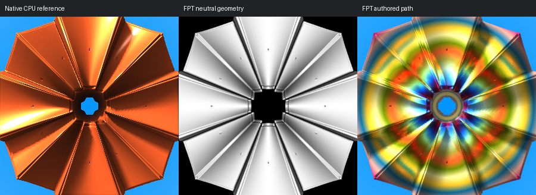

# 104: T-DifsHelixMenger_001

[Reviewed gallery](README.md) | [Needs-work audit](needs-work.md) | [Full catalogue](../mandel-catalog/README.md)

**accepted-with-limitations**. The radial panel layout, outer silhouette and central aperture align broadly. FPT changes the copper material to a rainbow reflective appearance, including different inner-rim reflections; this acceptance is for readable structure, not material parity.

FPT: 300x300, 32 SPP; FPT scene/config default; metadata records effective configuration.
Native CPU: authored sampling/lighting, not an identical integrator. Neutral FPT uses a white geometry control, not matched authored lighting.

Capture: **refreshed-2026-09-11**, renderer revision `d328d97a7daa4b60fbb9572417e952356ced63d4`.
Renderer SHA256: `698f2967631d743065e1b9101921a52f70e954560ef0aecb6a88b5e17ec294e1`.

Review: 2026-09-11, Codex visual comparison of native CPU, neutral FPT and authored FPT captures. Geometry: acceptable; illumination: acceptable.

[Upstream scene](https://github.com/buddhi1980/mandelbulber2/blob/230456cee40968cbaa7f301bba91daa4865a29db/mandelbulber2/deploy/share/mandelbulber2/examples/Graeme%20McLaren%20%20collection%20-%20license%20Creative%20Commons%20%20%28CC-BY%204.0%29/T-DifsHelixMenger_001.fract) | Collection credit: Graeme McLaren  collection - license Creative Commons  (CC-BY 4.0)
Source SHA256: `b724517e5c716acd0f5c4055a71818146d068872c7b98199f8d295e5d8df77e2`.

This acceptance applies to these captures. It is not exact native parity or NAADF/CVOX certification. Colours, skies and unsupported volumes may differ. No new timing claim.

[Source/capture evidence](../mandel-catalog/review-evidence.json) | [Explicit decisions](../mandel-catalog/reviews.json)
