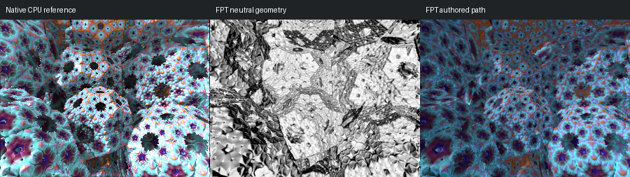

# 11: hybrid16

[Reviewed gallery](README.md) | [Needs-work audit](needs-work.md) | [Full catalogue](../mandel-catalog/README.md)

**accepted-with-limitations**. Prior ranked-gallery visual acceptance retained for these unchanged captures. Native appearance and fine-detail parity are not certified.

FPT: 300x225, 32 SPP; unchanged scene/config default.
Native CPU: authored sampling/lighting, not an identical integrator. Neutral FPT uses a white geometry control, not matched authored lighting.

Capture: **historical-2026-09-10**, renderer revision `fc3685578891ac006c972c0abb01c59e1eb46415`.
Renderer SHA256: `cf8b020ae682eef515020dc2dfda3178f963b1e12b39f1df2cec4169aa53cbcb`.

Review: 2026-09-11, Prior user-accepted ranked gallery; migrated capture-specific decision. Geometry: acceptable; illumination: acceptable.

[Upstream scene](https://github.com/buddhi1980/mandelbulber2/blob/230456cee40968cbaa7f301bba91daa4865a29db/mandelbulber2/deploy/share/mandelbulber2/examples/Krzysztof%20Marczak%20collection%20-%20license%20Creative%20Commons%20%28CC-BY%204.0%29/hybrid16.fract) | Collection credit: Krzysztof Marczak collection - license Creative Commons (CC-BY 4.0)
Source SHA256: `ba19f06138f0351692f5e84163de4428598c0d20ed088dcc02379c61e12c51ef`.

This acceptance applies to these captures. It is not exact native parity or NAADF/CVOX certification. Colours, skies and unsupported volumes may differ. No new timing claim.

[Source/capture evidence](../mandel-catalog/review-evidence.json) | [Explicit decisions](../mandel-catalog/reviews.json)
