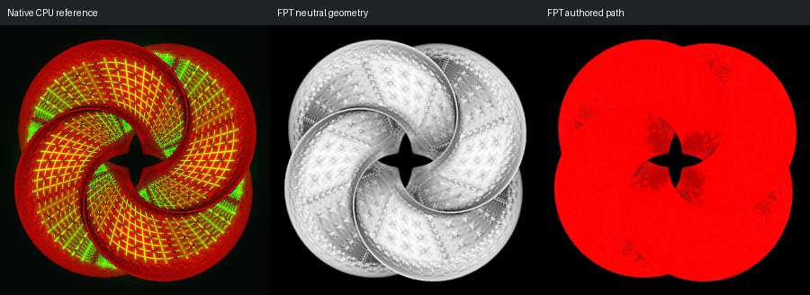

# 113: T-DifsTorusMenger_menger7

[Reviewed gallery](README.md) | [Needs-work audit](needs-work.md) | [Full catalogue](../mandel-catalog/README.md)

**needs-work**. The four curled lobes and central opening align in the neutral control, but authored FPT becomes almost uniformly red and loses the prominent yellow/green grid pattern and surface contrast visible in native. Hold the material/lighting interpretation.

FPT: 300x300, 32 SPP; FPT scene/config default; metadata records effective configuration.
Native CPU: authored sampling/lighting, not an identical integrator. Neutral FPT uses a white geometry control, not matched authored lighting.

Capture: **refreshed-2026-09-11**, renderer revision `35c5aa020e1fb61aa4a946c894c7fea8ccbe2253`.
Renderer SHA256: `698f2967631d743065e1b9101921a52f70e954560ef0aecb6a88b5e17ec294e1`.

Review: 2026-09-11, Codex visual comparison of native CPU, neutral FPT and authored FPT captures. Geometry: acceptable; illumination: needs-work.

[Upstream scene](https://github.com/buddhi1980/mandelbulber2/blob/230456cee40968cbaa7f301bba91daa4865a29db/mandelbulber2/deploy/share/mandelbulber2/examples/Graeme%20McLaren%20%20collection%20-%20license%20Creative%20Commons%20%20%28CC-BY%204.0%29/T-DifsTorusMenger_menger7.fract) | Collection credit: Graeme McLaren  collection - license Creative Commons  (CC-BY 4.0)
Source SHA256: `1b8b35cc75cf3ff18190bce9d57a0dfd2d9d19f2120a43eff1d8668e337a3ac3`.

This acceptance applies to these captures. It is not exact native parity or NAADF/CVOX certification. Colours, skies and unsupported volumes may differ. No new timing claim.

[Source/capture evidence](../mandel-catalog/review-evidence.json) | [Explicit decisions](../mandel-catalog/reviews.json)
