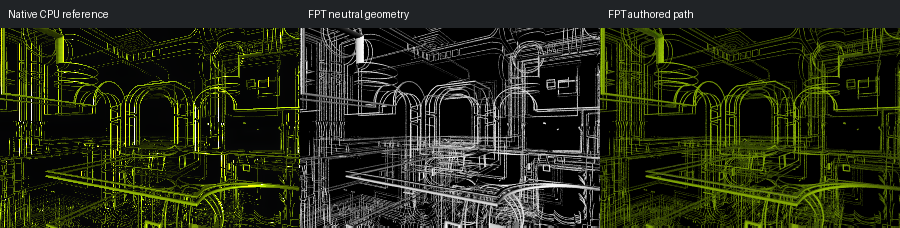

# 123: T_DIFS Spring MixPinski

[Reviewed gallery](README.md) | [Needs-work audit](needs-work.md) | [Full catalogue](../mandel-catalog/README.md)

**accepted-with-limitations**. The thin spring/wire corridor, twin rounded door outlines and long crossing horizontal lines align. Both renders intentionally have a black field with yellow-green lines; FPT changes fine line intensity and reflective repetition, without an obvious loss of the main wire structure.

FPT: 300x200, 32 SPP; FPT scene/config default; metadata records effective configuration.
Native CPU: authored sampling/lighting, not an identical integrator. Neutral FPT uses a white geometry control, not matched authored lighting.

Capture: **refreshed-2026-09-11**, renderer revision `35c5aa020e1fb61aa4a946c894c7fea8ccbe2253`.
Renderer SHA256: `698f2967631d743065e1b9101921a52f70e954560ef0aecb6a88b5e17ec294e1`.

Review: 2026-09-11, Codex visual comparison of native CPU, neutral FPT and authored FPT captures. Geometry: acceptable; illumination: acceptable.

[Upstream scene](https://github.com/buddhi1980/mandelbulber2/blob/230456cee40968cbaa7f301bba91daa4865a29db/mandelbulber2/deploy/share/mandelbulber2/examples/Graeme%20McLaren%20%20collection%20-%20license%20Creative%20Commons%20%20%28CC-BY%204.0%29/T_DIFS%20Spring%20MixPinski.fract) | Collection credit: Graeme McLaren  collection - license Creative Commons  (CC-BY 4.0)
Source SHA256: `7f40aeb3c2cd5ce44f59e62b7b6a3c3bbd0a36afd6aac629eca6f7194bb985d3`.

This acceptance applies to these captures. It is not exact native parity or NAADF/CVOX certification. Colours, skies and unsupported volumes may differ. No new timing claim.

[Source/capture evidence](../mandel-catalog/review-evidence.json) | [Explicit decisions](../mandel-catalog/reviews.json)
