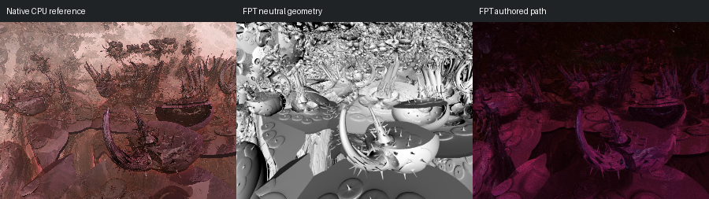

# 37: FoldIntPow2 2

[Reviewed gallery](README.md) | [Needs-work audit](needs-work.md) | [Full catalogue](../mandel-catalog/README.md)

**needs-work**. Authored scene remains substantially underlit, especially upper and background structures. Preserve the historical comparison but exclude from the showcase.

FPT: 300x225, 32 SPP; unchanged scene/config default.
Native CPU: authored sampling/lighting, not an identical integrator. Neutral FPT uses a white geometry control, not matched authored lighting.

Capture: **historical-2026-09-10**, renderer revision `fc3685578891ac006c972c0abb01c59e1eb46415`.
Renderer SHA256: `cf8b020ae682eef515020dc2dfda3178f963b1e12b39f1df2cec4169aa53cbcb`.

Review: 2026-09-11, Codex visual comparison of reference/neutral/authored sheets; colour differences allowed by user. Geometry: acceptable; illumination: needs-work.

[Upstream scene](https://github.com/buddhi1980/mandelbulber2/blob/230456cee40968cbaa7f301bba91daa4865a29db/mandelbulber2/deploy/share/mandelbulber2/examples/Krzysztof%20Marczak%20collection%20-%20license%20Creative%20Commons%20%28CC-BY%204.0%29/FoldIntPow2%202.fract) | Collection credit: Krzysztof Marczak collection - license Creative Commons (CC-BY 4.0)
Source SHA256: `d6e64b69b64ccae9302f375f6f0e199568b5420a186c9a6d15a2167ddd300ae4`.

This acceptance applies to these captures. It is not exact native parity or NAADF/CVOX certification. Colours, skies and unsupported volumes may differ. No new timing claim.

[Source/capture evidence](../mandel-catalog/review-evidence.json) | [Explicit decisions](../mandel-catalog/reviews.json)
