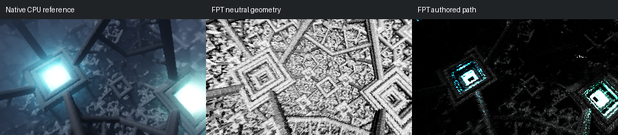

# 373: IFS_002

[Reviewed gallery](README.md) | [Needs-work audit](needs-work.md) | [Full catalogue](../mandel-catalog/README.md)

**needs-work**. Only small cyan light patches remain bright in authored FPT, with most native blue-lit beams and surrounding structure lost in darkness. Neutral controls are needed for the ambiguous geometry.

FPT: 300x169, 32 SPP; FPT scene/config default; metadata records effective configuration.
Native CPU: authored sampling/lighting, not an identical integrator. Neutral FPT uses a white geometry control, not matched authored lighting.

Capture: **historical-2026-09-10**, renderer revision `029c3bc9faff9f8c15ad0b39d20b3ebcdced92ab`.
Renderer SHA256: `cf8b020ae682eef515020dc2dfda3178f963b1e12b39f1df2cec4169aa53cbcb`.

Review: 2026-09-11, Codex visual comparison of reference/neutral/authored sheets; colour differences allowed by user. Geometry: unassessed; illumination: needs-work.

[Upstream scene](https://github.com/buddhi1980/mandelbulber2/blob/230456cee40968cbaa7f301bba91daa4865a29db/mandelbulber2/deploy/share/mandelbulber2/examples/IFS_002.fract) | Collection credit: Mandelbulber example collection
Source SHA256: `54a3cb2e49d07b4f2961d4ca9fb47fc0846e66c18bdc112df5fb44d76e49772f`.

This acceptance applies to these captures. It is not exact native parity or NAADF/CVOX certification. Colours, skies and unsupported volumes may differ. No new timing claim.

[Source/capture evidence](../mandel-catalog/review-evidence.json) | [Explicit decisions](../mandel-catalog/reviews.json)
