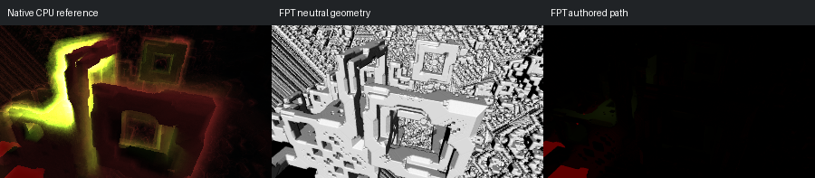

# 376: Construct by Ectoplaz 3

[Reviewed gallery](README.md) | [Needs-work audit](needs-work.md) | [Full catalogue](../mandel-catalog/README.md)

**needs-work**. Neutral FPT exposes rectangular architecture, but authored FPT is almost black and lacks the native bright yellow illuminated feature. The dark beauty capture cannot establish scene-wide geometry agreement.

FPT: 300x169, 32 SPP; FPT scene/config default; metadata records effective configuration.
Native CPU: authored sampling/lighting, not an identical integrator. Neutral FPT uses a white geometry control, not matched authored lighting.

Capture: **captured-2026-09-13**, renderer revision `1752a41553338cd1cbe02c2ebcc53c417b943c51`.
Renderer SHA256: `698f2967631d743065e1b9101921a52f70e954560ef0aecb6a88b5e17ec294e1`.

Review: 2026-09-13, Codex visual comparison of native CPU, neutral FPT and authored FPT captures. Geometry: uncertain; illumination: needs-work.

[Upstream scene](https://github.com/buddhi1980/mandelbulber2/blob/230456cee40968cbaa7f301bba91daa4865a29db/mandelbulber2/deploy/share/mandelbulber2/examples/Krzysztof%20Marczak%20collection%20-%20license%20Creative%20Commons%20%28CC-BY%204.0%29/Construct%20by%20Ectoplaz%203.fract) | Collection credit: Krzysztof Marczak collection - license Creative Commons (CC-BY 4.0)
Source SHA256: `663ee77e5f49d2e5774b9bc4694f9fe75e44d5d90361ca342263778168e59446`.

This acceptance applies to these captures. It is not exact native parity or NAADF/CVOX certification. Colours, skies and unsupported volumes may differ. No new timing claim.

[Source/capture evidence](../mandel-catalog/review-evidence.json) | [Explicit decisions](../mandel-catalog/reviews.json)
