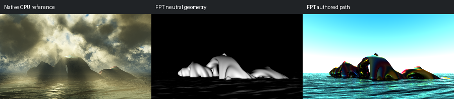

# 416: clouds 2_v3

[Reviewed gallery](README.md) | [Needs-work audit](needs-work.md) | [Full catalogue](../mandel-catalog/README.md)

**needs-work**. The island group and water horizon correspond, but the native scene is dominated by dense clouds and atmospheric shafts of light. FPT replaces that sky with a flat cyan gradient and renders the islands with strong rainbow reflections. The missing cloud and atmospheric illumination structure is a material appearance failure, not a colour-only difference.

FPT: 300x169, 32 SPP; FPT scene/config default; metadata records effective configuration.
Native CPU: authored sampling/lighting, not an identical integrator. Neutral FPT uses a white geometry control, not matched authored lighting.

Capture: **experimental-95-2026-09-14**, renderer revision `6359aa1976b24634796fbeb7a9b97e5fb2f0c5ad`.
Renderer SHA256: `b12a1b744287c1bc0d2f6e604d0f113d663e9c216cdb4832cbd75f180729ebd0`.

Review: 2026-09-14, Codex visual comparison of complete 300px authored native / FPT neutral / FPT authored triplets. Geometry: acceptable; illumination: needs-work.

[Upstream scene](https://github.com/buddhi1980/mandelbulber2/blob/230456cee40968cbaa7f301bba91daa4865a29db/mandelbulber2/deploy/share/mandelbulber2/examples/Krzysztof%20Marczak%20collection%20-%20license%20Creative%20Commons%20%28CC-BY%204.0%29/clouds%202_v3.fract) | Collection credit: Krzysztof Marczak collection - license Creative Commons (CC-BY 4.0)
Source SHA256: `034d38efc21b1451cbbff0f1d66bbb83a334de8c35985786e89cb5955677ca2f`.

This acceptance applies to these captures. It is not exact native parity or NAADF/CVOX certification. Colours, skies and unsupported volumes may differ. No new timing claim.

[Source/capture evidence](../mandel-catalog/review-evidence.json) | [Explicit decisions](../mandel-catalog/reviews.json)
