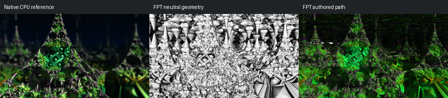

# 443: hybrid35

[Reviewed gallery](README.md) | [Needs-work audit](needs-work.md) | [Full catalogue](../mandel-catalog/README.md)

**accepted-with-limitations**. The triangular spires, the green lattice and the dark background correspond. FPT greens are brighter and more saturated, and a few thin white streaks appear near the top-left edge. The overall appearance remains readable.

FPT: 300x169, 32 SPP; FPT scene/config default; metadata records effective configuration.
Native CPU: authored sampling/lighting, not an identical integrator. Neutral FPT uses a white geometry control, not matched authored lighting.

Capture: **opencl-triage-2026-09-27**, renderer revision `6359aa1976b24634796fbeb7a9b97e5fb2f0c5ad`.
Renderer SHA256: `5773e21cb00821b7fa75fd88454f0f3d62f09c8260d5a952b87a151226688c4a`.

Review: 2026-09-27, Claude visual comparison of complete 300px authored native CPU / FPT neutral / FPT authored triplets. Geometry: acceptable; illumination: acceptable.

[Upstream scene](https://github.com/buddhi1980/mandelbulber2/blob/230456cee40968cbaa7f301bba91daa4865a29db/mandelbulber2/deploy/share/mandelbulber2/examples/Krzysztof%20Marczak%20collection%20-%20license%20Creative%20Commons%20%28CC-BY%204.0%29/hybrid35.fract) | Collection credit: Krzysztof Marczak collection - license Creative Commons (CC-BY 4.0)
Source SHA256: `1f113355ea0c5b7f515c040c536059e3cb8cae7cf7d3708de1858b9ed2264b82`.

This acceptance applies to these captures. It is not exact native parity or NAADF/CVOX certification. Colours, skies and unsupported volumes may differ. No new timing claim.

[Source/capture evidence](../mandel-catalog/review-evidence.json) | [Explicit decisions](../mandel-catalog/reviews.json)
