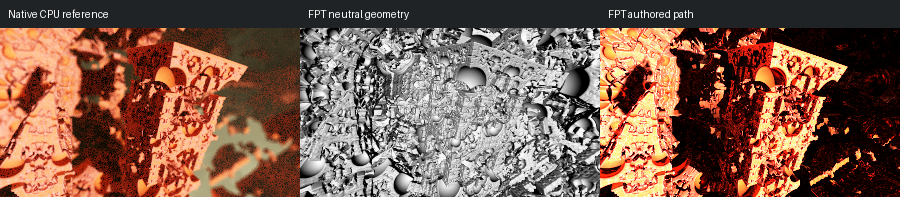

# 484: mandelbox29

[Reviewed gallery](README.md) | [Needs-work audit](needs-work.md) | [Full catalogue](../mandel-catalog/README.md)

**accepted-with-limitations**. The tilted carved slabs, repeated arch/opening motifs, central dark recess and large circular upper opening correspond across the three captures. FPT authored rendering retains the native warm-lit slab faces and shadowed recess but is sharper, more orange/red and more contrasty, with harder clipped highlights and a darker background. Native depth-of-field softness is not reproduced. The main carved geometry remains readable; exact blur, lighting and material parity is not claimed.

FPT: 300x169, 32 SPP; FPT scene/config default; metadata records effective configuration.
Native CPU: authored sampling/lighting, not an identical integrator. Neutral FPT uses a white geometry control, not matched authored lighting.

Capture: **experimental-95-2026-09-14**, renderer revision `6359aa1976b24634796fbeb7a9b97e5fb2f0c5ad`.
Renderer SHA256: `b12a1b744287c1bc0d2f6e604d0f113d663e9c216cdb4832cbd75f180729ebd0`.

Review: 2026-09-14, Codex visual comparison of complete 300px authored native / FPT neutral / FPT authored triplets. Geometry: acceptable; illumination: acceptable.

[Upstream scene](https://github.com/buddhi1980/mandelbulber2/blob/230456cee40968cbaa7f301bba91daa4865a29db/mandelbulber2/deploy/share/mandelbulber2/examples/Krzysztof%20Marczak%20collection%20-%20license%20Creative%20Commons%20%28CC-BY%204.0%29/mandelbox29.fract) | Collection credit: Krzysztof Marczak collection - license Creative Commons (CC-BY 4.0)
Source SHA256: `e62a8539483a2a92d33ee922c4d948c479c493ca416c1b8bd06b3836a6a49479`.

This acceptance applies to these captures. It is not exact native parity or NAADF/CVOX certification. Colours, skies and unsupported volumes may differ. No new timing claim.

[Source/capture evidence](../mandel-catalog/review-evidence.json) | [Explicit decisions](../mandel-catalog/reviews.json)
